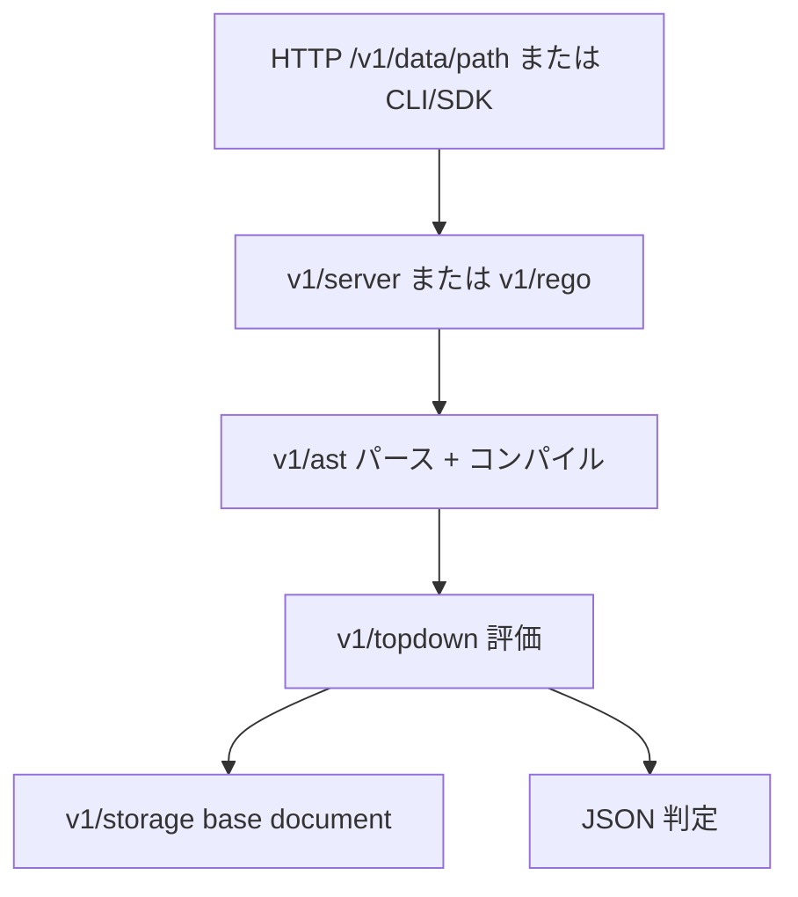

# アーキテクチャ

## 全体像

OPA は層状の Go パッケージ群からなる単一バイナリである。`cmd/` の CLI が cobra のルートにサブコマンドを束ね (`cmd/commands.go:14`)、`main.go:22` が `cmd.RootCommand.Execute()` を呼ぶ。CLI の下に本処理を担う 4 層がある。`v1/ast/` が Rego をパース・コンパイルし、`v1/topdown/` が評価し、`v1/rego/` がコンパイル〜評価を高レベル API として orchestration し、`v1/server/` がそれをポリシー決定点 (PDP) の REST として公開する。外部データの保存は `v1/storage/` で抽象化され、ポリシーとデータは `v1/bundle/` が配布用にパッケージ化する。

## コンポーネント

### CLI (`cmd/`)

`eval`・`run`・`test`・`build`・`fmt`・`check`・`bench`・`exec` などのサブコマンドが cobra のルート `RootCommand` (`cmd/commands.go:14`) に登録される。`opa run --server` が常駐 PDP を起動し、その他のコマンドは同じ評価コアを使うワンショットツールである。

### AST とコンパイラ (`v1/ast/`)

このパッケージは Rego のパーサ・コンパイラ・型チェッカを持ち、`parser.go`・`compile.go`・`term.go`・`policy.go` にまたがる。Rego のソーステキストを、評価器が消費するコンパイル済み・型チェック済みの AST に変換する。

### 評価エンジン (`v1/topdown/`)

評価器は top-down 評価と単一化を行う。主ループは `eval.go` と `query.go` にあり、組み込み関数 (`http.go`・`crypto.go`・`glob.go` ほか多数) も同ディレクトリにある。ここで input とデータに対してクエリが実際に計算される。

### 高レベル API (`v1/rego/`)

`v1/rego/rego.go` が orchestration 層。`rego.New(...).Eval()` がパース・コンパイル・評価を束ねる。サーバも組み込みライブラリ利用者も、このパッケージからエンジンに入る。

### REST サーバ (`v1/server/`)

サーバが PDP である。`v1DataGet` (`v1/server/server.go:1512`) と `v1DataPost` (`v1/server/server.go:1741`) が既定の decision path `/v1/data/<path>` を処理し、リクエストの `input` に対して指定ルールを評価して JSON を返す。

### ストレージと bundle (`v1/storage/`, `v1/bundle/`)

`v1/storage/` は base document (外部データ) 用の `Store` インターフェース (`v1/storage/interface.go:20`) を定義し、in-memory 実装を同梱する。`v1/bundle/` は bundle の読込・署名・検証を扱う。bundle はポリシーとデータをまとめた配布単位で、HTTP または OCI で pull される。

## リクエストの流れ

HTTP 経由のポリシー判定は次のように進む。

1. クライアントが `/v1/data/<path>` に `GET` または `POST` を送り、`v1DataGet` (`v1/server/server.go:1512`) か `v1DataPost` (`v1/server/server.go:1741`) が処理する。
2. handler はリクエストの `input` を AST 値化し、指定クエリを `rego` API 経由で評価する。
3. `(*Rego).Eval` (`v1/rego/rego.go:1502`) が txn を開き、ポリシーを一度だけパース・コンパイルする `PrepareForEval` (`v1/rego/rego.go:1788`) を呼ぶ。
4. `(*Rego).eval` (`v1/rego/rego.go:2309`) が既定の rego target で `topdown` クエリを組んで実行する。
5. `(*Query).Iter` (`v1/topdown/query.go:565`) が `(*eval).eval` (`v1/topdown/eval.go:404`) の評価ループを回し、結果が JSON にシリアライズされて返る。

組み込みライブラリ利用者も同じ経路を通る。サーバを介さず `rego.New(...).Eval()` を直接呼ぶだけである。

## 主要な設計判断

最も影響が大きいレイアウト上の判断は v1 shim である。ルートの `rego/`・`ast/`・`topdown/` は実装ではなく、型エイリアスで `v1/*` を再公開する。例えば `rego/rego.go` は `github.com/open-policy-agent/opa/v1/rego` に対し `type Rego = v1.Rego`、`type EvalContext = v1.EvalContext` を宣言する。これにより OPA 1.0 で Rego の既定言語を v0 から v1 に切り替える際、import path を壊さずに済んだ。利用者は `github.com/open-policy-agent/opa/rego` を import し続けつつ、新コードは `v1/` に集約される。

第二の判断は、`Store` インターフェース (`v1/storage/interface.go:20`) を境界にしたポリシーとデータの分離である。外部 base document は txn 経由で読まれ、ポリシーの評価とそれが読むデータが分離される。

## 拡張ポイント

- 組み込み関数は評価器と並んで `v1/topdown/` にあり、エンジンは `rego` API でカスタム組み込みを受け付ける。
- `v1/plugins/` が decision logging・bundle download・status reporting のプラグインを提供する。
- `v1/sdk/` は OPA を他の Go プログラムに埋め込むための SDK。
- `wasm/`・`v1/ir/`・`v1/compile/` は Rego を WASM と中間表現にコンパイルし、別の評価ターゲットとする。
