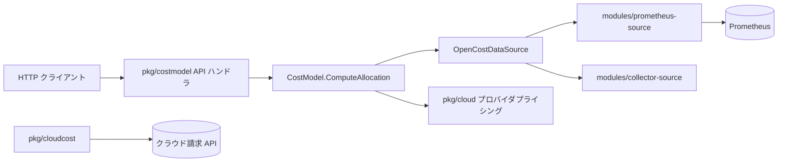

# アーキテクチャ

## 全体像

OpenCost は単一の Go バイナリとして配布される。`cmd/costmodel/main.go:11` のエントリポイントは cobra のコマンドツリーを呼ぶだけで、実体は 3 つの層に分かれる。コストモデルと HTTP API (`pkg/costmodel`)、共有ドメイン型とデータソース抽象 (`core/`)、メトリクスバックエンド (`modules/`) だ。実行時は、データソース (既定は Prometheus) から使用量メトリクスをクエリし、クラウドプロバイダのプライシングを掛け、ポート `9003` の HTTP API でコスト按分を返す。クラウド請求データは別パイプライン (`pkg/cloudcost`) を流れる。

## コンポーネント

### エントリポイントとコマンドツリー

`cmd/costmodel/` が単一バイナリのエントリポイント。`main.go:11` で `cmd.Execute(nil)` を呼び、これが `pkg/cmd/commands.go:35` の既定 cost-model コマンドに解決される。そのコマンドの `Execute` は `pkg/cmd/costmodel/costmodel.go:33` にあり、HTTP ルータとコストモデルを wire する。

### コアドメインライブラリ

`core/` はドメイン型 (`core/pkg/opencost`: Allocation・Asset・CloudCost・Window)、データソース抽象 (`core/pkg/source`)、storage・log・filter・clusters ヘルパを持つ共有モジュール。メインバイナリとメトリクスモジュールの両方が import する。

### コストモデルと API

`pkg/costmodel` がコストモデルと HTTP ハンドラを持つ。pod 単位の使用量マップを作り、プライシングと結合し、コスト按分セットを組み立てる。`pkg/cloud/<provider>` は AWS・Azure・GCP・Alibaba・Oracle・DigitalOcean・Scaleway・OTC のプライシングロジック。`pkg/cloudcost` は別パイプラインの請求 API、`pkg/clustercache` は Kubernetes オブジェクトのキャッシュ、`pkg/metrics` は OpenCost 自身のメトリクスを公開する。

### メトリクスモジュール

`modules/prometheus-source` と `modules/collector-source` はメトリクス取得の 2 実装。どちらも `OpenCostDataSource` インターフェースの背後にあり、コストモデルに触れずにバックエンドを差し替えられる。

## リクエストの流れ

namespace・pod・controller 別のコストを返す中核 API、`GET /allocation` を追う。

1. ルートは `pkg/cmd/costmodel/costmodel.go:55` で httprouter に `router.GET("/allocation", a.ComputeAllocationHandler)` として登録される。
2. `pkg/costmodel/aggregation.go:330` `ComputeAllocationHandler` がクエリパラメータを解釈する。`window` は必須で `aggregation.go:337` の `ParseWindowWithOffset` で解析、aggregation プロパティは `aggregation.go:350`、加えて `includeIdle`・`idleByNode`・`shareIdle`・`filter`。フィルタは aggregation の前にクエリ内で適用され、cluster や node 等の属性がマージで消える前に絞れる (`aggregation.go:391`)。
3. ハンドラは `aggregation.go:395` で `a.Model.QueryAllocation(...)` を呼ぶ。
4. `pkg/costmodel/allocation.go:32` `ComputeAllocation` は `BatchDuration` より長い window を分割し、個別に計算して `Accumulate` (`allocation.go:125`) で畳む。labels・annotations・services は性能上その intersection で伝播しないので、ここで明示的に再付与する。
5. `pkg/costmodel/allocation.go:219` `computeAllocation` (小文字) が 1 window 分の実体を担う。`buildPodMap` (`allocation.go:260`) で pod map を作り、残りのメトリクスクエリを並列に fan-out し、pod map から按分セットを組み立てる。
6. fan-out は `allocation.go:272` の `source.NewQueryGroup()` と `ds := cm.DataSource.Metrics()` から始まる。RAM・CPU・GPU・PV・Network・NAT Gateway のクエリは Future で発行され、後で Await される。
7. データソースの境界は `core/pkg/source/datasource.go:11` の `MetricsQuerier` インターフェースで、`QueryRAMBytesAllocated` 等のメソッドを持つ (`datasource.go:49`)。
8. Prometheus 実装は `modules/prometheus-source/pkg/prom/metricsquerier.go:525` の `PrometheusMetricsQuerier.QueryRAMBytesAllocated`。実際の PromQL は `avg(avg_over_time(container_memory_allocation_bytes{...}[dur])) by (container, pod, namespace, node, uid, ...)` で `metricsquerier.go:527` に定義される。

要するに、Prometheus の使用量メトリクスをクラウドプライシングと pod 単位で掛け合わせ、idle と shared を配分して Allocation に落とす。

## 主要な設計判断

- pull 型。OpenCost はクラスタ内で動き、Prometheus がすでに収集しているメトリクスを定期的にクエリする。push されるイベントを受けるのではない。請求データ (CloudCost) はクラウドプロバイダの請求 API に対する別パイプラインで取り込む。
- データソースは抽象であり固定依存ではない。`OpenCostDataSource` インターフェースにより Prometheus は差し替え可能で、`collector-source` モジュールは `COLLECTOR_DATA_SOURCE_ENABLED` で有効化する代替バックエンドだ。
- ワークロードコストは OpenCost Specification に従い `max(request, usage)` で定義される。idle はどのワークロードにも帰属しない按分コストである。

## 拡張ポイント

- クラウドプロバイダ: `pkg/cloud/<provider>` 配下のプロバイダ別プライシングロジック。
- データソース: `MetricsQuerier` (`core/pkg/source/datasource.go:11`) を実装して、別のメトリクスストアでコストモデルを駆動できる。
- プラグイン: 外部コストソース (Datadog・OpenAI・MongoDB Atlas) は別リポジトリ `opencost-plugins` にある。
- MCP サーバ: `pkg/mcp` が AI agent からコストデータをクエリするインターフェースを公開する。
