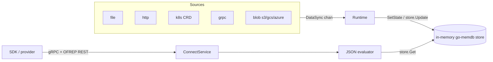

# アーキテクチャ

## 全体像

flagd は 3 つのモジュールから成る Go モノレポだ。`core/` は再利用ライブラリ (evaluator / store / sync / model / telemetry)、`flagd/` はデーモン (cobra コマンド / runtime / 各 service)、`flagd-proxy/` は sync ストリームを多数の flagd にファンアウトする別バイナリ。2 つのデータパスが通る。flag 取り込み (sync ソースが定義をインメモリストアへ push) と flag 評価 (リクエストが evaluator 経由でストアを読む) だ。

## コンポーネント

### core (再利用ライブラリ)

`core/` モジュールには、組み込みもスタンドアロン実行も想定した部品が入る。evaluator は flag 定義と評価コンテキストを値と理由に変える (`core/pkg/evaluator/json.go`)。store はインメモリの flag データベース (`core/pkg/store/store.go`)。sync 層は flag ソースと runtime の契約を定める (`core/pkg/sync/isync.go:13-27`)。model パッケージは `Flag` 型と理由コードを定義する (`core/pkg/model/flag.go`)。

### flagd (デーモン)

`flagd/` モジュールが実行可能なデーモンだ。`flagd/main.go:11` は `cmd.Execute` を呼ぶだけで、cobra の `start` サブコマンドに振り分ける (`flagd/cmd/start.go`)。runtime の配線は `flagd/pkg/runtime/from_config.go:55`。評価リクエストは connect service が処理する (`flagd/pkg/service/flag-evaluation/connect_service.go`)。

### flagd-proxy

1 組の sync ソースを購読し、多数の flagd インスタンスへ再公開する別バイナリ。上流ソースへの負荷を下げる (1)。

## リクエストの流れ

boolean 評価 (`/flagd.evaluation.v1.Service/ResolveBoolean`) は次のように流れる。

1. connect service が `FlagEvaluationService.ResolveBoolean` で gRPC リクエストを受ける (`flagd/pkg/service/flag-evaluation/flag_evaluator_v1.go:207`)。`flagd-selector` ヘッダを読み `store.NewSelector` 化し、それとプロトコルバージョンを ctx に載せる (`flag_evaluator_v1.go:214-217`)。
2. 共通のジェネリック resolver `resolve[T]` (`flagd/pkg/service/flag-evaluation/flag_evaluator.go:349`) がリクエストコンテキスト・設定の静的コンテキスト・マップされたヘッダを統合し (`flag_evaluator.go:356`)、評価関数を呼び、エラーを `errFormat` で connect の code に翻訳する (`flag_evaluator.go:395-409`)。
3. 評価本体は `Resolver.ResolveBooleanValue` (`core/pkg/evaluator/json.go:205`) で、ジェネリックな `resolve[bool]`、さらに `evaluateVariant` (`core/pkg/evaluator/json.go:326`) に委譲する。
4. `evaluateVariant` はストアから flag を取得し (`json.go:335`)、flag が無効なら `DISABLED` で早期 return し (`json.go:349-352`)、それ以外は JSONLogic ターゲティングを適用して `TARGETING_MATCH` か `STATIC` のデフォルトを返す (`json.go:378`、`json.go:420`)。

## 主要な設計判断

- store は単純な map ではない。flagd は `hashicorp/go-memdb` を使う。複数の index (id 複合 / source / priority / flagSetId / key と各種複合) を持つトランザクショナルなインメモリ DB だ (`core/pkg/store/store.go:47-118`)。selector ヘッダで評価を特定の source や flag set に絞れるのはこの設計ゆえ。
- 2 つの sync ソースが同じ flag key を定義した場合、設定された `sources` スライスでの位置が priority として働き、高優先の source が勝つ (`core/pkg/store/store.go:42`、`store.go:232`)。source URI は verbatim 登録されるため、sync が返す `DataSync.Source` は設定 URI とクエリ文字列まで完全一致しなければならない (`flagd/pkg/runtime/from_config.go:84-90`)。
- 3 つの評価プロトコルバージョンが 1 つの HTTP ハンドラを共有し、`bufSwitchHandler` で多重化される (`connect_service.go:177-181`)。これにより古いクライアントを動かしたまま、v2 で任意の value / variant フィールドを足せる。

## 拡張ポイント

- sync ソースの provider は `SyncBuilder.syncFromConfig` で provider/scheme により選ばれる (`core/pkg/sync/builder/syncbuilder.go:99-134`): file / fsnotify / fileinfo / kubernetes / http / grpc / gcs / azblob / s3。
- `ISync` インターフェース (`core/pkg/sync/isync.go:13-27`) が新しい flag ソースの実装契約だ: `Init` / `Sync` / `ReSync` / `IsReady`。
- JSONLogic のカスタム演算子 (`fractional` / `starts_with` / `ends_with` / `sem_ver`) は `NewResolver` で global に登録される (`core/pkg/evaluator/json.go:147-150`)。
- OpenTelemetry の trace / metrics プロバイダは runtime 起動時に構築される (`from_config.go:67-82`)。
