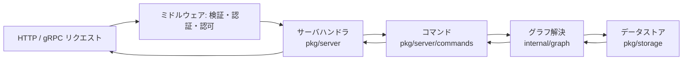

# アーキテクチャ

## 全体像

OpenFGA は gRPC API と HTTP ゲートウェイを公開する単一の Go バイナリである。リクエストはトランスポートハンドラに到達し、ミドルウェア (検証、認証、API 認可) を通り、サーバハンドラに渡り、トランスポート非依存のコマンドに委譲され、それがグラフ解決エンジンを駆動し、エンジンが差し替え可能なデータストアから関係タプルを読む。[`cmd/`](https://github.com/openfga/openfga/tree/9a556d8a134db308a7690f328dade79104922c8a/cmd) の CLI がこれらを配線してサーバを起動する。

## コンポーネント

### CLI とサーバ起動 (`cmd/`)

[`cmd/openfga/main.go:14-26`](https://github.com/openfga/openfga/blob/9a556d8a134db308a7690f328dade79104922c8a/cmd/openfga/main.go#L14-L26) は Cobra のルートコマンドを構築し、`run`、`migrate`、`validate-models`、`version` サブコマンドを取り付ける。サーバ本体は [`cmd/run/run.go`](https://github.com/openfga/openfga/blob/9a556d8a134db308a7690f328dade79104922c8a/cmd/run/run.go) で起動し、設定の読み込み、データストアのオープン、graceful shutdown を扱う。`migrate` は DB スキーマのマイグレーションを適用する。

### トランスポートハンドラ (`pkg/server/`)

[`pkg/server/`](https://github.com/openfga/openfga/tree/9a556d8a134db308a7690f328dade79104922c8a/pkg/server) は gRPC/HTTP ハンドラを持ち、API 面ごとに 1 ファイル (`check.go`、`batch_check.go`、`list_objects.go`、`list_users.go`、`expand.go`、`write.go`、`read.go`) になっている。AuthZEN 互換エンドポイントは [`pkg/server/authzen.go`](https://github.com/openfga/openfga/blob/9a556d8a134db308a7690f328dade79104922c8a/pkg/server/authzen.go) にある。ハンドラはリクエスト検証と API 認可を行い、コマンドに引き渡す。

### コマンド (`pkg/server/commands/`)

[`pkg/server/commands/`](https://github.com/openfga/openfga/tree/9a556d8a134db308a7690f328dade79104922c8a/pkg/server/commands) はトランスポートから切り離したビジネスロジック層である。`CheckQuery.Execute` ([`check_command.go:102`](https://github.com/openfga/openfga/blob/9a556d8a134db308a7690f328dade79104922c8a/pkg/server/commands/check_command.go#L102)) が内部の解決リクエストを組み立て、resolver を呼ぶ。

### グラフエンジン (`internal/graph/`)

[`internal/graph/`](https://github.com/openfga/openfga/tree/9a556d8a134db308a7690f328dade79104922c8a/internal/graph) が中核である。`LocalChecker` がモデルの rewrite ルールを辿りタプルを読んでチェックを解決する。resolver はチェーン (キャッシュ、dispatch スロットリング、shadow 評価) に合成され、[`builder.go`](https://github.com/openfga/openfga/blob/9a556d8a134db308a7690f328dade79104922c8a/internal/graph/builder.go) で構築される。

### 型システム (`pkg/typesystem/`)

[`pkg/typesystem/`](https://github.com/openfga/openfga/tree/9a556d8a134db308a7690f328dade79104922c8a/pkg/typesystem) は認可モデルをパース・検証し、クエリ経路最適化のためにモデルの重み付きグラフを構築する。`TypeSystem` は `authzWeightedGraph` フィールドを持つ ([`typesystem.go:184`](https://github.com/openfga/openfga/blob/9a556d8a134db308a7690f328dade79104922c8a/pkg/typesystem/typesystem.go#L184))。

### ストレージ (`pkg/storage/`)

[`pkg/storage/`](https://github.com/openfga/openfga/tree/9a556d8a134db308a7690f328dade79104922c8a/pkg/storage) は `OpenFGADatastore` と `RelationshipTupleReader` インターフェースを定義し ([`storage.go:152`](https://github.com/openfga/openfga/blob/9a556d8a134db308a7690f328dade79104922c8a/pkg/storage/storage.go#L152))、インメモリ、PostgreSQL、MySQL、SQLite の実装を持つ。

## リクエストの流れ

`Check` 呼び出しを端から端まで追う。

1. [`pkg/server/check.go:37`](https://github.com/openfga/openfga/blob/9a556d8a134db308a7690f328dade79104922c8a/pkg/server/check.go#L37) `(*Server).Check` がトレース span を開始し、リクエストを検証し、`checkAuthz` で API 認可を行う ([`check.go:63`](https://github.com/openfga/openfga/blob/9a556d8a134db308a7690f328dade79104922c8a/pkg/server/check.go#L63))。
2. ストアで `ExperimentalWeightedGraphCheck` フラグが有効なら v2 パス `s.v2Check` を試し、非タイムアウト系エラーでは v1 にフォールバックする ([`check.go:69-152`](https://github.com/openfga/openfga/blob/9a556d8a134db308a7690f328dade79104922c8a/pkg/server/check.go#L69-L152))。
3. v1 パスは `getCheckResolverBuilder(storeID).Build()` で resolver チェーンを構築し ([`check.go:156`](https://github.com/openfga/openfga/blob/9a556d8a134db308a7690f328dade79104922c8a/pkg/server/check.go#L156))、モデルを解決し ([`check.go:162`](https://github.com/openfga/openfga/blob/9a556d8a134db308a7690f328dade79104922c8a/pkg/server/check.go#L162))、`NewCheckCommand` を構築し ([`check.go:168`](https://github.com/openfga/openfga/blob/9a556d8a134db308a7690f328dade79104922c8a/pkg/server/check.go#L168))、`checkQuery.Execute` を呼ぶ ([`check.go:182`](https://github.com/openfga/openfga/blob/9a556d8a134db308a7690f328dade79104922c8a/pkg/server/check.go#L182))。
4. `(*CheckQuery).Execute` ([`check_command.go:102`](https://github.com/openfga/openfga/blob/9a556d8a134db308a7690f328dade79104922c8a/pkg/server/commands/check_command.go#L102)) が `ResolveCheckRequest` を組み立て、データストアをリクエスト単位のタプルキャッシュでラップし、`c.checkResolver.ResolveCheck` を呼ぶ ([`check_command.go:150`](https://github.com/openfga/openfga/blob/9a556d8a134db308a7690f328dade79104922c8a/pkg/server/commands/check_command.go#L150))。
5. `(*LocalChecker).ResolveCheck` ([`internal/graph/check.go:395`](https://github.com/openfga/openfga/blob/9a556d8a134db308a7690f328dade79104922c8a/internal/graph/check.go#L395)) が解決深度を確認し、サイクルを検出し、self-defining タプルを短絡し、`PathExists` で到達不能経路を枝刈りし、関係の rewrite ルールを `CheckRewrite` で評価する ([`check.go:465`](https://github.com/openfga/openfga/blob/9a556d8a134db308a7690f328dade79104922c8a/internal/graph/check.go#L465))。

各分岐は [内部実装](./internals) で詳しく追う。

## 主要な設計判断

- **ステートレスエンジンと差し替え可能なストレージ。** 認可状態はすべて `RelationshipTupleReader` インターフェースの背後にある ([`storage.go:152`](https://github.com/openfga/openfga/blob/9a556d8a134db308a7690f328dade79104922c8a/pkg/storage/storage.go#L152)) ため、インスタンスは水平スケールでき、ストレージは差し替え可能。
- **resolver チェーンは循環リンクリスト。** resolver は負荷の軽い順に並べられ、最後が先頭に委譲し直す ([`builder.go:66-104`](https://github.com/openfga/openfga/blob/9a556d8a134db308a7690f328dade79104922c8a/internal/graph/builder.go#L66-L104))。`CheckResolver` 契約は `Delegate.ResolveCheck` が無限再帰を起こさないことを要求する ([`interface.go:13-40`](https://github.com/openfga/openfga/blob/9a556d8a134db308a7690f328dade79104922c8a/internal/graph/interface.go#L13-L40))。
- **整合性はリクエスト単位で調整可能。** `HIGHER_CONSISTENCY` を要求しない限り、エンジンはキャッシュ無効化時刻を参照しキャッシュから応答しうる ([`check_command.go:110-112`](https://github.com/openfga/openfga/blob/9a556d8a134db308a7690f328dade79104922c8a/pkg/server/commands/check_command.go#L110-L112))。強整合性はオプトイン。
- **戦略選択はオンライン学習。** どの解決戦略を使うかを固定ルールではなく、[`internal/planner/`](https://github.com/openfga/openfga/tree/9a556d8a134db308a7690f328dade79104922c8a/internal/planner) のプランナが Thompson Sampling でクエリ経路ごとに学習する。

## 拡張ポイント

- **データストアドライバ** は `OpenFGADatastore` / `RelationshipTupleReader` を実装する ([`pkg/storage/storage.go:152`](https://github.com/openfga/openfga/blob/9a556d8a134db308a7690f328dade79104922c8a/pkg/storage/storage.go#L152))。SQLite と MySQL のアダプタはコミュニティの貢献だった。
- **認証** は none、pre-shared key、OIDC をサポートする ([`internal/authn/`](https://github.com/openfga/openfga/tree/9a556d8a134db308a7690f328dade79104922c8a/internal/authn))。
- **AuthZEN エンドポイント** ([`pkg/server/authzen.go`](https://github.com/openfga/openfga/blob/9a556d8a134db308a7690f328dade79104922c8a/pkg/server/authzen.go)) は `Check` の上に OpenID AuthZEN 互換 API を公開する。
