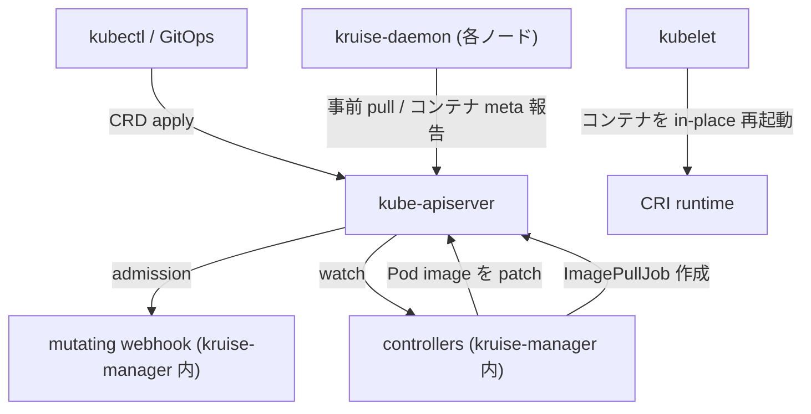

# アーキテクチャ

## 全体像

OpenKruise は 2 つのデプロイ単位で出荷される。1 つ目は `kruise-manager` で、すべてのコントローラと admission webhook サーバを 1 バイナリに同居させる。2 つ目は `kruise-daemon` で、各ノードでエージェントを動かす DaemonSet。manager がワークロードに何をすべきかを決め、daemon は kubelet ができないノードローカルな作業 (イメージの事前 pull、コンテナランタイムからの実 meta 読み取りなど) を行う。mutating webhook は in-place update を安全にする仕掛けを注入する。3 者は協調して動き、どれ 1 つでも in-place update を単独で実現できない。

## コンポーネント

### kruise-manager

中央コンポーネント。`main.go` がエントリポイント。先に webhook を登録し、webhook の readiness を待ってからコントローラを登録する (`main.go:236-267`)。コントローラのセットアップは `webhook.WaitReady()` でブロックする goroutine 内で走るので、コントローラが Pod パスを reconcile するのは webhook が mutate できる状態になってから (`main.go:260-262`)。leader election のロック名は `kruise-manager` (`main.go:129-130`)。

コントローラは `pkg/controller/` 配下にあり CRD と 1:1 対応する: `cloneset`, `statefulset` (Advanced StatefulSet), `daemonset` (Advanced DaemonSet), `sidecarset`, `uniteddeployment`, `broadcastjob`, `advancedcronjob`, `ephemeraljob`, `imagepulljob` / `imagelistpulljob`, `nodeimage`, `nodepodprobe`, `podprobemarker`, `containerrecreaterequest`, `containerlaunchpriority`, `persistentpodstate`, `podunavailablebudget`, `podreadiness`, `resourcedistribution`, `sidecarterminator`, `workloadspread`。

### kruise-daemon

DaemonSet として各ノードに常駐するエージェント。エントリポイントは `cmd/daemon/main.go` で、`NewDaemon` でデーモンを組み立てる (`cmd/daemon/main.go:85`)。責務は `pkg/daemon/` 配下のサブパッケージに分かれる: `imagepuller` (CRI 経由のイメージ事前 pull)、`criruntime` と `kuberuntime` (コンテナランタイムとの通信)、`containermeta` (各コンテナで走っている実イメージの報告)、`containerrecreate` (要求に応じたコンテナ再作成)、`podprobe` (カスタム Pod probe)。

### admission webhook

webhook は `kruise-manager` バイナリの一部で、in-place update の要。mutating パスは Kruise 管理 Pod に Kruise 独自の readiness gate を注入する (`pkg/webhook/pod/mutating/pod_readiness.go:30-37`)。Pod の create 時に `util.InjectReadinessGateToPod(pod, appspub.KruisePodReadyConditionType)` を呼ぶ。in-place update 中はコントローラがこの condition を倒して Pod を NotReady にし、イメージ差し替え前にトラフィックを抜ける。

## リクエストの流れ

CloneSet のローリング in-place update を、`Reconcile` から patch 済み Pod まで追う。

1. `Reconcile` は `reconcileFunc` (= `doReconcile`) に委譲する (`pkg/controller/cloneset/cloneset_controller.go:198-200`)。
2. `doReconcile` は CloneSet を取得し、scale expectation を確認し、Pod / PVC を claim し、ControllerRevision を列挙・ソートして current / update revision を決め、resourceVersion expectation で informer cache の鮮度を待つ。
3. revision が変わっていれば、どの Pod も触る前に `kruise-daemon` が新イメージを事前 pull できるよう ImagePullJob を作る (`createImagePullJobsForInPlaceUpdate`)。
4. `syncCloneSet` (`pkg/controller/cloneset/cloneset_controller.go:403`) が current / update の Pod テンプレートを復元し、まず scale、次に update を実行する。
5. `realControl.Update` (`pkg/controller/cloneset/sync/cloneset_update.go:47`) が対象 Pod ごとに `updatePod` (`cloneset_update.go:254`) を回す。ポリシーが `InPlaceIfPossible` か `InPlaceOnly` で in-place 可能なら `inplaceControl.Update` (`cloneset_update.go:306`) に入る。in-place 不可かつ `InPlaceOnly` の場合は再作成せずエラーにする (`cloneset_update.go:319-320`)。
6. 共通 in-place エンジン (`pkg/util/inplaceupdate/inplace_update.go`) が差分を計算し、必要なら Pod を NotReady にし、走っている Pod を patch する。kubelet は再スケジュールせずコンテナを再起動する。

詳細なコード追跡は [内部実装](./internals) に。

## 主要な設計判断

in-place update は上流の 1 つの保証を逆手に取る: Pod spec の `image` フィールドだけを patch するとコンテナは再作成されず再起動する。OpenKruise は差分が image (v1.8 以降は resize subresource 経由の resource) に閉じるときだけ in-place を選び、それ以上に広がれば通常の recreate にフォールバックする。Pod を再作成しないので scheduler / CNI / CSI をスキップし PVC の再バインドを避けられ、それが大規模での速さになる。

この選択が「2 + 1」のコンポーネント分割を強いる。mutating webhook が readiness gate を注入してコントローラが差し替え中にトラフィックを抜けるようにし、ノードごとの daemon が実ランタイムイメージを報告してコントローラが kubelet status だけに頼らず完了を判定できるようにする。コントローラ単独では in-place update は成立せず、webhook と daemon は任意の追加ではなく前提条件。

## 拡張ポイント

- CRD: `apis/apps/{v1alpha1,v1beta1}` と `apis/policy` 配下。API グループは `apps.kruise.io` と `policy.kruise.io`。CloneSet は v1alpha1 から v1beta1 への conversion を持つ。
- SidecarSet: sidecar コンテナの注入と独立アップグレード。v1.7 以降は native Kubernetes sidecar に対応。
- admission webhook: Pod の mutation / validation の結合面。
- `inplaceupdate.Interface` と `UpdateOptions` の関数フック: 各ワークロードコントローラが 1 つの in-place エンジンを共有しつつ挙動を変えられる ([内部実装](./internals) 参照)。
