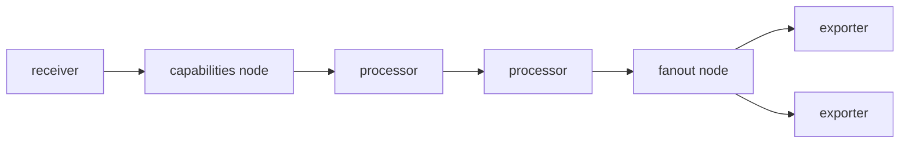

# アーキテクチャ

## 全体像

Collector は YAML config を読み、コンポーネントの有向非巡回グラフ (DAG) にコンパイルし、そのグラフにテレメトリを流す。グラフは 5 種類のコンポーネントから成る。receiver がテレメトリを取り込み、processor が順序を保って加工し、exporter が送出し、connector が片方のパイプラインの出力を別パイプラインの入力につなぎ、extension はヘルスチェックや zpages のような付随機能としてパイプラインの脇で動く。

## コンポーネント

### receiver / processor / exporter / connector / extension

各種別はそれぞれのトップレベルディレクトリに置かれる。`receiver/`・`processor/`・`exporter/`・`connector/`・`extension/` である。receiver は入口、processor は順序を持つ中間段、exporter はバックエンドへの出口である。connector はあるパイプラインでは exporter、別パイプラインでは receiver として振る舞う。これがシグナル変換やパイプライン間ルーティングの表現方法になる。extension はデータ経路の外側に置かれる。

### service と graph

`service` パッケージが稼働中のパイプラインを所有し、`service/internal/graph` がコンポーネント DAG を構築・駆動する。グラフは gonum の `simple.DirectedGraph` を `Graph` 構造体で包んだもので (`service/internal/graph/graph.go:60`)、`pipeline.ID` からそのパイプラインのノードへの map を持つ。

### config の配線

`confmap` が起動時に登録される設定プロバイダを提供する。`env`・`file`・`http`・`https`・`yaml` のスキームである (`cmd/otelcorecol/main.go:31`)。`otelcol` パッケージが設定を結線し、service を起動する。

## リクエストの流れ

起動でグラフを構築し、その上にテレメトリを流す。

1. `cmd/otelcorecol/main.go` が `otelcol.CollectorSettings` を構築し、confmap プロバイダを登録する (`cmd/otelcorecol/main.go:25`)。
2. `setupConfigurationComponents` が config を取得し、`confmap.Validate` を実行し、各コンポーネントの config と factory を渡して `service.New` を呼ぶ (`otelcol/collector.go:178`、`otelcol/collector.go:212`)。
3. service は `service/internal/graph` の `Build` を呼ぶ (`service/internal/graph/graph.go:75`)。これがノード生成、エッジ描画、コンポーネント実体化を行う。
4. 実行時には各段が 1 本のインターフェースで次段へデータを渡す。例えば `ConsumeTraces(ctx, ptrace.Traces) error` (`consumer/traces.go:15`)。

## 主要な設計判断

receiver は同型シグナルのパイプライン間で共有される。receiver ノードの ID は「パイプライン種別」と「コンポーネント ID」から導出されるため、同じ receiver を名指す 2 つの trace パイプラインは 1 インスタンスを共有する (`service/internal/graph/receiver.go:24`)。

グラフは processor を slice で保持する。順序が重要だからである。一方 receiver と exporter は共有インスタンスの重複排除のため map で保持する (`service/internal/graph/graph.go:385`)。

exporter の前には常に fanout ノードが挿入される。exporter がちょうど 1 個でも挿入され、その場合は noop として振る舞う (`service/internal/graph/graph.go:280`)。これにより fanout のロジックを 1 か所に集約し、単一 exporter のパイプラインを特別扱いせずに済む。

## 拡張ポイント

サードパーティは factory と consumer のインターフェースに対してコンポーネントを実装する。receiver・processor・exporter・connector・extension は factory を提供することで追加される。`opentelemetry-collector-contrib` にある数百のコミュニティコンポーネントはこの方式で作られている。運用者は欲しいコンポーネントを選び、OCB でバイナリをビルドする。`consumer.Traces`・`consumer.Metrics`・`consumer.Logs` インターフェース (`consumer/traces.go:15`) が、すべてのパイプライン段が実装する契約である。
