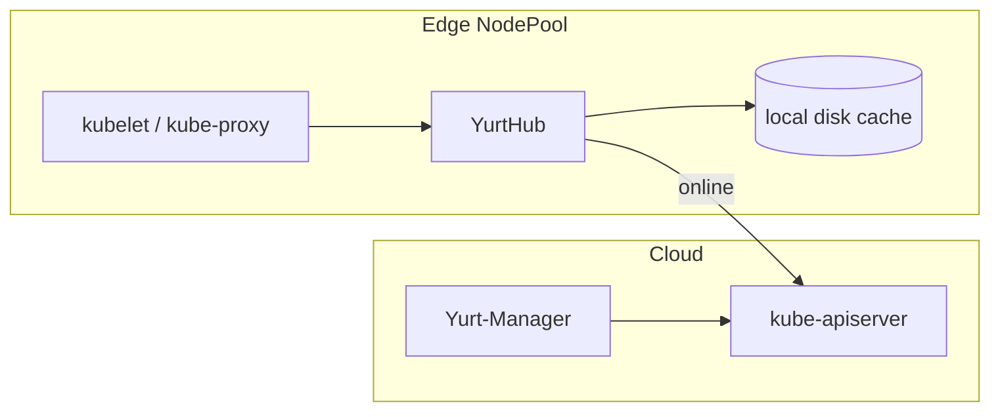

# アーキテクチャ

## 全体像

OpenYurt はクラシックなクラウドエッジ構成に従う (`README.md:31-34`)。通常の Kubernetes コントロールプレーンをクラウドに置く。エッジノードは遠隔サイトで動き、物理リージョン単位で NodePool にまとまる。各エッジノードでは YurtHub というサイドカーが kubelet と kube-proxy から apiserver への全トラフィックを横取りする。これにより、リンクが生きていればクラウドへ転送し、切れていればローカルキャッシュから応答できる。コントローラと Webhook はクラウドの Yurt-Manager で動く。

## コンポーネント

### YurtHub

全 worker ノードで static pod として動くノードサイドカー。kubelet、kube-proxy、その他ノードコンポーネントから kube-apiserver への全リクエストを横取りするリバースプロキシ兼ローカルキャッシュだ。コードは `pkg/yurthub/` 配下。バイナリのエントリポイントは `cmd/yurthub/yurthub.go:27` で、`app.NewCmdStartYurtHub` からコマンドを組む。

### Yurt-Manager

エッジ向けコントローラと Webhook の集合。コントローラは `pkg/yurtmanager/controller/` 配下にあり、`nodepool`、`yurtappset`、`nodelifecycle`、`csrapprover`、`raven`、`platformadmin`、`hubleader` などを含む。クラウドで標準の apiserver に対して動く。

### Raven-Agent

異なる物理リージョンの pod 間に L3 のネットワーク接続を提供する。エッジ間とエッジクラウド間の両経路をカバーする (`README.md:42-50`)。`pkg/apis/raven/` で定義される Gateway CRD で駆動する。

### YurtIoTDock

エッジ NodePool ごとに 1 インスタンス配置される。EdgeX Foundry プラットフォームをブリッジし、Kubernetes CRD でエッジデバイスを管理する (`README.md:42-50`)。API 型は `pkg/apis/iot/` 配下。

## リクエストの流れ

kubelet からの読み取りリクエストを YurtHub 越しに追う。

1. YurtHub は `cmd/yurthub/yurthub.go:27` で起動する。`Run` (`cmd/yurthub/app/start.go:94`) がキャッシュ・証明書・ヘルスチェッカ・プロキシハンドラを組み立てる。`cachemanager.NewCacheManager` は `start.go:128`、`proxy.NewYurtReverseProxyHandler` は `start.go:172`、`server.RunYurtHubServers` は `start.go:184`。
2. リクエストは `pkg/yurthub/proxy/proxy.go:149` (`ServeHTTP`) に入る。先頭で readiness check を走らせる (`proxy.go:152-162`)。
3. default パス (`proxy.go:212`) は `p.loadBalancer.PickOne(req)` で健全なクラウド apiserver backend を取る (`proxy.go:214`)。取れれば `backend.ServeHTTP` がクラウドへ転送する。取れなければ、つまりノードがオフラインなら、`p.localProxy.ServeHTTP` へ落ちて (`proxy.go:217`) ローカルキャッシュから応答する。これがエッジ自律だ。
4. 転送したリクエストでは、応答が `modifyResponse` (`pkg/yurthub/proxy/remote/loadbalancer.go:352`) を通る。2xx なら必要に応じて response filter を適用し、`cacheResponse` を呼ぶ (`loadbalancer.go:409-412`)。
5. `cacheResponse` (`loadbalancer.go:431`) は `hubutil.NewDualReadCloser` (`pkg/yurthub/util/util.go:284`) でレスポンスボディを tee する。片方はクライアントへ素通し、もう片方は goroutine で `localCacheMgr.CacheResponse` を経てディスクへ向かう (`loadbalancer.go:433-438`)。
6. 転送が失敗すると `errorHandler` (`loadbalancer.go:333`) が動く。get や list なら `localCacheMgr.QueryCache(req)` (`loadbalancer.go:343-346`) でキャッシュ済みオブジェクトを返す。

## 主要な設計判断

中核の判断は非侵襲性だ。クラウドのコントロールプレーンは無改変の upstream Kubernetes で、エッジの挙動はすべてノード側の YurtHub プロキシと Yurt-Manager のコントローラで足す。README はこれを Kubernetes API 互換性を無傷で保つと表現する (`README.md:24-25`)。

2 つめの非自明な判断は pool-scope メタデータ用の leader YurtHub だ。`services` と `discovery.k8s.io/endpointslices` はデフォルトで pool scope 扱い (`cmd/yurthub/app/options/options.go:126-129`)。全ノードの YurtHub が個別にこれらをクラウド apiserver から list/watch すると WAN 負荷がノード数倍になる。代わりに NodePool ごとに leader YurtHub を選出し (`pkg/yurtmanager/controller/hubleader/`, `pkg/yurthub/proxy/multiplexer/`)、leader がクラウドから取得、follower は `loadBalancerForLeaderHub` 経由で leader から読む (`proxy.go:171-189`)。multiplexer がプールを 1 本の list/watch に畳む。

## 拡張ポイント

- `pkg/apis/` 配下の複数 API グループの CRD: `apps` (NodePool, YurtAppSet)、`iot` (PlatformAdmin, Device)、`network` (PoolService)、`raven` (Gateway)。
- Yurt-Manager のコントローラと Webhook (`pkg/yurtmanager/controller/`)。
- NodePool の `HostNetwork` は flannel などの CNI プラグインを許容する (`pkg/apis/apps/v1beta2/nodepool_types.go:47-51`)。
- YurtIoTDock 経由の EdgeX Foundry 連携。
