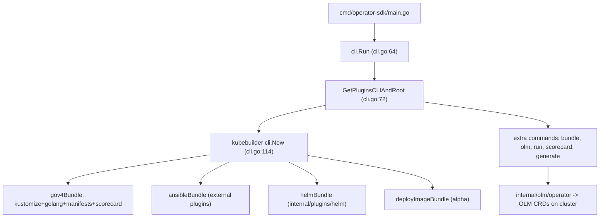

# アーキテクチャ

## 全体像

Operator SDK は単一の CLI バイナリだ。エントリポイントは `cmd/operator-sdk/main.go` で、`internal/cmd/operator-sdk/cli/cli.go:64` に定義された `cli.Run()` を呼ぶ。決定的な選択は、SDK が自前のスキャフォルディングエンジンを持たない点にある。kubebuilder v4 のプラグインベース CLI (`sigs.k8s.io/kubebuilder/v4 v4.6.0`, `go.mod:44`) を取り込み、その上にプラグインバンドルと extra command 群を登録する。

## コンポーネント

### CLI 組み立て

`GetPluginsCLIAndRoot()` (`internal/cmd/operator-sdk/cli/cli.go:72-128`) が CLI を構築する。4 つのプラグインバンドルを作り、kubebuilder の `cli.New(...)` (`cli.go:114`) に渡す。

- `gov4Bundle`: kustomize v2・golang v4・manifests v2・scorecard v2 (`cli.go:73-82`)。
- `ansibleBundle`: kustomize v2・外部リポ `operator-framework/ansible-operator-plugins` の ansible v1・manifests v2・scorecard v2 (`cli.go:84-93`, `go.mod:16`)。
- `helmBundle`: in-tree の `internal/plugins/helm/v1` の helm v1 プラグイン (`cli.go:95-104`)。
- `deployImageBundle`: alpha バンドル (`cli.go:106-113`)。

つまり Go Operator の `init` / `create api` は kubebuilder のコマンドだ。SDK 固有の価値は `manifestsv2` / `scorecardv2` プラグインと、`cli.go:50-58` で登録される extra command 群 (`bundle`, `cleanup`, `generate`, `olm`, `run`, `scorecard`, `pkgmantobundle`) にある。

### OLM operator 層

`internal/olm/operator` がクラスタと通信するコードを持つ。Operator をインストールするため OLM カスタムリソースを作成・承認する。共有 kube クライアントは `operator.Configuration` (`internal/olm/operator/config.go:32-42`) にある。

## リクエストの流れ

bundle イメージを OLM 経由でデプロイする SDK 固有のパス `operator-sdk run bundle <bundle-image>` を追う。

1. コマンドは `internal/cmd/operator-sdk/run/bundle/cmd.go:27-65` に定義。`bundle.NewInstall(cfg)` で installer を作り、`PreRunE` で config をロード、`Run` で `cfg.Timeout` context を張って `i.Run(ctx)` を呼ぶ (`cmd.go:46-54`)。
2. `Install.Run` が `setup` のあと `InstallOperator` を呼ぶ (`internal/olm/operator/bundle/install.go:66-70`)。
3. `setup` (`install.go:73-150`) は `operator.LoadBundle` で bundle ラベルと CSV を取得し (`install.go:87`)、`InstallMode.CheckCompatibility` で install mode 整合チェック (`install.go:93`)、`fbcutil.IsFBC` で index イメージが File-Based Catalog か SQLite かを判定する (`install.go:98`)。SQLite は deprecation 警告を出す (`install.go:135`)。その後 package name・catalog source name・starting CSV・supported install modes を詰める (`install.go:141-147`)。
4. `OperatorInstaller.InstallOperator` (`internal/olm/operator/registry/operator_installer.go:55-102`) が OLM へ書き込む。`CatalogCreator.CreateCatalog` で CatalogSource 作成 (`operator_installer.go:56`)、`ensureOperatorGroup` (`operator_installer.go:73`)、`createSubscription` (`operator_installer.go:79`)、`waitForInstallPlan` のあと `approveInstallPlan` (`operator_installer.go:84-89`)、最後に `getInstalledCSV` (`operator_installer.go:94`)。

## 主要な設計判断

SDK はスキャフォルディングを kubebuilder へ委譲し、自前実装を OLM glue (deploy・bundle・scorecard) に絞る。トレードオフは明確だ。kubebuilder のレイアウト進化に無料で追従できる反面、リリースは upstream バージョンに強く縛られる。kubebuilder v4.6.0 (`go.mod:44`)、ansible-operator-plugins v1.42.2 (`go.mod:16`) だ。

Subscription は手動 install plan 承認、すなわち `withInstallPlanApproval(v1alpha1.ApprovalManual)` で作られる (`operator_installer.go:281-285`)。CLI はその plan を自分で承認する。`approveInstallPlan` が `ip.Spec.Approved = true` を `RetryOnConflict` でセットして Update する (`operator_installer.go:319-339`)。plan を pending のまま残さず、CLI がユーザーの代理で承認者として動く。

## 拡張ポイント

プラグインモデルが主要な拡張面だ。各バンドルは kubebuilder プラグインの集合で、SDK はそのうち 1 つ (ansible v1) を外部リポ `operator-framework/ansible-operator-plugins` (`go.mod:16`) から引いており、プラグインがツリー外にも置けることを示す。グローバル `--verbose` フラグは root コマンドに後付けされ (`cli.go:140-148`)、`TODO(estroz): upstream PR for global --verbose` というコメントが kubebuilder 未マージのパッチであることを示す。SDK が生成する Operator 自体も、CRD を定義しコントローラが reconcile する Kubernetes の拡張ポイントだ。

## 出典

1. operator-framework/operator-sdk repository: <https://github.com/operator-framework/operator-sdk>
2. Operator SDK documentation site: <https://sdk.operatorframework.io/>
3. operator-framework/operator-lifecycle-manager: <https://github.com/operator-framework/operator-lifecycle-manager>
