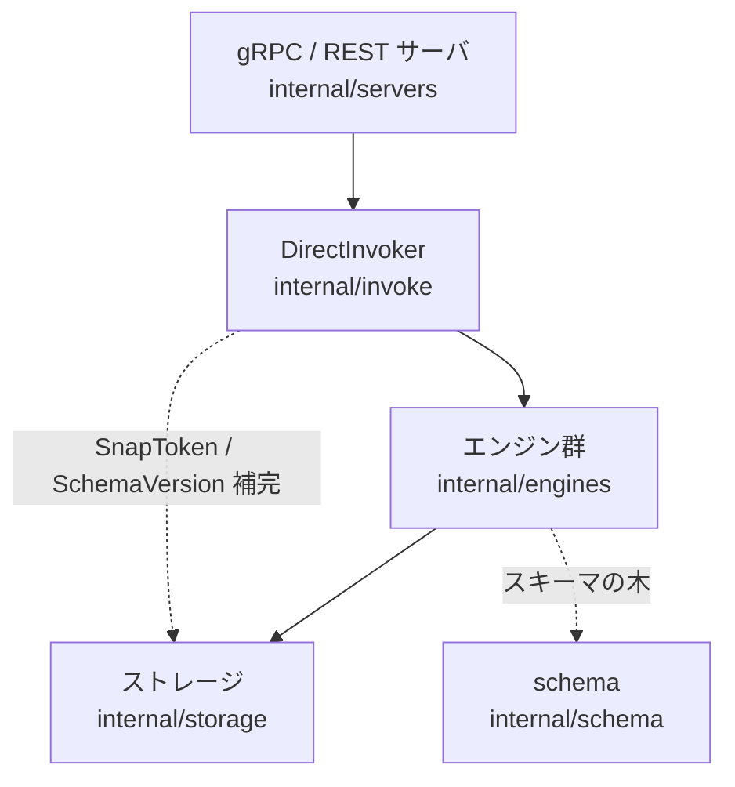

# アーキテクチャ

## 全体像

Permify はレイヤ構成。薄い gRPC/REST サーバ層がリクエストを検証して invoker に渡し、invoker が整合性のデフォルトを補完してエンジンに委譲し、エンジンがストレージからスキーマとリレーションシップデータを読んで認可の問いを解決する。バイナリのエントリポイントは `cmd/permify/permify.go` で、`main()` が cobra ルートに CLI コマンド (`serve`、`validate`、`coverage`、`ast`、`migrate`) を登録し、その前に consistent-hash の gRPC balancer と Kubernetes resolver を登録する (`cmd/permify/permify.go:16-17`)。

## コンポーネント

### サーバ層 (`internal/servers`)

gRPC と REST を扱う。`PermissionServer` が `Check`、`BulkCheck`、`Expand`、`LookupEntity` (とそのストリーミング版)、`LookupSubject`、`SubjectPermission` を公開する。各 RPC は OpenTelemetry span を張り、`request.Validate()` を実行してから invoker に委譲する。`Check` は薄いラッパで、検証して `r.invoker.Check` を呼び、エラーを gRPC ステータスへ変換するだけ (`internal/servers/permission_server.go:32-50`)。`BulkCheck` はバッチを 100 件で上限とし、それを超えると拒否する (`internal/servers/permission_server.go:80-85`)。

### invoker 層 (`internal/invoke`)

`DirectInvoker` が schema reader、data reader、4 つのエンジン (Check、Expand、Lookup、SubjectPermission) を束ねる (`internal/invoke/invoke.go:56-72`)。ここが全 RPC 共通の前処理点で、depth を検証し、リクエストに SnapToken がなければ最新スナップショットから補完し、スキーマバージョンがなければ head version から補完し、depth を 1 減らしてリクエストを clone し、最後に `CheckCount` を atomic にインクリメントする (`internal/invoke/invoke.go:105-192`)。

### エンジン群 (`internal/engines`)

認可解決の中核: `check.go`、`expand.go`、`lookup.go`、`entity_filter.go`、`subject_filter.go`、`subject_permission.go`、`bulk.go`。Check エンジンはコンパイル済みスキーマの木を歩き、結果をブール演算子で並行に合成する。

### schema (`internal/schema`) とストレージ (`internal/storage`)

`internal/schema` はコンパイル済みスキーマから entity/permission/relation/rule 定義を解決するヘルパを持つ。`internal/storage` は永続化の抽象で、`postgres/` が本番ストア、`memory/` が開発用、`proxies/` がキャッシュ等のデコレータ、`storage/context/` がリクエスト内の contextual tuples と attributes を運ぶ。

## リクエストの流れ

1 件の `Check` を追う:

1. サーバが RPC を受信。`PermissionServer.Check` が検証して invoker を呼ぶ (`internal/servers/permission_server.go:32-49`)。
2. invoker が depth を検証し、SnapToken と SchemaVersion のデフォルトを補完し、depth を 1 減らしてリクエストを clone し、Check エンジンを呼ぶ (`internal/invoke/invoke.go:105-192`)。depth は負値なら `checkDepth` で弾く (`internal/invoke/utils.go:10-16`)。
3. Check エンジンが entity 定義を読み、`engine.check(...)(ctx)` を実行する (`internal/engines/check.go:63-84`)。
4. `check()` が権限の参照種別を判定して分岐する: rewrite を持つ permission は `checkRewrite`、attribute は `checkDirectAttribute`、relation は `checkDirectRelation`、それ以外は `checkDirectCall` (`internal/engines/check.go:108-164`)。
5. `checkRewrite` が UNION・INTERSECTION・EXCLUSION を対応する合成器にマップする (`internal/engines/check.go:168-187`)。
6. `checkDirectRelation` が `TupleFilter` を組み、リクエスト内の contextual tuples とストレージから読んだタプルをマージし、subject が一致すれば即座に許可、userset なら invoker 経由で再帰する (`internal/engines/check.go:252-260`)。

## 主要な設計判断

整合性の決定的な選択は、SnapToken (Zanzibar の zookie) を専用ストアではなく PostgreSQL のトランザクションスナップショット上に実装した点。`Token` は `XID8` 値とスナップショット文字列を包み (`internal/storage/postgres/snapshot/token.go:16-26`)、invoker は呼び出し側がトークンを渡さないとき `HeadSnapshot()` で各 Check を最新スナップショットに固定する (`internal/invoke/invoke.go:135-151`)。これにより Check が読むデータ世代が固定され、新旧データが混ざらない。

並行性がもう 1 つの意図的な選択。ブール合成器はキャンセル可能な context の下で子を並走させ、`checkUnion` は 1 つでも許可が来た時点で return し残りをキャンセルする (`internal/engines/check.go:635-685`)。並列度はサイズ `concurrencyLimit` (既定 100、`internal/engines/utils.go:18-20`) のセマフォ chan で `checkRun` が絞る (`internal/engines/check.go:820-862`)。

## 拡張ポイント

- ストレージバックエンドは `internal/storage` の reader/writer インターフェースを実装する。PostgreSQL と in-memory が提供され、`proxies/` 層でキャッシュをデコレートできる。
- gRPC と REST の API は `proto/base/v1/` の protobuf 定義から生成され、各言語 SDK は `sdk/` にある。
- 分散デプロイ向けに、consistent-hash balancer (`pkg/balancer`) と Kubernetes resolver が起動時に登録される (`cmd/permify/permify.go:16-17`)。
- ABAC ルールは CEL で書かれ判定時に評価されるため、ポリシー作成者はエンジンを再コンパイルせずスキーマのルールで挙動を拡張する。
