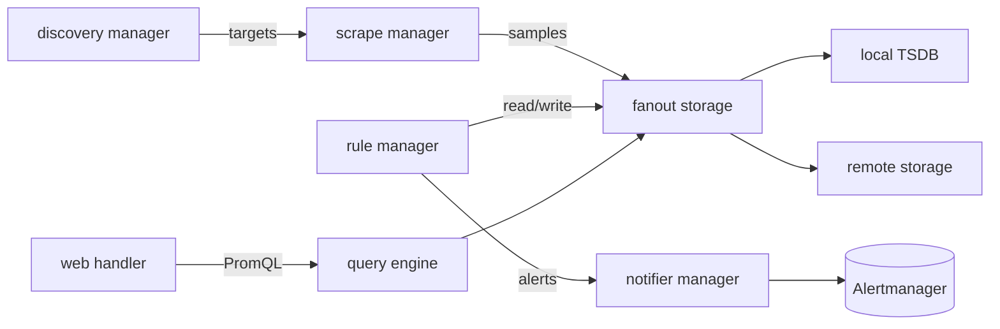

# アーキテクチャ

## 全体像

Prometheus サーバは、いくつかの長寿命コンポーネントを束ねる単一プロセスである。それらはすべて `cmd/prometheus/main.go` で生成・配線され、goroutine のライフサイクルは `oklog/run` の run group にまとめられる。各 `g.Add(...)` がコンポーネントの起動関数と停止関数を登録する (`cmd/prometheus/main.go:1232` 以降)。discovery manager がターゲットを発見し、scrape manager が pull し、TSDB がサンプルを保存し、PromQL engine がクエリし、rule manager がルールを評価し、notifier が Alertmanager へアラートを送る。

## コンポーネント

### discovery manager 群

ターゲット発見。scrape 用と notify (Alertmanager) 用の 2 つのマネージャがあり、いずれも `discovery.NewManager` で生成される (`cmd/prometheus/main.go:950`, `cmd/prometheus/main.go:956`)。サービスディスカバリプラグインは `discovery/` 配下にあり、Go の build tag でコンパイルに含めるかを切り替えられる (README:114-144)。

### scrape manager

discovery が生成したターゲットを受け取り、その HTTP メトリクスエンドポイントを一定間隔で pull する。`scrape.NewManager` で生成される (`cmd/prometheus/main.go:962`)。scrape ループとメトリクスパースは `scrape/` にある。

### storage

ローカルストアは TSDB で、`tsdb.Open` で開く (`cmd/prometheus/main.go:1620`、`openDBWithMetrics` でラップ)。remote write / remote read は `remote.NewStorage` を通る (`cmd/prometheus/main.go:917`)。fanout storage がローカルとリモートを 1 つの `storage.Storage` に合成し (`storage.NewFanout` @ `cmd/prometheus/main.go:918`)、システムの残りは単一の appender / querier だけを見る。

### PromQL engine と rule manager

クエリエンジンは PromQL を評価する。`promql.NewEngine` で生成される (`cmd/prometheus/main.go:1002`)。rule manager は recording / alerting ルールを評価し、fanout storage 経由で書き戻す。`rules.NewManager` で生成される (`cmd/prometheus/main.go:1004`)。

### notifier と web handler

notifier は発火したアラートを Alertmanager へ送る。`notifier.NewManager` で生成される (`cmd/prometheus/main.go:925`)。web handler は HTTP API と UI を提供する。`web.New` で生成される (`cmd/prometheus/main.go:1068`)。

## リクエストの流れ

1 回の scrape を端から端まで追う。

1. `scrapeLoop.run` がインターバルごとに発火し `scrapeAndReport` を呼ぶ (`scrape/scrape.go:1263`, `scrape/scrape.go:1346`)。
1. appender を取得し、トランザクション境界を defer で仕込む。成功時 `Commit`、失敗時 `Rollback` (`scrape/scrape.go:1362-1377`)。
1. HTTP で scrape し body を読む。バッファは pool から再利用する (`scrape/scrape.go:1408`, `scrape/scrape.go:1413`)。
1. body を `app.append(b, contentType, appendTime)` に渡す (`scrape/scrape.go:1446`)。失敗時は rollback し、空 scrape で stale marker を打つ。
1. 本処理は `scrapeLoopAppender.append`。content-type に応じたパーサを `textparse.New` で作り (`scrape/scrape.go:1595`, `scrape/scrape.go:1605`)、エントリをループ処理する (`scrape/scrape.go:1653`)。
1. サンプルは `appenderWithLimits` でラップした appender を通り、sample_limit / bucket_limit を強制する (`scrape/scrape.go:1643`)。
1. TSDB の `headAppender.Append` に到達する (`tsdb/head_append.go:434`)。series ref で series を引き、無ければ生成する (`tsdb/head_append.go:442`)。
1. `s.appendable(...)` が順序・OOO ウィンドウ・有効範囲を判定し、OK なら `record.RefSample` としてバッチに溜める (`tsdb/head_append.go:475`, `tsdb/head_append.go:497`)。
1. defer された `Commit` が WAL に書き、head chunk にバッチを反映する。

## 主要な設計判断

- **push ではなく pull。** Prometheus はターゲットを HTTP で scrape する。push は batch job 向けの中継ゲートウェイ経由に限定される (README:28-36)。これにより scraper からターゲットの健全性が見える。
- **自律した単一サーバ。** 分散ストレージに依存しない (README:28-33)。HA と長期保存はコアに組み込むのではなく、Thanos や Mimir のような外部システムを重ねて実現する (5)。
- **多次元モデル + PromQL。** メトリクス名と key/value ラベル、それを PromQL でクエリすることが、明言された中核の差別化要素である (README:26-35)。

## 拡張ポイント

- **サービスディスカバリプラグイン** (`discovery/` 配下)。Go の build tag でビルド時に選択する (README:114-144)。
- **remote write / remote read** (`remote.NewStorage` @ `cmd/prometheus/main.go:917`)。Thanos や Mimir などの下流システムが構築する統合面。
- **exporter とクライアントライブラリ**。別リポジトリにあり、非 Prometheus システムの公開とアプリの計装を担う。
