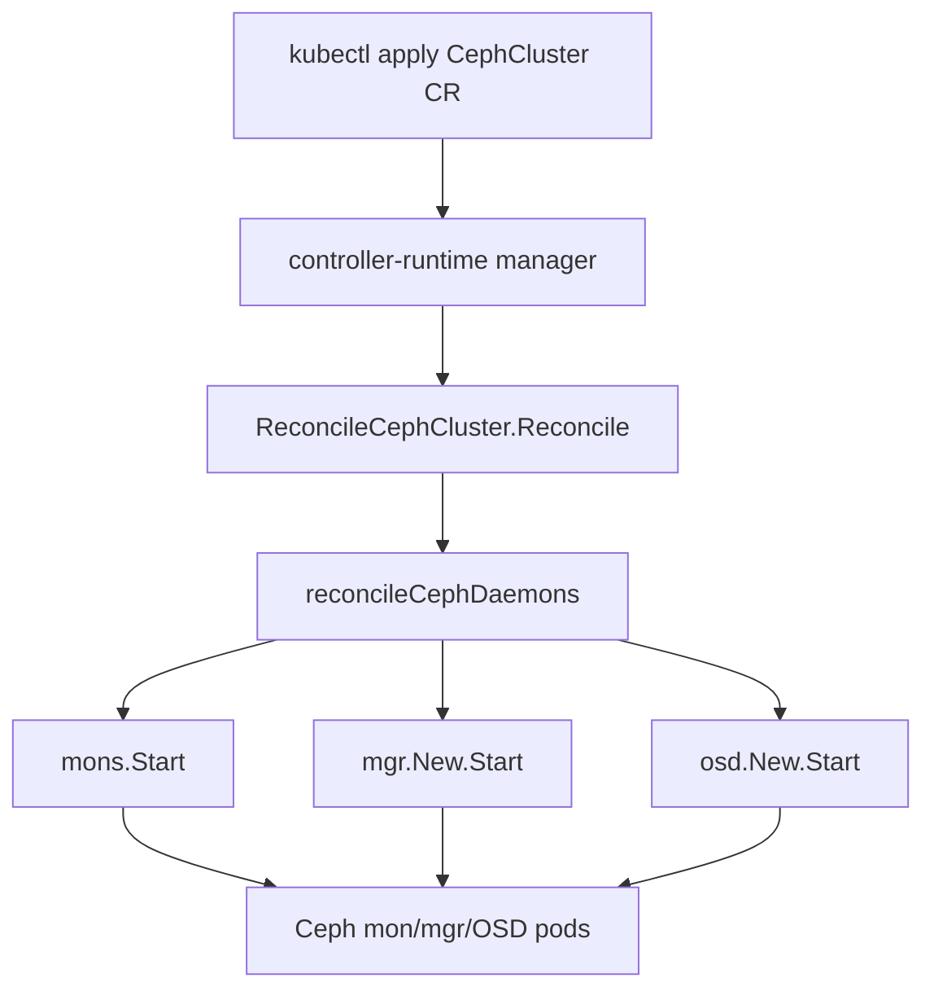

# アーキテクチャ

## 全体像

Rook は Kubernetes オペレータとして動く 1 つの Go バイナリである。リポジトリは CLI エントリの `cmd/` とロジックの `pkg/` に分かれ、`pkg/apis/ceph.rook.io/v1` が CRD の型を、`pkg/operator/ceph` がコントローラを持つ。`rook` バイナリは cobra でオペレータと pod 内ヘルパコマンド群を束ねており、`ceph operator` がオペレータ本体である (`cmd/rook/main.go:27`)。

オペレータはストレージのバイトを動かさない。カスタムリソースを watch し、各リソースに対応する Ceph デーモンを deploy・設定するコントロールプレーンである。データパスは Ceph と、オペレータが deploy する ceph-csi ドライバが担う。

## コンポーネント

### オペレータプロセス

`startOperator` がオペレータの context を組み立て、`New` 経由で `Operator` を生成し (`cmd/rook/ceph/operator.go:54`, `pkg/operator/ceph/operator.go:68`)、`Run` を呼ぶ (`pkg/operator/ceph/operator.go:85`)。`Run` は `runCRDManager` で controller-runtime manager を起動し、その後 OS シグナルを待つ無限ループでブロックする (`pkg/operator/ceph/operator.go:85`)。

### コントローラ群

リソースごとのコントローラは 1 か所で登録される。`AddToManagerFuncs` は pool・object・file・nfs・rbd・client・nvmeof・mirror・csi・bucket・cosi など 20 を超える `Add` 関数を並べる (`pkg/operator/ceph/cr_manager.go:75`)。CephCluster コントローラは `cluster.Add` で別途登録される (`pkg/operator/ceph/cr_manager.go:113`)。もう 1 つのリスト `AddToManagerFuncsMaintenance` は disruption 処理用のコントローラを持つ (`pkg/operator/ceph/cr_manager.go:70`)。

### Ceph デーモン

CRD ごとに 1 つのコントローラがあり、各々が自分のリソースを Ceph デーモン (monitor (mon)・manager (mgr)・object storage daemon (OSD)) へ翻訳する。Rook は Ceph の操作を再実装せず、デーモンを deploy し pod 内から Ceph mgr と CLI を呼び出してオーケストレーションする。

## リクエストの流れ

CephCluster の reconcile は端から端まで次のように動く。

1. controller-runtime が `ReconcileCephCluster.Reconcile` を呼ぶ。これは panic を捕捉するために `RecoverAndLogException` を defer し、結果を `reporting.ReportReconcileResult` で報告する (`pkg/operator/ceph/cluster/controller.go:311`)。
2. 内側の `reconcile` が `r.client.Get` で CephCluster を取得し (`pkg/operator/ceph/cluster/controller.go:329`)、`AddFinalizerIfNotPresent` で finalizer を付与し (`pkg/operator/ceph/cluster/controller.go:340`)、deletion timestamp があれば `reconcileDelete` へ分岐し (`pkg/operator/ceph/cluster/controller.go:351`)、`SkipReconcileLabelKey` ラベルがあれば処理をスキップする (`pkg/operator/ceph/cluster/controller.go:356`)。
3. `reconcileCephCluster` が namespace 単位の `*cluster` を取得または生成してオーケストレーションを実行する (`pkg/operator/ceph/cluster/controller.go:456`)。
4. `reconcileCephDaemons` が mon を起動し (`pkg/operator/ceph/cluster/cluster.go:117`)、クラスタ identity の確立を確認し (`pkg/operator/ceph/cluster/cluster.go:122`)、post-mon アクションを実行し、mgr を起動し (`pkg/operator/ceph/cluster/cluster.go:145`)、続いて OSD を起動し (`pkg/operator/ceph/cluster/cluster.go:160`)、stretch クラスタでは arbiter を設定する (`pkg/operator/ceph/cluster/cluster.go:167`)。

## 主要な設計判断

オペレータのリロードは粗い。`SIGHUP` を受けると個別の reconciler を更新せず、controller-runtime manager 全体を停止して `runCRDManager` で作り直す (`pkg/operator/ceph/operator.go:110`)。ログも明示的で、"reloading operator's CRDs manager, cancelling all orchestrations!" と出す (`pkg/operator/ceph/operator.go:111`)。これによりオペレータの設定 ConfigMap の変更が確実に全コントローラへ波及する一方、進行中のオーケストレーションはキャンセルされる。

## 拡張ポイント

主要な拡張面は `pkg/apis/ceph.rook.io/v1` の CRD 群である。管理者は CephCluster を作成し、続いて層ごとのリソース (CephBlockPool・CephFilesystem・CephObjectStore など) を作る。各々は `pkg/operator/ceph/cr_manager.go:75` で登録された専用コントローラが処理する。ストレージは標準的な Kubernetes インターフェースで消費される。ceph-csi ドライバが PersistentVolumeClaim を満たし、object store は S3 互換 API を公開する。
