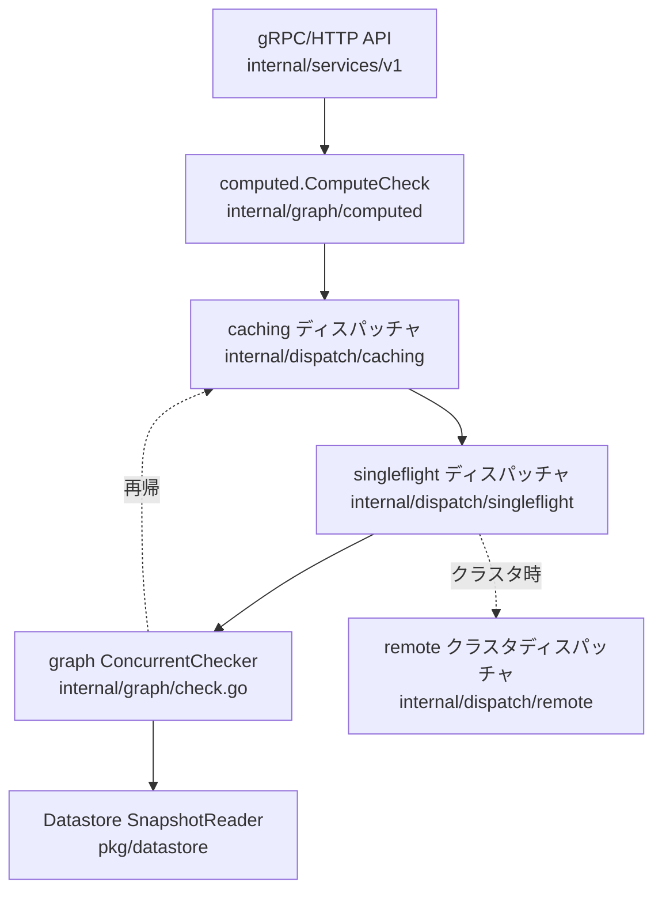

# アーキテクチャ

## 全体像

SpiceDB のノードは 4 つのレイヤを持つ。gRPC/HTTP API レイヤはリクエストを受け、スキーマに照らして検証する。ディスパッチレイヤは 1 つの権限問い合わせを多数の小さなサブチェックに分解し、キャッシュし、重複排除し、クラスタでは他ノードへファンアウトする。グラフレイヤが実際の関係グラフ探索を行う。データストアレイヤが特定リビジョンで関係とスキーマを読み書きする。バイナリのエントリポイントは `cmd/spicedb/main.go` で、cobra のコマンドツリーを構築し、その `serve` サブコマンドがサーバを起動する。

## コンポーネント

### API サービス

v1 gRPC サービスは `internal/services/v1/` にある: Permissions、Schema、Watch、Relationships。`permissions.go` が `CheckPermission` などを持つ。このレイヤはリクエストのリビジョンとスキーマを解決し、スナップショットリーダーを開き、グラフ処理に入る前に指定されたオブジェクト型と relation が存在するか検証する。

### ディスパッチレイヤ

`internal/dispatch/` が認可計算を分散する。これはチェーンである: `caching/` (サブチェック結果をメモ化)、`singleflight/` (同一の同時サブチェックを 1 本に束ねる)、そしてローカル探索なら `graph/`、クラスタへの再ディスパッチなら `remote/`。`combined/combined.go` がこのチェーンを組み立てる。ローカルグラフディスパッチャは caching ディスパッチャに配線で戻され、再帰的なサブチェックもキャッシュされる。

### グラフエンジン

`internal/graph/` が探索エンジンである: 権限チェックの `check.go`、relation をメンバへ展開する `expand.go`、逆引きの `lookupresources*.go` / `lookupsubjects.go`。`check.go` の `ConcurrentChecker` が中核で、タプルを直接読むか、userset rewrite (他の relation や権限を集合演算で組み合わせて権限を導くスキーマ規則。union、intersection、exclusion) を再帰的に評価する。

### データストア

`internal/datastore/` と `pkg/datastore/` が共通インターフェースを定義し、CockroachDB、PostgreSQL、MySQL、Spanner、インメモリ (`memdb`) のドライバと `proxy` を持つ。インターフェースは MVCC 的で、読み取りは明示的なリビジョンに対して行う。スキーマ DSL は `pkg/schema/` と `pkg/schemadsl/` (lexer、parser、compiler、generator)、中核データ構造は `pkg/tuple/` にある。

## リクエストの流れ

`CheckPermission` 呼び出しは次のように辿れる。

1. `(*permissionServer).CheckPermission` (`internal/services/v1/permissions.go:62`) が `consistency.RevisionFromContext` (`permissions.go:78`) でリビジョンとスキーマハッシュを解決し、スナップショットリーダーを開き (`permissions.go:83`)、Caveat コンテキストを組み立て (`permissions.go:85`。Caveats は関係に実行時条件を付けるユーザー定義の CEL 式で、コンテキストはその評価に使う値を供給する)、`namespace.CheckNamespaceAndRelations` (`permissions.go:95`) でオブジェクト型と relation を検証する。
2. `computed.ComputeCheck` (`permissions.go:124`) を呼び、`ResourceType = tuple.RR(objectType, permission)`、subject の ObjectAndRelation (ONR)、`MaximumDepth = config.MaximumAPIDepth` を渡す。
3. `computeCheck` (`internal/graph/computed/computecheck.go:89`) が深さに合わせた traversal bloom filter を生成し (`computecheck.go:113`)、resourceID をチャンク分割し (`computecheck.go:122`)、チャンクごとに `d.DispatchCheck` を呼び (`computecheck.go:123`)、bloom を `Metadata.TraversalBloom` に載せる (`computecheck.go:131`)。
4. ディスパッチチェーンが走る: キャッシュヒットなら即返す。なければ singleflight が実行中の重複チェックを束ね、クラスタ構成では他ノードへ再ディスパッチしうる。
5. ローカル探索は `(*ConcurrentChecker).Check` (`internal/graph/check.go:99`)、次いで `checkInternal` (`check.go:165`) で走る。まず subject に直接一致する resourceID をフィルタし (`filterForFoundMemberResource`、`check.go:192`)、userset rewrite が無ければ `checkDirect` (`check.go:304`) でタプルを読み、有れば `checkUsersetRewrite` (`check.go:539`) で再帰し、各子を `dispatch` (`check.go:561`) で再ディスパッチする。
6. 結果は `computeCaveatedCheckResult` (`computecheck.go:170`) で Caveat 評価され、API の permissionship 値に変換されて返る。

## 主要な設計判断

- **常に最新を読むのではなく、設定可能な consistency。** データストアは `OptimizedRevision` (レプリケート済みの可能性が高く低遅延) と `HeadRevision` (最新を保証) を `pkg/datastore/datastore.go:711` と `:715` で公開する。クライアントはリクエストごとに consistency レベルを選び、`ZedToken` (`pkg/zedtoken/zedtoken.go`) で「この過去の書き込み以降の鮮度」を要求して New Enemy 問題を避けられる。
- **キャッシュとファンアウトのチェーンとしてのディスパッチ。** caching、singleflight、ローカルグラフを 1 つの自己参照チェーンに組む (`internal/dispatch/combined/combined.go:201`、`:245`、`:318`) ことで、1 つのチェックが自然に複数ノードへ広がりつつ各サブ結果がメモ化される。
- **差し替え可能なデータストア。** 単一の `Datastore` インターフェース (`pkg/datastore/datastore.go`) により、同じエンジンが CockroachDB、PostgreSQL、MySQL、Spanner、インメモリで動く。Zanzibar の Spanner 前提をデプロイの柔軟性と引き換えにしている。

## 拡張ポイント

- **データストアドライバ**は `datastore.Datastore` インターフェース (`pkg/datastore/datastore.go`) を実装する。ストレージバックエンド追加の接合点であり (MySQL ドライバはこの形で寄贈された)。
- **Caveats** はスキーマ内のユーザー定義 CEL 式 (`pkg/caveats/`、`internal/caveats/`) で、関係に実行時条件を付ける。
- **Watch API** (`internal/services/v1/`) は関係変更を下流の利用者へリアルタイム配信する。
