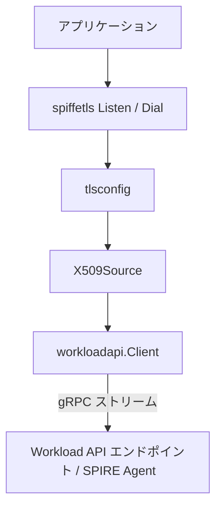

# アーキテクチャ

## 全体像

go-spiffe はクライアントライブラリなので、そのアーキテクチャはアプリケーションとローカルの Workload API エンドポイントの間に置かれるパッケージ群である。最下層に ID マテリアルをストリームする gRPC クライアントがある。その上に、最新の SVID とトラストバンドルをメモリに保持する型付きの source がある。さらにその上に、それらの source を Go の `crypto/tls` や gRPC に結線するヘルパがある。各パッケージは `github.com/spiffe/go-spiffe/v2` モジュールのリポジトリルート直下にある。

## コンポーネント

### spiffeid

`spiffeid.ID` と `spiffeid.TrustDomain` 型を持つ。`spiffe://` URI のパース・検証・マッチングを担う (`spiffeid/id.go`、`spiffeid/trustdomain.go`、`spiffeid/match.go`)。ライブラリの他のすべては、これらの型でワークロードを名付ける。

### svid と bundle

`svid/x509svid` と `svid/jwtsvid` は SVID 型と検証ロジックを持つ。`bundle/x509bundle`、`bundle/jwtbundle`、`bundle/spiffebundle` はトラストバンドル、つまりピア検証に使う信頼アンカーの集合を持つ。

### workloadapi

Workload API クライアント。低レベルの `Client` (`workloadapi/client.go`) が gRPC ストリームを開き、高レベルの `X509Source`・`JWTSource`・`BundleSource` が最新マテリアルを保持しローテーション時に再取得する (`workloadapi/x509source.go`、`workloadapi/watcher.go`)。

### spiffetls と spiffegrpc

`spiffetls` と `spiffetls/tlsconfig` は `Listen`/`Dial` ヘルパを提供し、source に結線した `tls.Config` を構築する。`spiffegrpc/grpccredentials` は gRPC 向けのトランスポートクレデンシャルを提供する。`federation/` はバンドルエンドポイント越しのトラストドメイン間の信頼を扱う。

## リクエストの流れ

mTLS サーバが自身の ID を立ち上げる流れを追う ([examples/spiffe-tls/server/main.go:35-39](https://github.com/spiffe/go-spiffe/blob/e9973f6314a3fa0e36eb1f00fbfe37bdc1554b96/examples/spiffe-tls/server/main.go#L35-L39)):

1. アプリが `MTLSServerWithSourceOptions(tlsconfig.AuthorizeID(clientID), ...)` 付きで `spiffetls.ListenWithMode` を呼ぶ。`tlsconfig` は `X509Source` を `tls.Config.GetCertificate` と `VerifyPeerCertificate` に結線する。
2. source の構築は `NewX509Source` ([workloadapi/x509source.go:31](https://github.com/spiffe/go-spiffe/blob/e9973f6314a3fa0e36eb1f00fbfe37bdc1554b96/workloadapi/x509source.go#L31)) を呼び、watcher を作る。初回更新が届くまでブロックする。
3. watcher が `WatchX509Context` を実行するバックグラウンド goroutine を起動する ([workloadapi/watcher.go:147-150](https://github.com/spiffe/go-spiffe/blob/e9973f6314a3fa0e36eb1f00fbfe37bdc1554b96/workloadapi/watcher.go#L147-L150))。
4. これが gRPC ストリーム `FetchX509SVID` ([workloadapi/client.go:552](https://github.com/spiffe/go-spiffe/blob/e9973f6314a3fa0e36eb1f00fbfe37bdc1554b96/workloadapi/client.go#L552)) を開き、`stream.Recv()` をループして各レスポンスを `X509Context` にパースする。
5. 各更新で source はロック下で新しい SVID とバンドルを差し替える ([workloadapi/x509source.go:102](https://github.com/spiffe/go-spiffe/blob/e9973f6314a3fa0e36eb1f00fbfe37bdc1554b96/workloadapi/x509source.go#L102))。TLS は `GetX509SVID` 経由で現在の SVID を読む ([workloadapi/x509source.go:63](https://github.com/spiffe/go-spiffe/blob/e9973f6314a3fa0e36eb1f00fbfe37bdc1554b96/workloadapi/x509source.go#L63))。

## 主要な設計判断

Workload API への接続は常に insecure な gRPC トランスポートで張られる ([workloadapi/client.go:519](https://github.com/spiffe/go-spiffe/blob/e9973f6314a3fa0e36eb1f00fbfe37bdc1554b96/workloadapi/client.go#L519))。これは意図的である。信頼境界はソケットそのものへの到達権であり、その上に被せる TLS ではない。エージェントは接続してくるプロセスを調べてワークロードをアテステーションするため、リンクはローカルでありファイルパーミッションで保護される。

すべての gRPC 呼び出しは `withHeader` 経由でメタデータ `workload.spiffe.io: true` を付与する ([workloadapi/client.go:661-664](https://github.com/spiffe/go-spiffe/blob/e9973f6314a3fa0e36eb1f00fbfe37bdc1554b96/workloadapi/client.go#L661-L664))。Workload API 仕様はこの security header を要求しており、サーバはこれを欠くリクエストを弾ける。

エンドポイントアドレスは環境変数 `SPIFFE_ENDPOINT_SOCKET` から来る ([workloadapi/addr.go:13](https://github.com/spiffe/go-spiffe/blob/e9973f6314a3fa0e36eb1f00fbfe37bdc1554b96/workloadapi/addr.go#L13))。`TargetFromAddress` ([workloadapi/addr.go:31](https://github.com/spiffe/go-spiffe/blob/e9973f6314a3fa0e36eb1f00fbfe37bdc1554b96/workloadapi/addr.go#L31)) がそれを gRPC ターゲットへパースし、TCP アドレスまたは Unix ドメインソケットを受け付ける。Windows の named pipe 対応はプラットフォーム固有のファイルにある。

## 拡張点

`X509Source` は複数の SVID から選ぶ picker 関数を受け取り、無指定なら先頭を選ぶ。`tlsconfig` はどのピア SPIFFE ID を許可するか決める `Authorizer` 値 (例: `AuthorizeID`) を公開する。`exp/` ツリーは WIT-SVID のような実験的フォーマットを、安定化前に第三者が試せるよう staging する。
