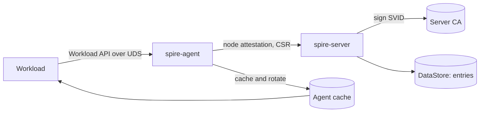

# アーキテクチャ

## 全体像

SPIRE は 2 つのバイナリだ。`spire-server` は 1 つの信頼ドメインの認証局で、ノードを attest し、登録エントリを保持し、SVID を署名する。`spire-agent` は各ノードで動き、ノード attestation でサーバから自身のアイデンティティを取得し、その後ローカルのワークロードに Unix domain socket 経由でアイデンティティを配る。両バイナリともほぼすべての機能をプラグイン catalog (`pkg/common/catalog/`) を通すので、attestation・鍵管理・upstream authority は差し替え可能だ。agent は SVID を事前にキャッシュ・ローテーションするため、ワークロードのリクエストはサーバへの往復ではなくローカルキャッシュから応答される。

## コンポーネント

### spire-server

信頼ドメインの CA。エントリポイントは `cmd/spire-server/main.go` で、`entrypoint.NewEntryPoint(new(cli.CLI).Run).Main()` により CLI に委譲する。ノードを attest し、登録エントリを datastore に保存し、ワークロード SVID を署名する。CA の署名面は `pkg/server/ca/ca.go:335` (`SignWorkloadX509SVID`)。server 側のプラグインファミリは `pkg/server/plugin/` 配下: `nodeattestor`・`upstreamauthority`・`keymanager`・`bundlepublisher`・`credentialcomposer`・`notifier`。

### spire-agent

各ノードで動く。エントリポイントは `cmd/spire-agent/main.go` で、同じく薄い CLI 委譲。ノード attestation で自身の SVID を取得し、Unix domain socket 上に Workload API を公開する。agent の manager はキャッシュをワークロード更新に購読させ (`pkg/agent/manager/manager.go:258`)、SVID rotator がサーバクライアント経由で証明書を更新する (`pkg/agent/svid/rotator.go` の `RenewSVID`)。agent 側のプラグインファミリは `pkg/agent/plugin/` 配下: `nodeattestor`・`keymanager`・`svidstore`・`workloadattestor`。

### プラグイン catalog

全機能がプラグイン化されている。catalog の実装は `pkg/common/catalog/` (`catalog.go`・`builtin.go`・`bind.go`)。ビルトインプラグインも外部プラグイン (HashiCorp go-plugin 経由で読み込む) も同じ catalog インターフェースを実装するので、読み込みパスは統一されている。

## リクエストの流れ

ワークロードが X509-SVID を取得する流れを端から端まで追う。

1. ワークロードが UDS 上で streaming RPC `FetchX509SVID` を呼ぶ。ハンドラは `pkg/agent/endpoints/workload/handler.go:251`。リクエスト body は空でクレデンシャルを渡さない。
2. ワークロード attestation。ハンドラは `handler.go:256` で `h.c.Attestor.Attest(ctx)` を呼ぶ。呼び出し元の PID は接続そのものから取る。SPIRE は UDS の peer credential をカーネルから読み、Linux では `SO_PEERCRED` で `unix.GetsockoptUcred` を使い (`pkg/common/peertracker/uds_linux.go:10`)、BSD/macOS では `LOCAL_PEERPID` を使う (`pkg/common/peertracker/uds_bsd.go:13`)。
3. attestor 本体は `pkg/agent/attestor/workload/workload.go:49` (`Attest(ctx, pid)`)。catalog からワークロード attestor プラグイン群を取り、各プラグインを goroutine で動かして PID からセレクタを集める (`workload.go:55-87`)。全プラグインが失敗したときだけエラーを返す (`workload.go:89-91`)。
4. レート制限。`handler.go:262` で `h.rateLimit(ctx, MethodFetchX509SVID, selectors)`。agent 自身の呼び出し (health check など) は `handler.go:86` の `isAgent(ctx)` で免除される。
5. キャッシュ購読。`handler.go:266` で `h.c.Manager.SubscribeToCacheChanges(ctx, selectors)`。manager はこれを `m.cache.SubscribeToWorkloadUpdates` にマップする (`pkg/agent/manager/manager.go:258`)。SVID はリクエストごとにサーバから取得するのではなく、manager が事前にキャッシュ・ローテーションしてある。
6. ストリーミングループ (`handler.go:273-283`) は `subscriber.Updates()` でキャッシュ更新を受け、`filterIdentities` でこの呼び出し元の identity だけ残し、`sendX509SVIDResponse` でチェーンと鍵を書き込む。`ctx.Done()` で終了する。SVID がローテーションされると、新しいものは poll ではなく開いたままの stream に push される。

サーバ側の署名はこのループの外で起きる。agent の rotator がローカルで鍵ペアを生成し、CSR をサーバに送る (`pkg/agent/svid/rotator.go`)。サーバ CA は公開鍵だけを受け取り、テンプレートを組んで署名し、生成された SPIFFE ID を検証する (`pkg/server/ca/ca.go:341-358`)。

## 主要な設計判断

- **ワークロードはクレデンシャルを出さない。** アイデンティティはカーネルが検証したプロセスのメタデータ (`SO_PEERCRED` で取った PID、そこから導いた uid/gid/コンテナ ID) だけから導出される。ブートストラップシークレットが存在しないので、シークレットの配布・ローテーション問題そのものが消える。
- **秘密鍵がノードを出ない。** agent (または store 経由のワークロード) がローカルで鍵ペアを生成し、CSR だけを送る。サーバ CA は署名時に `params.PublicKey` のみを参照する (`pkg/server/ca/ca.go:347`)。サーバはワークロードの秘密鍵を握らない。
- **二要素 attestation。** ノード attestation (agent がプラットフォーム証跡で自身を証明) とワークロード attestation (プロセス属性) が階層を作り、エントリの `ParentId` がノードに、`Selectors` がワークロードに対応する。
- **poll ではなくキャッシュ + push。** agent は失効前に SVID をローテーションし、開いた stream に更新を push するので、ワークロードはリクエストごとのサーバ往復を避けられる。

## 拡張ポイント

プラグインファミリが拡張面だ。server 側: `nodeattestor`・`upstreamauthority`・`keymanager`・`bundlepublisher`・`credentialcomposer`・`notifier` (`pkg/server/plugin/`)。agent 側: `nodeattestor`・`keymanager`・`svidstore`・`workloadattestor` (`pkg/agent/plugin/`)。プラグインはビルトインとしてコンパイルするか、外部プロセスとして同じ catalog インターフェース経由で読み込める (`pkg/common/catalog/`)。
