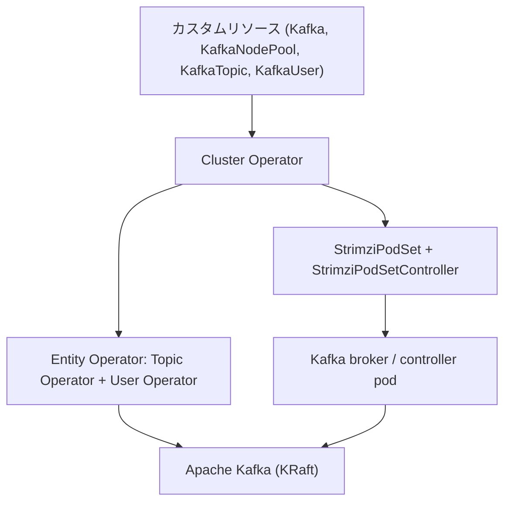

# アーキテクチャ

## 全体像

Strimzi は Maven のマルチモジュールプロジェクトである。トップレベルのモジュールは、API モデル、それを操作する Operator 群、Kafka コンテナ内で動く補助エージェントにきれいに分かれる。`api/` モジュールがカスタムリソースを定義し、Operator モジュールがそれを reconcile し、`operator-common/` が共有の reconcile 機構を持つ。



## コンポーネント

### api

CRD と API モデルを Java POJO として定義する: `Kafka`、`KafkaNodePool`、`KafkaTopic`、`KafkaUser`、`KafkaConnect`、`KafkaMirrorMaker2`、`KafkaBridge`、`KafkaRebalance`、`StrimziPodSet`。CRD はこれらの型から `crd-generator/` が生成する。トップレベルの `Kafka` 型は Fabric8 の `CustomResource` を継承する (`api/src/main/java/io/strimzi/api/kafka/model/kafka/Kafka.java:82`)。

### cluster-operator

中核の Operator。Kafka クラスタ本体と周辺コンポーネント (Cruise Control、Kafka Exporter、Entity Operator) を reconcile する。Fabric8 Kubernetes Client `7.7.0` (`pom.xml:75`) に依存し、非同期実行モデルとして Vert.x を使う。

### topic-operator と user-operator

`topic-operator/` は `KafkaTopic` リソースを Kafka 上のトピックに反映し、独自の `Main.java` を持つ。`user-operator/` は `KafkaUser` リソースを Kafka のユーザ、ACL、TLS 証明書に反映する。Cluster Operator は両者を Entity Operator としてデプロイする。

### operator-common

共有ユーティリティ。`Reconciliation` コンテキスト (`operator-common/src/main/java/io/strimzi/operator/common/Reconciliation.java`) と、各モジュールで使う Fabric8 ベースの resource operator 群。

### コンテナ内エージェントと certificate-manager

`kafka-init/`、`kafka-agent/`、`tracing-agent/` は Kafka コンテナ内で動き、rack 設定、broker のメトリクスと設定、OpenTelemetry トレースを担う。`certificate-manager/` はプロジェクト自前の CA と TLS 証明書を管理する。

## リクエストの流れ

`Kafka` の reconcile は `KafkaAssemblyOperator.createOrUpdate` (`cluster-operator/src/main/java/io/strimzi/operator/cluster/operator/assembly/KafkaAssemblyOperator.java:156`) から始まる。mutable な `ReconciliationState` を作り、`reconcile(reconcileState)` (`KafkaAssemblyOperator.java:231`) が各ステップを Vert.x Future でチェーンする:

```text
initialStatus
  -> reconcileCas (clusterCa / clientsCa)
  -> emitCertificateSecretMetrics
  -> versionChange (Kafka / metadata バージョン変更の判定)
  -> reconcileKafka          (broker / controller pod 群)
  -> reconcileCruiseControl
  -> reconcileEntityOperator (topic + user operator)
  -> reconcileKafkaExporter
  -> reconcileKafkaAutoRebalancing
```

`reconcileKafka` は `KafkaReconciler.reconcile(KafkaStatus, Clock)` (`cluster-operator/src/main/java/io/strimzi/operator/cluster/operator/assembly/KafkaReconciler.java:250`) を呼ぶ。これも Future チェーンで、desired state を順に収束させる: network policy、PVC、RBAC、listeners、broker ごとの config map、そして `podSet()` で pod を作り、`rollingUpdate(podSetDiffs)` で必要な broker だけを再起動する。

これらすべての土台が `AbstractOperator` の共通骨格である。public な `reconcile(Reconciliation)` (`cluster-operator/src/main/java/io/strimzi/operator/cluster/operator/assembly/AbstractOperator.java:181`) はリソースごとにロックを取り、`reconcileResource` (`AbstractOperator.java:211`) に振り分ける。ここで label 不一致なら skip し、`strimzi.io/pause-reconciliation` アノテーションを尊重し、それ以外は具象クラスの `createOrUpdate` を呼ぶ。

## 主要な設計判断

最も影響の大きい判断は、Kafka pod に Kubernetes の StatefulSet を使わないことである。独自 CRD `StrimziPodSet` を定義し、自前の `StrimziPodSetController` (`cluster-operator/src/main/java/io/strimzi/operator/cluster/operator/assembly/StrimziPodSetController.java:60`) を動かす。これにより、ローリング更新の順序制御、個別 pod の操作、broker ごとの設定とストレージの適用、KRaft の controller/broker 混在ロールの管理を Operator 側で完全に握れる。StatefulSet ではどれもきれいには扱えない。詳細は内部実装ページで追う。

Operator は active/passive の HA である。Kubernetes Lease ベースのリーダー選出を使い、リーダーでなくなったレプリカは exit してコンテナが再起動する (`cluster-operator/src/main/java/io/strimzi/operator/cluster/Main.java:230`)。reconcile は watch によるイベント駆動と定期 resync の両輪で、各ステップは冪等だ。desired state を計算して差分を適用する。

## 拡張ポイント

カスタムリソース自体が拡張面である。コネクタとレプリケーションの `KafkaConnect` と `KafkaMirrorMaker2`、HTTP-Kafka の `KafkaBridge`、Cruise Control リバランスの `KafkaRebalance`、broker/controller のグループを定義する `KafkaNodePool`。認証は OAuth と OIDC に、TLS は cert-manager に連携する。
