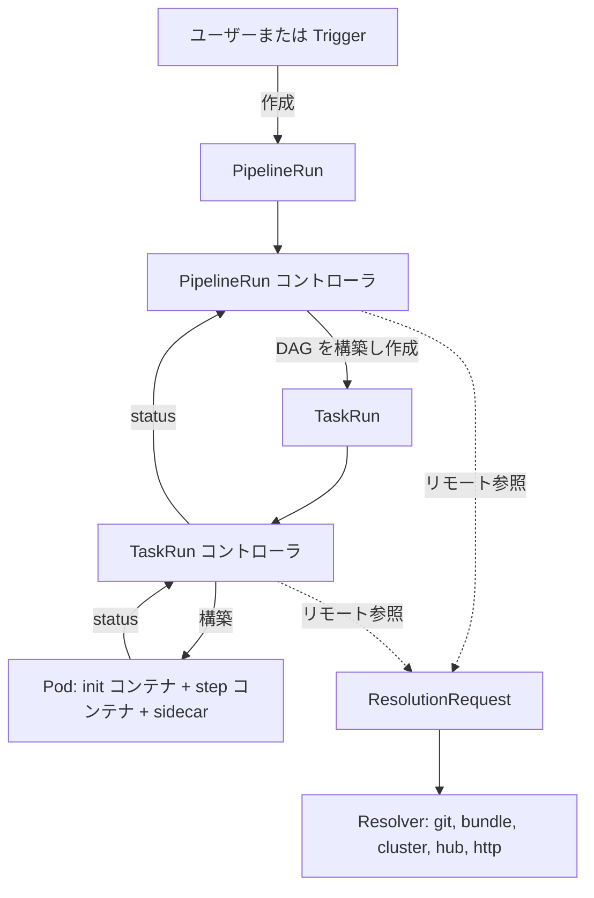

# アーキテクチャ

## 全体像

Tekton の実体は、いくつかのカスタムリソース定義と、それらを Pod に変えるコントローラ群。実行モデルに変わったところは無い。`TaskRun` は Pod になり、`PipelineRun` は複数の `TaskRun` になり、スケジューリングは Kubernetes がやる。面白いのは、Kubernetes が Tekton の必要とする動きをしてくれない 2 か所、つまり Pod の中で step を順番に走らせることと、クラスタに存在しない定義を取ってくることだ。

## コンポーネント

### CRD

`config/300-crds/` が 8 つのカスタムリソース定義を入れる。

| CRD | 保持するもの |
| --- | --- |
| `Task` | 順序付きの step の並び。step はコンテナイメージとコマンドの組 |
| `TaskRun` | `Task` の 1 回の実行。ちょうど 1 つの Pod に対応する |
| `Pipeline` | タスクとその依存関係の集合 |
| `PipelineRun` | `Pipeline` の 1 回の実行。`TaskRun` を作る |
| `StepAction` | 単一の再利用可能な step。`Task` から参照する |
| `CustomRun` | Tekton 以外のコントローラに実行を委ねる |
| `ResolutionRequest` | クラスタ外から定義を取得する要求 |
| `VerificationPolicy` | 取得した定義に対する署名検証ルール |

### コントローラとバイナリ

`cmd/` は 8 つのバイナリをビルドする。常駐する Deployment になるのは 3 つで、`controller` (reconciler 群)、`webhook` (検証・デフォルト値の付与・API バージョン間の変換)、`resolvers` (リモート解決)。残りはユーザーの Pod に注入される。`entrypoint` (step の直列化。[内部実装](./internals) で扱う)、`sidecarlogresults`、`nop`、`workingdirinit`。

reconciler は `knative.dev/pkg` の Knative コントローラフレームワークの上に載っている。Knative の中で生まれたプロジェクトであることの名残り。

### Resolver

`pkg/resolution/resolver/` に `git`、`bundle` (OCI アーティファクト)、`cluster` (別の名前空間)、`hub` (Artifact Hub)、`http` の実装があり、`framework` パッケージを共有する。リモート参照された `Task` や `Pipeline` は、実行開始前にクラスタ内へ登録されている必要が無い。コントローラが `ResolutionRequest` を作り、resolver がそれを満たす。`VerificationPolicy` を使えば結果に署名を要求できる。

## リクエストの流れ

`PipelineRun` の作成からコンテナが動き出すまでを追う。

PipelineRun コントローラが `pkg/reconciler/pipelinerun/pipelinerun.go:191` (`ReconcileKind`) で拾う。`:390` (`resolvePipelineState`) で pipeline の定義と、そこが名指しするすべてのタスク参照を解決する。ローカルからでも resolver 経由でもよい。本体は `:545` (`reconcile`) で、依存グラフを組んでから `:989` (`runNextSchedulableTask`) で「今なにを流せるか」を問い合わせる。流せるタスクごとに `:1315` (`createTaskRuns`) で `TaskRun` を、`:1477` で `CustomRun` を、そしてパイプラインのタスクが別のパイプラインを参照している場合は `:1134` (`createChildPipelineRuns`) で子の `PipelineRun` を作る。

グラフ自体は小さく読みやすい。`pkg/reconciler/pipeline/dag/dag.go:73` (`Build`) が `runAfter` の宣言とタスク間の result 参照からグラフを組む。他タスクの result を消費すること自体が依存関係だからだ。`:135` (`findCyclesInDependencies`) が実行前に循環を弾く。`:103` (`GetCandidateTasks`) が先行タスクをすべて終えたノードを返し、`pkg/reconciler/pipelinerun/resources/pipelinerunstate.go:459` (`DAGExecutionQueue`) がそれを reconciler の扱うキューに変える。

独立したスケジューラのプロセスは無い。reconcile が回るたびに、現在の status に対してグラフ全体を評価し直し、いま実行可能になったものを作る。

続いて TaskRun コントローラが `pkg/reconciler/taskrun/taskrun.go:137` (`ReconcileKind`) で引き取る。`:531` (`prepare`) でタスクを解決・検証し、`:729` (`reconcile`) が本体、`:1082` (`createPod`) で Pod を作る。実際の組み立ては `pkg/pod/pod.go:166` (`Builder.Build`) に委譲される。この builder が step をコンテナに、workspace をボリュームに変え、[内部実装](./internals) で説明する entrypoint の書き換えを行う場所でもある。

## 主要な設計判断

**TaskRun 1 つに Pod 1 つ。** これで隔離が手に入り、配置の責任は Kubernetes のスケジューラに移る。step が Pod のファイルシステムを共有するので、タスク内のデータ受け渡しは無料になる。代償として、タスクの境界を越えるものはすべて workspace、実際には永続ボリュームを必要とする。現実のパイプラインで摩擦の主因になるのはここで、trusted artifacts をめぐる設計議論が続いている理由でもある [1]。

**result は Pod の termination message に乗る。** タスクが値を返す仕組みは [内部実装](./internals) で扱うが、アーキテクチャ上の帰結は、result が設計上小さいものであり、それを超える量のために Tekton が別の仕組みを足さざるを得なかったということ。

**API の安定度はビルドではなく実行時のフラグ。** `enable-api-fields` は ConfigMap から読まれてクラスタ全体に効き、既定は `beta` (`pkg/apis/config/feature_flags.go:73`)。alpha の機能はどのインストールにも存在していて、クラスタ管理者が有効にしない限り単に拒否されるだけ。

**定義はクラスタ内に無くてよい。** リモート解決により、パイプラインが git のリビジョンや署名済み OCI アーティファクトを参照できる。1 つのカタログが多数のクラスタに使えるのはこのため。

## 拡張ポイント

- **`CustomRun`**: パイプラインのタスクが Tekton の実装していない `kind` を名指しでき、サードパーティのコントローラがそれを実行する。Pod ではない処理を Tekton のパイプラインに入れる手段。
- **Resolver**: `pkg/resolution/resolver/framework` が文書化されたインタフェースになっていて、組織独自のタスク定義の供給元を足せる。
- **`StepAction`**: 個々の step を、タスク間でコピーされるものではなく、参照可能でバージョン付きのオブジェクトにする。
- **Sidecar**: タスクの実行中ずっと step の隣で動くコンテナ。ビルドが必要とするレジストリやデータベースのようなサービス向け。
- **Tekton ファミリの残り**: Triggers が webhook から実行を作り、Chains が完了した実行を監視して出力に署名し、Results がそれを保管する。いずれも同じ CRD を読む別のコントローラ。
