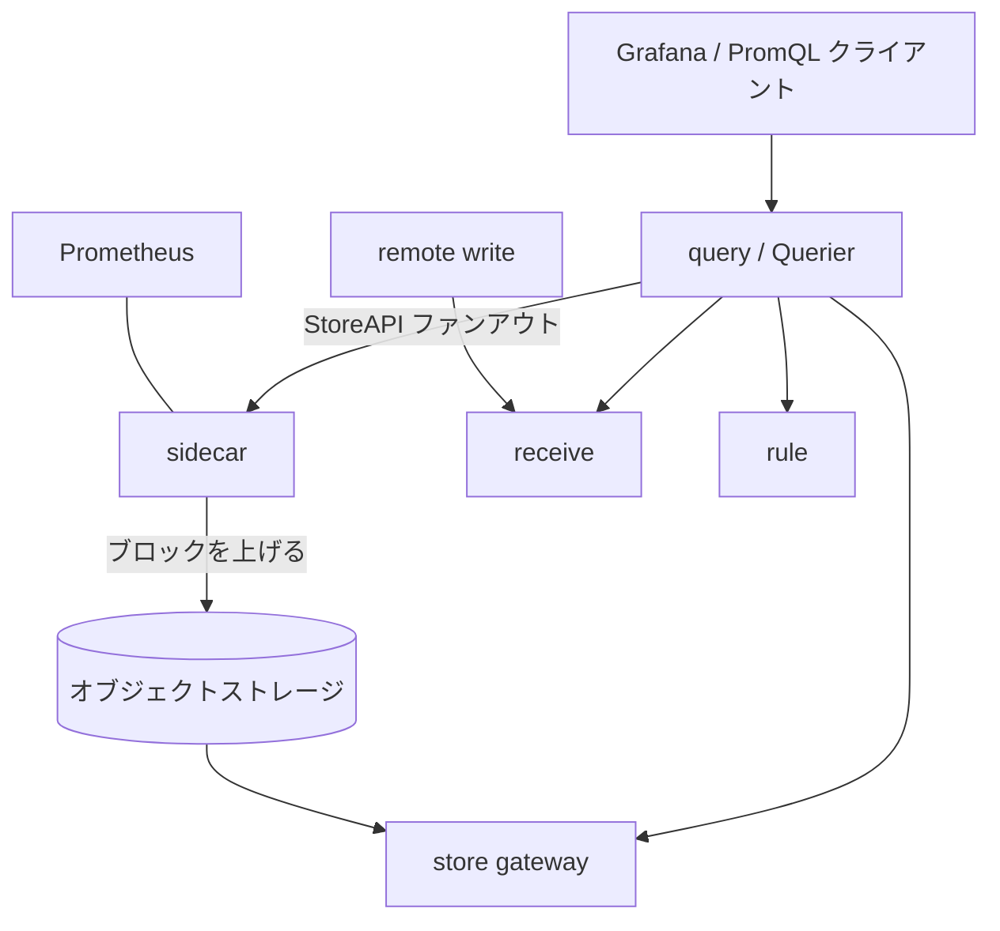

# アーキテクチャ

## 全体像

Thanos は 1 つのバイナリを複数の役割として動かす。一部の役割はメトリクスデータを持ち、gRPC の StoreAPI を実装する (`pkg/store/storepb/rpc.proto:26`)。1 つの役割である Querier はデータを持たず、代わりにクエリを全データソースへファンアウトして結果をマージする。統一する抽象は、Querier から見ると全データソースが同じに見えることだ。つまり sidecar、store gateway、receive、ruler、さらに別の Querier が、1 つのインターフェースの裏で交換可能になる。

## コンポーネント

### sidecar

Prometheus サーバーの隣で動く。完了した TSDB ブロックを shipper 経由でオブジェクトストレージに上げ (`pkg/shipper/shipper.go:344`)、Prometheus の最近のインメモリデータを StoreAPI で公開する。サブコマンドは `cmd/thanos/main.go:56-63` で登録される。

### store gateway

オブジェクトストレージにある過去のブロックを StoreAPI で返す。ブロックリーダは `BucketStore` (`pkg/store/bucket.go:384`) で、外部ライブラリ `thanos-io/objstore` からブロックを読む。

### query (Querier)

ファンアウトとマージのエンジン。PromQL と StoreAPI を実装するが、自身はデータを持たない。下流の StoreAPI エンドポイントを発見してそれらの系列をマージする。実装は `pkg/store/proxy.go:84` の `ProxyStore`。

### receive

push パス。Prometheus の remote-write を受け、系列をローカルに保存する。スクレイプできないソース向け。パッケージは `pkg/receive/`。

### compact

オブジェクトストレージのブロックに対してコンパクションとダウンサンプリングを行い、長期間レンジのクエリを高速に保つ。パッケージは `pkg/compact/` と `pkg/compactv2/`。

### rule, query-frontend

`rule` は recording / alerting ルールを評価し、それ自身が StoreAPI ソースになる。`query-frontend` (`pkg/queryfrontend/`) は Querier の前段でクエリを分割・キャッシュする。

## リクエストの流れ

PromQL クエリは Querier に届き、その StoreAPI 入口は `ProxyStore.Series` (`pkg/store/proxy.go:277`) だ。

1. `pkg/store/proxy.go:287` でリクエストの外部ラベルセレクタを設定済み selector ラベルと突き合わせる。無関係なら早期 return。
2. `pkg/store/proxy.go:302-309` で gRPC metadata からテナント情報を取り出し、マルチテナント用に outgoing context へ再付与する。
3. `pkg/store/proxy.go:312` で時間範囲とマッチャから対象ストアを絞る。0 件なら早期 return。
4. `pkg/store/proxy.go:319-333` で下流向けの `SeriesRequest` を組み直し、外部ラベルをマッチャに畳み込み、shard 情報と `WithoutReplicaLabels` を引き継ぐ。
5. `pkg/store/proxy.go:357` で `newAsyncRespSet` により各ストアへ非同期ストリームを 1 本ずつ開始する。失敗時は partial-response 戦略に従って警告送出か abort。
6. `pkg/store/proxy.go:376` で `NewProxyResponseLoserTree` により全ストリームを loser tree に載せる。dedup 有効なら `pkg/store/proxy.go:378` で `ResponseDeduplicator` に包む。
7. `pkg/store/proxy.go:382-397` で `r.Limit` を尊重しつつグローバルソート順に系列を取り出し、`srv.Send` で各々送出する。`pkg/store/proxy.go:400` で残りのバッファ済み系列を flush する。

## 主要な設計判断

- **ファンインでは重複除去しない。** `NewProxyStore` の doc コメントは、dedup は PromQL 直前の最上位でだけ行うべきと明言する (`pkg/store/proxy.go:160-161`)。プロキシは最上位オプションが有効なときだけ重複除去する (`pkg/store/proxy.go:377-379`)。これにより多段の federated クエリ層で重複除去が繰り返されるのを避ける。
- **loser-tree による k-way merge。** 多数のストアからのソート済みストリームを、全てをメモリに展開せずトーナメント木でマージする (`pkg/store/proxy_merge.go:197`)。マージの比較回数とメモリを抑える。
- **1 つの再帰的な StoreAPI 抽象。** Querier 自身も StoreAPI サーバーなので、federated な多段クエリは特別なモードではなく組み込みの性質になる。`rpc.proto` のコメントも、これが federated クエリでのリソース使用を最適化すると述べる (`pkg/store/storepb/rpc.proto:35`)。

## 拡張ポイント

- **StoreAPI** (`pkg/store/storepb/rpc.proto:26`): `Series` ストリーミング RPC を実装する任意のコンポーネントを Querier から問い合わせられる。
- **オブジェクトストレージ**: 外部ライブラリ `thanos-io/objstore` 経由で差し替え可能なバックエンド (S3、GCS、Azure、Swift、Tencent COS)。
- **`Client` インターフェース** (`pkg/store/proxy.go:52`): Querier が全下流コンポーネントを束ねる共通型。
