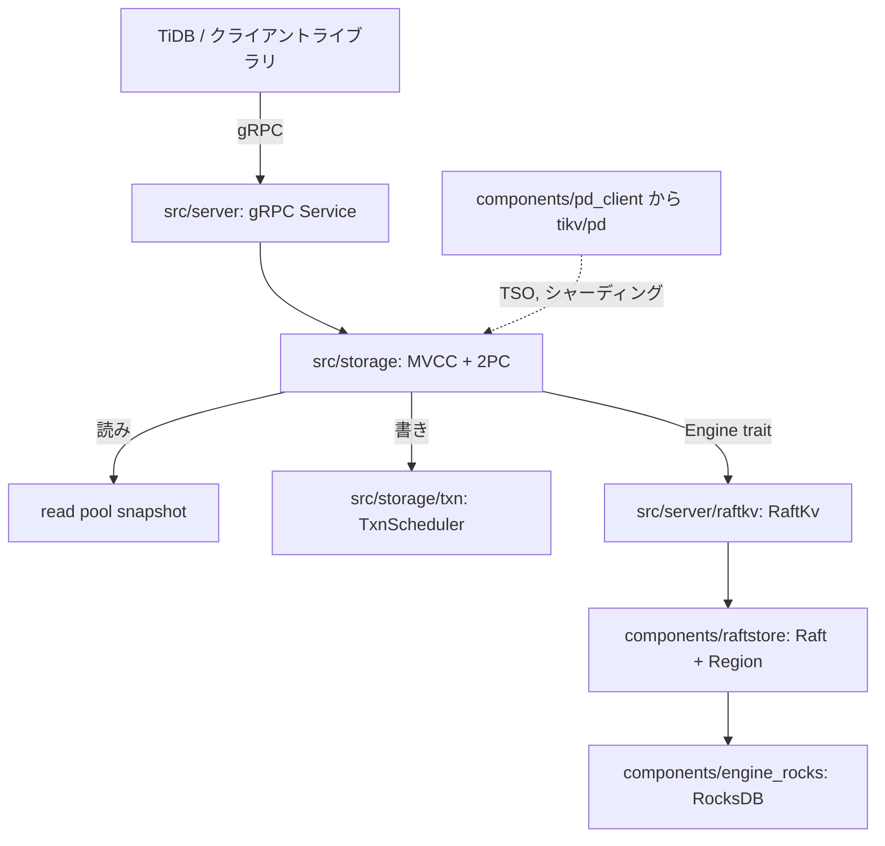

# アーキテクチャ

## 全体像

TiKV ノードは層の積み重ねである。gRPC サーバが TiDB やクライアントライブラリからのリクエストを受ける。その下にトランザクションストレージ層があり、MVCC と Percolator の 2 フェーズコミットを実装する。この層が永続化に到達するのは `Engine` トレイト経由のみで、本番実装は書き込みを Raft 経由で RocksDB に裏打ちされた複製ステートマシンへ送る。別プロセスの Placement Driver (`tikv/pd`) が Region を追跡し、タイムスタンプを発行する。リポジトリは `components/` 配下に 70 以上のクレートを持つ Rust ワークスペースで、サーババイナリは `cmd/tikv-server/src/main.rs` にある。

## コンポーネント

### gRPC サーバ

server クレートはクライアントとのネットワーク境界を担う。リクエストハンドラは `handle_request!` マクロで生成される。例えば `kv_get` が `future_get` にディスパッチする (`src/server/service/kv.rs:339`)。ここが TiDB と `client-rust` のトラフィックがノードに入る場所である。コードは `src/server/` にある。

### トランザクションストレージ層

`src/storage/` は MVCC とトランザクションの層である。`Storage<E, L, F>` (`src/storage/mod.rs:197`) がファサードで、エンジン・トランザクションスケジューラ・read pool・concurrency manager を保持する。MVCC のエンコード/デコードは `src/storage/mvcc/` に、トランザクションコマンドの処理は `src/storage/txn/` にある。この層が Percolator 方式の 2 フェーズコミットを実装する。

### エンジン抽象と RocksDB

`components/engine_traits/` がストレージ抽象を定義し、`components/engine_rocks/` が RocksDB 実装である。`engine_panic` などのダミー実装があり、層を差し替えられる。データは 4 つの RocksDB Column Family に分かれ、`components/engine_traits/src/cf_defs.rs:4` で命名されている。`default` が実データ、`lock` が Percolator のロック、`write` がコミット記録、`raft` が Raft ログとメタである。

### Raftstore

`components/raftstore/` (および `components/raftstore-v2/`) が Raft コンセンサスと Region 管理を peer・apply・store のステートマシンで実装する。ここで propose された書き込みは多数派に複製され、commit され、ステートマシンに apply される。

### Placement Driver クライアントとトランザクション型

`components/pd_client/` が Placement Driver と通信し、auto-sharding・Region リバランス・タイムスタンプ (TSO) 発行を委譲する。`components/txn_types/` がトランザクション基本型 `Key`・`Value`・`Lock`・`Write`・`TimeStamp` を持つ。`components/concurrency_manager` がインメモリのロックテーブルと `max_ts` を持ち、async-commit と 1PC の正しさを担保する。

## リクエストの流れ

ある `start_ts` でのトランザクション読み取り (`kv_get`):

1. gRPC の `kv_get` ハンドラが `handle_request!` 経由で `future_get` にディスパッチする (`src/server/service/kv.rs:339`)。関数本体は `src/server/service/kv.rs:1614`。
2. `Storage::get` (`src/storage/mod.rs:610`) が `get_entry` (`src/storage/mod.rs:625`) を呼び、処理を read pool スレッドへ spawn する。
3. `prepare_snap_ctx` (`src/storage/mod.rs:694`) が concurrency manager のインメモリロックを確認し、`bypass_locks` を考慮する。ここで `max_ts` などの並行性制御が効く。
4. エンジンのスナップショットを取得する (`src/storage/mod.rs:702`)。`Engine` トレイト経由で `RaftKv::async_snapshot` (`src/server/raftkv/mod.rs:653`) に入り、LocalReader のリース読み / read-index で Raft ログを書かずに線形化可能読みを保つ。
5. `SnapshotStore::new(...)` を構築し (`src/storage/mod.rs:713`)、`PointGetter::get_entry` (`src/storage/mvcc/reader/point_getter.rs:188`) が MVCC ロジックを実行する。`write` CF を `commit_ts <= start_ts` で逆向きにシークし、見つけた `start_ts` で `default` CF から実データを引く。

書き込みは read pool ではなくスケジューラを通る。`Storage::sched_txn_command` (`src/storage/mod.rs:1861`) がコマンドを検証し (Prewrite は `src/storage/mod.rs:1874`)、`TxnScheduler` (`src/storage/txn/scheduler.rs:422`) が key 単位の latch を取得して (`src/storage/txn/scheduler.rs:404`) コマンドを実行し、生成された変更を `RaftKv::async_write` (`src/server/raftkv/mod.rs:503`) 経由で送る。これが変更を `RaftCmdRequest` に変換し (`src/server/raftkv/mod.rs:578`)、raftstore に渡す。

## 主要な設計判断

ストレージ層は `Engine` トレイト (`impl Engine for RaftKv` は `src/server/raftkv/mod.rs:438`) 経由でのみ永続化する。そのため同じトランザクション/MVCC コードが RaftKv (単一 RocksDB) と RaftKv2 (Region ごとに tablet を分離する partitioned-raft-kv) の両方で動く。選択は `cmd/tikv-server/src/main.rs:248` でランタイムに行われる。

読みは Raft ログを経由しない。`RaftKv::async_snapshot` はリース読み / read-index を使い、リーダーの読みを線形化可能に保ちつつログ書き込みを避ける。Raft を通るのは書き (`async_write`) だけである。この非対称性が読みパスを安く保つ。

値は読み取りコストが最小になる場所に格納される。短い値は `lock` または `write` CF に直接埋め込み、長い値は `start_ts` をキーに `default` CF へ退避する。点読みでは短い値について CF を 1 往復節約できる。

## 拡張ポイント

`Engine` トレイト (`components/engine_traits`) が、別のストアでトランザクション層を裏打ちするためにサードパーティが実装する主インターフェースである。TiDB からの coprocessor push-down は `src/coprocessor/` と `src/coprocessor_v2/` で処理される。変更データキャプチャは `components/cdc` と `components/resolved_ts` の上に構築され、一括取り込みは `components/sst_importer` を通る。他言語のクライアント (`client-go`・`client-java`・`client-python`) は `client-rust` と同じ gRPC API を対象とする。

## 出典

- [4] [tikv/tikv README](https://github.com/tikv/tikv)
- [10] [TiKV Documentation](https://tikv.org/docs/latest/concepts/overview/)
