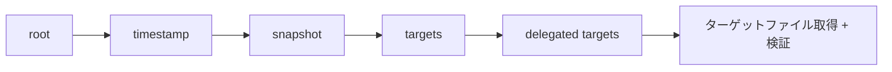

# アーキテクチャ

## 全体像

python-tuf は責務の異なる 3 つのパッケージに分かれる。`tuf.api` は低レベルの Metadata API で、TUF メタデータ (root/timestamp/snapshot/targets) のシリアライズ・デシリアライズと署名検証のプリミティブを提供する。`tuf.ngclient` は高レベルのクライアントで、TUF 仕様の detailed client workflow を実装する。`tuf.repository` はそのメタデータを生成・署名するリポジトリ側ツールを作るための基底クラス。多くの利用者が触れるのはクライアントである。

クライアントは 4 つのトップレベルメタデータロールを固定順でリフレッシュし、各段で次を検証してから信頼する。



## コンポーネント

### Metadata API: `tuf/api`

低レベル層。`Metadata[T]` は署名済みペイロードを包む総称ラッパ ([tuf/api/metadata.py:81](https://github.com/theupdateframework/python-tuf/blob/9a3c304/tuf/api/metadata.py#L81))。ロールのペイロード型は `tuf/api/_payload.py` (コードベース最大のファイル) にあり、抽象基底は `Signed` ([tuf/api/_payload.py:84](https://github.com/theupdateframework/python-tuf/blob/9a3c304/tuf/api/_payload.py#L84))。組み込みシリアライザは JSON のみ (`tuf/api/serialization/json.py`)、DSSE 封筒対応は `tuf/api/dsse.py`。

### クライアント: `tuf/ngclient`

高レベル層。`Updater` がクライアントワークフローを実装する ([tuf/ngclient/updater.py:78](https://github.com/theupdateframework/python-tuf/blob/9a3c304/tuf/ngclient/updater.py#L78))。信頼集合の状態機械 `TrustedMetadataSet` は内部モジュール ([tuf/ngclient/_internal/trusted_metadata_set.py:94](https://github.com/theupdateframework/python-tuf/blob/9a3c304/tuf/ngclient/_internal/trusted_metadata_set.py#L94))。HTTP 取得は `FetcherInterface` で抽象化され、既定実装は `Urllib3Fetcher`。`requests_fetcher.py` は deprecated。

### リポジトリヘルパ: `tuf/repository`

抽象基底クラス `Repository(ABC)` が `open` / `close` / `edit` / `do_snapshot` / `do_timestamp` を定義する ([tuf/repository/_repository.py:35](https://github.com/theupdateframework/python-tuf/blob/9a3c304/tuf/repository/_repository.py#L35))。同梱の examples や RSTUF などリポジトリツールの土台になる。

## リクエストの流れ

`Updater.refresh()` は 4 ロールを順にロードする ([tuf/ngclient/updater.py:174](https://github.com/theupdateframework/python-tuf/blob/9a3c304/tuf/ngclient/updater.py#L174)):

```python
self._load_root()
self._load_timestamp()
self._load_snapshot()
self._load_targets(Targets.type, Root.type)
```

各段はまずローカルキャッシュを試し、ダメなら remote から取得して検証し、永続化する。`get_targetinfo()` を `refresh()` 未実行で呼ぶと、updater が暗黙的に実行する ([tuf/ngclient/updater.py:213](https://github.com/theupdateframework/python-tuf/blob/9a3c304/tuf/ngclient/updater.py#L213))。委譲ターゲットは `_preorder_depth_first_walk()` が必要時に解決する ([tuf/ngclient/updater.py:500](https://github.com/theupdateframework/python-tuf/blob/9a3c304/tuf/ngclient/updater.py#L500))。ターゲットのメタデータが見つかった後、ダウンロードしたバイト列を期待される length と hashes に照合する ([tuf/ngclient/updater.py:300](https://github.com/theupdateframework/python-tuf/blob/9a3c304/tuf/ngclient/updater.py#L300))。

## 主要な設計判断

信頼アンカーの渡し方は意図的な設計。`Updater.__init__` は `bootstrap` をキーワード必須引数にする (`*, bootstrap: bytes | None`, [tuf/ngclient/updater.py:115](https://github.com/theupdateframework/python-tuf/blob/9a3c304/tuf/ngclient/updater.py#L115))。意図された経路は、埋め込み root のバイト列を渡して安全に初期化することだ。`bootstrap=None` のときだけ、updater はキャッシュ済み `root.json` を信頼アンカーにフォールバックする ([tuf/ngclient/updater.py:139](https://github.com/theupdateframework/python-tuf/blob/9a3c304/tuf/ngclient/updater.py#L139))。これにより、呼び出し側は trust-on-first-use 的な挙動を既定で得るのではなく、明示的にオプトインさせられる。

## 拡張ポイント

- `FetcherInterface` ([tuf/ngclient/fetcher.py](https://github.com/theupdateframework/python-tuf/blob/9a3c304/tuf/ngclient/fetcher.py)): メタデータとターゲットの取得方法を制御するために実装する (プロキシ、独自トランスポート、オフラインソース)。
- `UpdaterConfig` ([tuf/ngclient/config.py](https://github.com/theupdateframework/python-tuf/blob/9a3c304/tuf/ngclient/config.py)): 封筒タイプ、user agent、リフレッシュ上限を調整する。
- `Repository(ABC)` ([tuf/repository/_repository.py:35](https://github.com/theupdateframework/python-tuf/blob/9a3c304/tuf/repository/_repository.py#L35)): サブクラス化してリポジトリ側のメタデータ管理を作る。
- シリアライズ (`tuf/api/serialization`): (デ)シリアライザのインターフェースにより、組み込み JSON 以外の形式も扱える。
