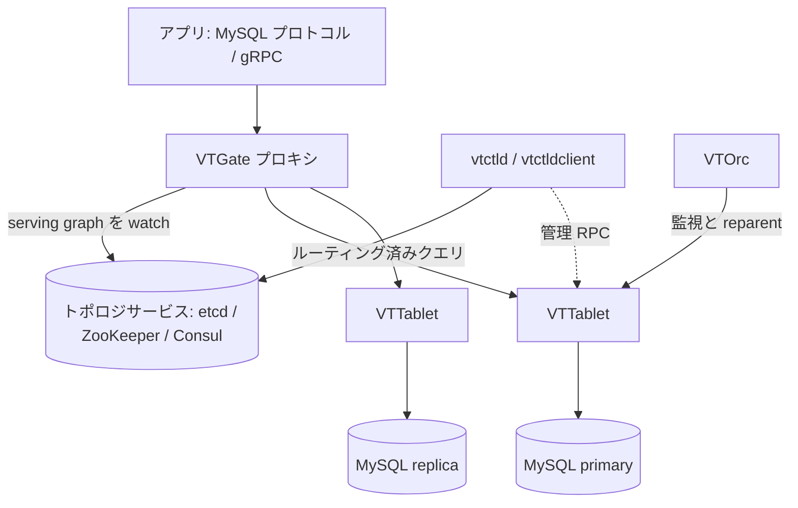

# アーキテクチャ

## 全体像

トップレベルの実行系は `go/cmd/` に個別のバイナリとして並ぶ。アプリは VTGate という ステートレスなプロキシとだけ通信する。VTGate はトポロジサービスからシャーディングのメタデータを読み、各クエリを 1 つ以上の VTTablet サイドカーへルーティングする。VTTablet はそれぞれ単一の MySQL インスタンスの前段に立つ。コントロールプレーン (vtctld, VTOrc, VTAdmin) はスキーマ・リシャーディング・フェイルオーバをアウトオブバンドで管理する。

## コンポーネント

### VTGate

ステートレスなプロキシ (`go/cmd/vtgate/`)。MySQL ワイヤプロトコルと gRPC を話し、SQL を受けてパース・プランニング・適切なシャードへのルーティングを行う。アプリから見える唯一のエンドポイントである。トポロジサービスを watch して、どの tablet がどのシャードを serving するかの serving graph を構築する (`go/vt/srvtopo/`)。

### VTTablet

各 MySQL インスタンスの隣で動くサイドカー (`go/cmd/vttablet/`)。クエリ実行・コネクションプール・クエリ整形 (consolidation)・ヘルスチェック・バックアップを担う。

### vtctld と vtctldclient

管理用コントロールプレーン (`go/cmd/vtctld/`, `go/cmd/vtctldclient/`)。スキーマ変更・リシャーディング・MoveTables などの運用操作の RPC を提供する。

### VTOrc

オーケストレータ (`go/cmd/vtorc/`)。レプリケーショントポロジを監視し、自動フェイルオーバ (reparent) を行う。

### VTAdmin

複数クラスタを束ねる管理 API と Web UI (`go/cmd/vtadmin/`)。

### トポロジサービス

etcd・ZooKeeper・Consul が keyspace・shard・tablet のメタデータを保存する (`go/vt/topo/`)。VTGate はここを watch し、`go/vt/srvtopo/` を通じて serving graph を構築する。

### vtcombo

全コンポーネントを 1 プロセスに詰めたテスト/ローカル用 (`go/cmd/vtcombo/`)。

論理データモデル: keyspace (論理データベース) が複数の shard に分割され、各 shard は primary + replica の MySQL グループである。シャーディングキーの導出は VSchema 上の Vindex (Vitess Index) が定義する。

## リクエストの流れ

VTGate は cobra コマンドとして起動する。`go/cmd/vtgate/vtgate.go` の `main()` が CLI を呼び、`run` (`go/cmd/vtgate/cli/cli.go:138`) がトポロジサーバを開き (`cli.go:147`)、resilient な serving-topology サーバを構築し (`cli.go:152`)、`vtgate.Init(...)` (`cli.go:182`) を呼んでから `servenv.RunDefault()` (`cli.go:192`) を呼ぶ。

1 本の SELECT は次の経路を辿る。

1. `Executor.Execute` (`go/vt/vtgate/executor.go:254`) がトレーススパンを張り `LogStats` を作り、内部の `execute` を呼ぶ。戻りで結果が大きければメモリ超過警告を追加し (`executor.go:270`)、エラー変換を通す (`executor.go:291`)。
2. `Executor.execute` (`go/vt/vtgate/executor.go:489`) は薄い橋渡しで、プラン実行コールバックを `newExecute` に渡すだけである (`executor.go:493`)。
3. `Executor.newExecute` (`go/vt/vtgate/plan_execute.go:65`) が本体。`MaxBufferingRetries` ループ (`plan_execute.go:90`) を回し、フェイルオーバのバッファリング中は新しい VSchema を待って (`plan_execute.go:106`) 再プランできる。プランを取得または生成し (`plan_execute.go:122`)、トランザクション系文はローカルで処理し (`plan_execute.go:156`)、必要な bind 変数を注入し (`plan_execute.go:165`)、実行する (`plan_execute.go:175`)。
4. プラン木の葉で `Route.TryExecute` (`go/vt/vtgate/engine/route.go:133`) が `findRoute` (`engine/route.go:134`, 実体 `go/vt/vtgate/engine/routing.go:138`) で対象シャードを解決し、`vcursor.ExecuteMultiShard(...)` (`route.go:185`) で並列実行する。`OrderBy` 付きの scatter はマージソートされ (`route.go:205`)、最後に truncate される (`route.go:211`)。

## 主要な設計判断

決定的なのは Vindex 抽象である。アプリに常にシャードキーをクエリへ含めさせるのではなく、Vitess は VSchema 上で列とシャードのマッピングを宣言し、プランナが各 Vindex の `Cost()` (`go/vt/vtgate/vindexes/vindex.go:52`) を見てルーティングを選ぶ (Opcode 選択は `go/vt/vtgate/engine/routing.go:152`)。これにより scatter 回避はアプリのクエリ書き換えではなく、スキーマ宣言とプランニングの問題になる。

ルーティング Opcode はトレードオフを直接表す。`Equal` と `EqualUnique` は Vindex の引きで単一シャードに解決し、`Scatter` は全シャードへ fan-out する (`routing.go:152`)。begin/commit などのトランザクション系文は実シャードに到達せず、session 操作として処理される (`plan_execute.go:156`)。

## 拡張ポイント

- **Vindex 実装** (`go/vt/vtgate/vindexes/`): `Vindex` インタフェース (`vindex.go:52`) を hash・lookup・consistent_lookup・numeric・cfc などが実装する。新しいシャーディング関数はここに差し込む。
- **トポロジバックエンド** (`go/vt/topo/`): etcd・ZooKeeper・Consul はトポロジストアの差し替え可能な実装である。
- **バックアップストレージ**: S3・GCS・Ceph がサポート対象 (例: `examples/local/ceph_backup_config.json`)。
- **Kubernetes**: vitess-operator が Vitess を Kubernetes 上にデプロイする (`examples/operator/operator.yaml`)。
