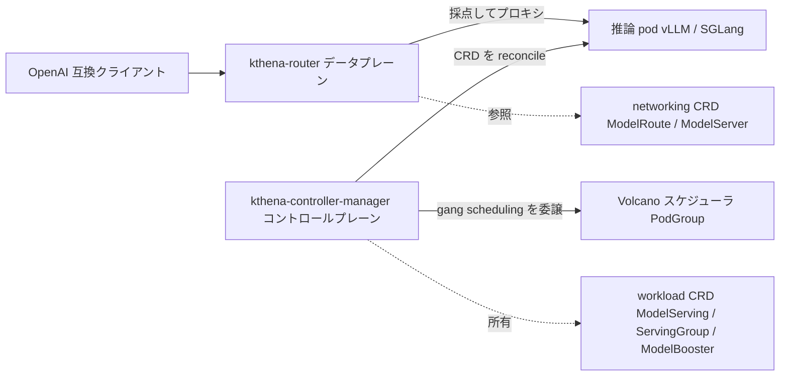

# アーキテクチャ

## 全体像

Kthena はコントロールプレーンとデータプレーンを分離し、片方だけでもデプロイして使える (`README.md:55`)。コントロールプレーンはカスタムリソースを推論ワークロードへ reconcile し、配置を Volcano スケジューラに任せる。データプレーンは推論トラフィックを終端し、各リクエストをバックエンド pod へルーティングする。バイナリは 2 つで、データプレーンが `cmd/kthena-router/main.go:40`、コントロールプレーンが `cmd/kthena-controller-manager/main.go:54`。

## コンポーネント

### kthena-controller-manager (コントロールプレーン)

Kthena の CRD を reconcile し、推論レプリカの deploy / scale / upgrade を回す。有効化できる controller は `modelserving` / `modelbooster` / `autoscaler` (`cmd/kthena-controller-manager/main.go:81-82`)。gang scheduling は自前実装せず Volcano に委譲する。また secure port 8443 で webhook サーバを動かし、証明書を自動生成して ValidatingWebhook / MutatingWebhook の CABundle を更新する (`cmd/kthena-controller-manager/main.go:74`)。所有する workload CRD は `pkg/apis/workload/v1alpha1` にある。

### kthena-router (データプレーン)

推論トラフィックの入口。各リクエストを model 名・ヘッダ・URI で分類し、ロードバランスとトラフィック制御を当て、適切な推論インスタンスへ振る。prefill-decode 分離ルーティングをネイティブ対応する。README は、router が参照実装であり、Gateway Inference Extension が prefill-decode 分散をネイティブにサポートしないため使われていること、標準 API gateway の後段にも置けることを明記している (`README.md:64`)。router は `pkg/apis/networking/v1alpha1` の networking CRD、すなわち `ModelRoute` (マッチ規則 + レート制限) と `ModelServer` (`PDGroup` / `KVConnector` / `TrafficPolicy` を持つバックエンド pod 群) を参照する。

## リクエストの流れ

router を通る 1 推論リクエスト (`pkg/kthena-router/router/router.go`):

1. gin ハンドラ `Router.HandlerFunc()` (`router.go:210`) が `GET /v1/models` を `ListModels` で即返し (`router.go:216-220`)、それ以外は本処理へ進む。
2. `ParseModelRequest` (`router.go:491`) がボディを読み、OpenAI 互換 struct `OpenAIRequestBody` (`pkg/kthena-router/handlers/request.go:29`) から `model` フィールドを取り出す。
3. プロンプトを tokenize して入力トークン数を算出し、失敗時は `len(promptStr)/4` にフォールバックする (`router.go:269-273`)。
4. `r.loadRateLimiter.RateLimit(modelName, promptStr)` (`router.go:285`) でレート制限。入力トークン・出力トークン・リクエスト数の 3 種を判定し、超過は HTTP 429。
5. fairness scheduling が無効なら `doLoadbalance` (`router.go:322`→`:335`)、有効なら `handleFairnessScheduling` (`router.go:327`→`:1037`) へ。
6. `doLoadbalance` (`router.go:335`) は `r.store.MatchModelServer` (`router.go:359`) で `ModelRoute` を先にマッチし、`getPodsAndServer` (`router.go:369`→`:513`) で pod 群と `ModelServer` を取得し、`framework.Context` を組み (`router.go:451-457`)、`r.scheduler.Schedule(ctx, pods)` (`router.go:459`) で pod を採点する。
7. 選抜結果を `proxyModelEndpoint` (`router.go:484`→`:682`) でプロキシする。PD 非分離なら `proxy` (`router.go:614`)、KVConnector ありなら `proxyToPDDisaggregated` (`router.go:943`)。
8. プロキシ後に `r.scheduler.RunPostHooks(ctx, i)` (`router.go:675`) が on-flight カウンタを更新する。

## 主要な設計判断

最も特徴的なのは、一部の同種プロジェクトが使う LeaderWorkerSet (LWS) / dual-LWS の多層パターンを避けたこと。代わりに単一の `ServingGroup` が Prefill / Decode の role を持ち、gang scheduling は Volcano の `scheduling.volcano.sh/v1beta1` PodGroup に委譲する。メンテナの理由は、Volcano gang scheduling と統合するには別アーキが必要で、dual-LWS の層構造は彼らのユースケースでは明確な利点なく複雑さだけ増えた、というもの ([pacoxu の比較](https://pacoxu.wordpress.com/2025/12/03/how-to-choose-the-inference-orchestration-solution-aibrix-or-kthena-or-dynamo/))。`ModelServingSpec.SchedulerName` のデフォルトは `volcano` (`pkg/apis/workload/v1alpha1/model_serving_types.go:47`)。

2 つ目は、KV キャッシュ・prefix キャッシュの局所性をエンジン内ではなく router の L7 採点層で推定し、共通プレフィックスを持つリクエストを同じ pod に寄せること (`pkg/kthena-router/scheduler/plugins/prefix_cache.go`)。

## 拡張ポイント

- **スケジューラ plugin**: router のスケジューラは差し替え可能な score / filter plugin を回す (`pkg/kthena-router/scheduler/plugins`)。デフォルトは `least-request` / `least-latency` / `prefix-cache` (`pkg/kthena-router/scheduler/scheduler_impl.go:68-72`)。
- **KV 転送 connector**: prefill-decode の KV 転送は NIXL / MoonCake / SGLang 向け connector で抽象化 (`pkg/kthena-router/connectors`)。
- **CRD**: workload CRD (`ModelServing` / `ServingGroup` / `ModelBooster` / `AutoscalingPolicy`) と networking CRD (`ModelRoute` / `ModelServer`)。いずれも `pkg/apis` 配下。
- **Webhook**: controller-manager が提供する ValidatingWebhook / MutatingWebhook (`cmd/kthena-controller-manager/main.go:74`)。
