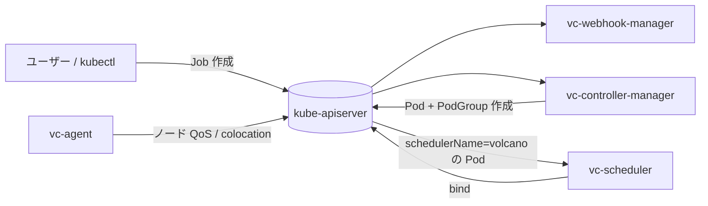

# アーキテクチャ

## 全体像

Volcano は単一プロセスではない。4 つの常駐コンポーネントと CLI から成り、それぞれが 1 つの関心事を持つ。スケジューラが配置を決め、コントローラマネージャが CRD を Pod と PodGroup に変換し、Webhook マネージャが入ってくるオブジェクトを検証・変更し、ノードエージェントが各ノードで colocation と QoS を担う。これらは `volcano.sh/apis` の CRD 型を共有するが、互いに独立して動く。

## コンポーネント

### vc-scheduler

スケジューラ本体は `pkg/scheduler/` にある。`kube-scheduler` とは別プロセスとして動き、`schedulerName` が自分を指す Pod だけを扱う。デフォルトスケジューラのものを再利用せず、自前の informer ベースのキャッシュと自前の binder を持つ。スケジューリングは周期的かつ session ベースで、各サイクルはスナップショットを取り、順序付けられた action 列をその上で回し、結果をコミットする。エントリポイントは `cmd/scheduler/main.go` で、デフォルトの action と plugin を blank import して登録する (`cmd/scheduler/main.go:39`)。

### vc-controller-manager

`pkg/controllers/` のコントローラ群が Volcano の CRD を reconcile する。`job` コントローラは VolcanoJob を Pod と PodGroup に展開し、`podgroup` コントローラは通常 Pod 向けに PodGroup を自動生成する。他に `queue`、`jobflow`/`jobtemplate` (ジョブの DAG)、`cronjob`、`hypernode`、ガベージコレクションを担うコントローラがある。

### vc-webhook-manager

`pkg/webhooks/admission/` の admission サーバは、リソースごとに validating/mutating Webhook を提供する: `jobs`, `pods`, `podgroups`, `queues`, `jobflows`, `cronjobs`, `hypernodes`。不正なジョブ spec (例えばタスク数より大きい `minAvailable`) は、スケジューラに届く前にここで弾かれる。

### vc-agent

ノードエージェント (`cmd/agent`、`cmd/network-qos` を伴う) は、オンライン・オフラインワークロードを混載するためのノード常駐デーモン。QoS と network QoS を強制し、レイテンシ重視のサービスとバッチジョブが 1 つのノードを共有できるようにする。リソース利用率を狙った新しめの追加機能。

### vcctl

`cmd/cli` が `vcctl` をビルドする。Volcano のジョブとキューを確認・管理するコマンドラインツール。

## リクエストの流れ

gang スケジューリングとフェアシェアを成立させるパス、デフォルトの `allocate` action による 1 スケジューリングサイクルを追う。

1. 起動時にスケジューラはループを開始する: `go wait.Until(pc.runOnce, pc.schedulePeriod, stopCh)` (`pkg/scheduler/scheduler.go:115`)。
2. `runOnce` は session を開き、設定された各 action を順に実行する (`OpenSession` は `pkg/scheduler/scheduler.go:141`、`action.Execute(ssn)` のループは `pkg/scheduler/scheduler.go:150`)。
3. `framework.OpenSession` はキャッシュを `Session` にスナップショットし、各 plugin の `OnSessionOpen` を呼ぶ。これが順序付け・述語・readiness の関数を session に登録する (`pkg/scheduler/framework/framework.go:34`、plugin 呼び出しは `:50`)。
4. デフォルト設定は action `enqueue, allocate, backfill` と gang/drf/proportion/predicates/nodeorder の plugin tier を有効にする (`pkg/scheduler/util.go:38`)。
5. `allocate` action が走る: `Execute` がコンテキストを構築し (`pkg/scheduler/actions/allocate/allocate.go:122`)、`QueueOrderFn` 順にキューを、`JobOrderFn` 順にジョブを pop し、task を配置する (`allocateResources` は `:283`、task 単位の処理は `:951`)。
6. 配置の成功は `ssn.JobReady(job)` が真の場合だけコミットされる (`pkg/scheduler/actions/allocate/allocate.go:314`)。gang plugin の `JobReady` が min-member 数を強制するので、gang を満たせないジョブは決して bind されない。
7. コミットは記録した operation を再生し、bind を非同期ワーカーに渡す (`pkg/scheduler/framework/statement.go:392`、続いて `statement.go:319` の `cache.AddBindTask`)。
8. 非同期ワーカーが bind を API server に書き込む (`pkg/scheduler/cache/cache.go:874` がワーカーループ、`DefaultBinder.Bind` は `cache.go:231`)。
9. `framework.CloseSession` が各 plugin の `OnSessionClose` を呼び、dirty なジョブをキャッシュに flush する (`pkg/scheduler/framework/framework.go:63`)。

## 主要な設計判断

- **session と statement による dry-run トランザクション。** action はまず session のメモリ上にだけ tentative な `Allocate`/`Pipeline`/`Evict` を積む。`RecoverOperations` で再生し、`Discard` で破棄でき、最良の結果だけがコミットされる (`pkg/scheduler/actions/allocate/allocate.go:447`)。これが gang の all-or-nothing とトポロジ対応配置の両立を可能にする。スケジューラは配置を試し、スコア付けし、最良を残す。
- **action と plugin の分離。** action (`enqueue`, `allocate`, `preempt`, `reclaim`, `backfill` など) が「いつ何をするか」を決め、plugin (`gang`, `drf`, `proportion`, `binpack`, `capacity`, `predicates`, `nodeorder` など) が比較関数・述語・スコアを提供する。両方とも ConfigMap で宣言的に有効化し、`fsnotify` でホットリロードする (`pkg/scheduler/scheduler.go:219`)。
- **kube-scheduler と共存する。** Volcano は自前のキャッシュと binder を持ち、`Pipeline` は releasing 中のリソースを次サイクルの将来 idle として予約する。これが preemption の配置を段取りする仕組み。
- **preempt と reclaim はデフォルト無効。** デフォルト設定は `enqueue, allocate, backfill` しか走らせない (`pkg/scheduler/util.go:38`)。優先度ベースの退避は ConfigMap にそれらの action を明示的に足す必要がある。

## 拡張ポイント

- **スケジューラ plugin**: 30 近い built-in plugin が `pkg/scheduler/plugins/factory.go` で登録される。カスタム plugin は plugin インターフェースを実装し init で登録する。
- **スケジューラ action**: `pkg/scheduler/actions/factory.go` で登録する (例えば `:37` の `RegisterAction(allocate.New())`)。
- **CRD**: `batch.volcano.sh Job`、`scheduling.volcano.sh PodGroup`/`Queue`、`flow.volcano.sh JobFlow`/`JobTemplate`、`topology.volcano.sh HyperNode`。`volcano.sh/apis` モジュールで定義される。
- **admission Webhook**: `pkg/webhooks/admission/` のリソース別 validating/mutating ハンドラ。
