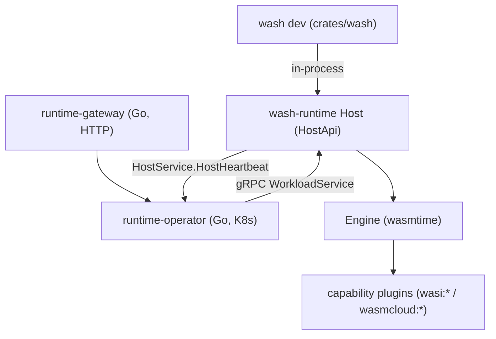

# アーキテクチャ

## 全体像

v2 システムは 1 つのランタイムと 2 つのドライバから成る。ランタイムは `wash-runtime` で、WebAssembly コンポーネントをコンパイル・リンク・実行する Wasmtime ベースのホストだ。公開面は `HostApi` trait (`crates/wash-runtime/src/host/mod.rs:74`) で、`heartbeat`・`workload_start`・`workload_status`・`workload_stop` を定義する。ローカルでは `wash dev` コマンドが `Host` を組んで直接駆動する。本番では Go の Kubernetes operator が同等のホストを gRPC で駆動し、`proto/wasmcloud/runtime/v2/` のサービス定義を使う。gRPC のメッセージ型は `crates/wash-runtime/src/types.rs` の Rust 型と 1:1 に対応する。

## コンポーネント

### wash CLI

`crates/wash` は開発者向け CLI。トップレベルのコマンドは `WashCliCommand` enum (`crates/wash/src/main.rs:65`): `build`・`config`・`completion`・`dev`・`inspect`・`host`・`new`・`oci`・`update`・`wit`。`wash dev` はホットリロードの開発ループを動かし、`wash host` は同じバイナリを operator から駆動されるホストプロセスとして振る舞わせる。各コマンドの `handle` は `crates/wash/src/main.rs:95-112` の match からディスパッチされる。

### wash-runtime

`crates/wash-runtime` は組み込みランタイム。Wasmtime を再エクスポートし (`crates/wash-runtime/src/lib.rs` がランタイム API を公開)、`wasmtime::Engine` を独自の `Engine` でラップする (`crates/wash-runtime/src/engine/mod.rs`)。`Host` は実行中の workload マップ `Arc<RwLock<HashMap<String, HostWorkload>>>` (`crates/wash-runtime/src/host/mod.rs:197`) を保持する。capability はプラグインとして `crates/wash-runtime/src/plugin/` 配下に供給される: `wasi_keyvalue`・`wasi_blobstore`・`wasi_config`・`wasi_logging`・`wasi_otel`・`wasi_webgpu`・`wasmcloud_messaging`・`wasmcloud_postgres`。

### gRPC API

`proto/wasmcloud/runtime/v2/` は operator とホスト間の契約を定義する。`WorkloadService` は `WorkloadStart`・`WorkloadStatus`・`WorkloadStop` を持つ (`proto/wasmcloud/runtime/v2/workload_service.proto:8-12`)。`HostService` はホストが operator に対して呼ぶ単一の `HostHeartbeat` RPC を持つ (`proto/wasmcloud/runtime/v2/host_service.proto:9-12`)。

### Kubernetes operator と gateway

`runtime-operator/` は Go の controller-runtime operator (Go モジュール `go.wasmcloud.dev/runtime-operator/v2`) で、Wasm workload を pod にマップし `wash host` を gRPC で駆動する。`runtime-gateway/` は Go の HTTP プロキシ兼リコンサイラ。`go.work` が 2 つの Go モジュールを束ねる。

## リクエストの流れ

代表的なローカル操作として `wash dev` のホットリロードを追う。

1. CLI ディスパッチ: `crates/wash/src/main.rs:106` が `WashCliCommand::Dev` をその `handle` (`crates/wash/src/cli/dev.rs:36` で定義) にルーティングする。
2. dev ハンドラがランタイムを組む: `Engine::builder()` (`crates/wash/src/cli/dev.rs:66`)、HTTP ルータ `DevRouter::default()` (`:141`)、`HttpServer::new(...)` (`:184`) を生成し `Host` を構築する。
3. ファイル変更時、`reload_component` (`crates/wash/src/cli/dev.rs:597`) が前回の workload を `host.workload_stop(...)` で止め、新しいものを `host.workload_start(WorkloadStartRequest { workload_id: uuid::Uuid::new_v4()..., workload })` で起動する (`crates/wash/src/cli/dev.rs:603-612`)。結果状態が `Running` でなければ bail する (`:614`)。
4. ホスト側 start: `Host::workload_start` (`crates/wash-runtime/src/host/mod.rs:636`) が workloads マップに `HostWorkload::Starting` を挿入し (`:644`)、`workload_start_inner` を呼ぶ (`:647`)。
5. 実体化: `workload_start_inner` (`crates/wash-runtime/src/host/mod.rs:543`) が `engine.initialize_workload` を呼び、import をプラグインに対して解決し、service があれば実行する。
6. コンパイルと検証: `Engine::initialize_workload` (`crates/wash-runtime/src/engine/mod.rs:294`) が volume を検証し (HostPath は実在ディレクトリか、EmptyDir は temp 作成)、service と各 component を Wasmtime component にコンパイルする。
7. import 解決: `resolve_workload_imports` (`crates/wash-runtime/src/engine/workload.rs:690`) と `resolve_component_imports` (`:804`) が各 component の WIT import を見て必要なプラグインを linker にバインドする。
8. 実行: `execute_service` (`crates/wash-runtime/src/engine/workload.rs:518`) が pre-instantiate してインスタンスを生成し、常駐タスクとして spawn する。
9. 確定: `workload_start` に戻り、成功時は `HostWorkload::Running(...)`、失敗時は `HostWorkload::Error(...)` にマップエントリを更新し (`crates/wash-runtime/src/host/mod.rs:665-667`)、`WorkloadStartResponse` を返す。

本番ではステップ 3 が operator からの gRPC `WorkloadService.WorkloadStart` 呼び出し (`proto/wasmcloud/runtime/v2/workload_service.proto:9`) になる。ステップ 4 以降は同一コードだ。

## 主要な設計判断

- 単一ランタイム・2 ドライバ。同じ `wash-runtime` ホストが `wash dev` と Kubernetes operator の双方を支えるため、ローカルで観測した挙動が本番の配置と一致する。これは v2 ロードマップの明示的な狙いだ ([roadmap](https://wasmcloud.com/docs/roadmap/))。
- NATS lattice より gRPC と Kubernetes。v2 はコントロールプレーンを gRPC + Kubernetes operator に移した (`proto/wasmcloud/runtime/v2/`)。NATS は特定プラグインの内部にのみ残る。
- egress は既定で拒否のゼロトラスト。空の `allowed_hosts` は全拒否を意味する (`crates/wash-runtime/src/types.rs:92`)。無制限 egress には明示的な `[AllowedHost::Any]` が要る。
- WASI バインディングの二重登録。WASI Preview 2 と Preview 3 のバインディングを常に linker に登録し、component ごとに実行時ディスパッチする ([内部実装](./internals) 参照)。

## 拡張ポイント

- `crates/wash-runtime/src/plugin/` 配下の capability プラグインが `wasi:*` / `wasmcloud:*` インターフェースを実装する。どのプラグインがバインドされるかは component の WIT import が決める。
- WIT インターフェースが component とホストの契約。新しい capability は `wit/` 配下のインターフェース定義と対応するプラグインで追加する。
- gRPC の `WorkloadService` / `HostService` 契約 (`proto/wasmcloud/runtime/v2/`) により、外部のオーケストレータがホストを駆動できる。
