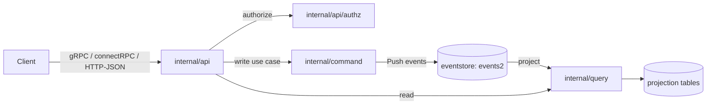

# アーキテクチャ

## 全体像

ZITADEL は CQRS とイベントソーシングの上に作られている。書き込み側 (command 層) は不変イベントをイベントストアへ append し、読み取り側 (query 層) はそのイベントから projection を構築する (README.md:65)。状態変更は行を上書きせずイベントとして記録される。これが、監査証跡を完全かつ API からアクセス可能にしている要因だ。すべては単一の Go バイナリ内で動き、その前段の API 層が単一のサービス定義から gRPC・connectRPC・HTTP/JSON を話す。背後はすべて PostgreSQL。

## コンポーネント

### イベントストア (`internal/eventstore/`)

書き込みパスの中核。書き込みの `Push`、読み取りの `Filter` / `FilterToReducer`、そして projection を必要としない field index 用の `Search` を提供する (internal/eventstore/eventstore.go:184)。PostgreSQL の `events2` テーブルが正本。各 aggregate は `InstanceID` と `ResourceOwner` (所有 org) を持つため、テナント識別子は保存されるイベントの一部だ (internal/eventstore/aggregate.go:79)。

### Command 側 (`internal/command/`)

書き込み側のユースケース。ドメイン操作を write model へ reduce し、整合性をチェックしてから、生成された command をイベントストアへ push する。永続化の前にビジネス不変条件を強制するのがここ。

### Query 側 (`internal/query/`)

読み取り側。イベント列から projection を SQL テーブルへ materialize し、そこから読み取りを提供する。この分離により、書き込みパスに触れずに読み取りを API 向けに整形できる。

### API 層 (`internal/api/`)

`grpc/`・`http/`・`authz/` を保持する。3 つのトランスポート (gRPC・connectRPC・HTTP/JSON) は単一のサービス定義から生成されるため、リソースは 3 つすべてで同一に公開される ([API introduction](https://zitadel.com/docs/apis/introduction))。`internal/api/authz/` がトークン検証と permission チェックを担う。

### CLI エントリ (`cmd/`)

`start`・`setup`・`initialise`・`mirror`・`key` などの cobra コマンド。`cmd/zitadel.go` がルートで、`main.go` から到達する。

### 次世代バックエンド (`backend/v3/`)

進行中の再構築。`storage/eventstore`・`storage/database`・`api/{user,org,session,instance}`・`instrumentation/{logging,metrics,tracing}` を持つ。`main.go` は既に `backend/v3/instrumentation/logging` を import している。

マルチテナント階層は Instance・Organization・Project・Application。前 2 つはすべての aggregate に書き込まれる。

## リクエストの流れ

認証付き gRPC 呼び出しを端から端まで追う:

1. 入口は unary interceptor `AuthorizationInterceptor` (internal/api/grpc/server/middleware/auth_interceptor.go:16)。`verifier.CheckAuthMethod(info.FullMethod)` で proto の auth option を読み、トークン不要なら素通しする (auth_interceptor.go:23)。
2. `Authorization` ヘッダを読み、空なら `codes.Unauthenticated` を返す (auth_interceptor.go:31)。org は `x-zitadel-orgid` ヘッダか、req が `OrganizationFromRequest` を実装していればそこから解決する (auth_interceptor.go:45)。
3. `authz.CheckUserAuthorization(...)` を呼ぶ (auth_interceptor.go:37)。これがトークンを検証し `CtxData` を作る (internal/api/authz/authorization.go:28)。必要権限が `authenticated` だけなら、role 解決をせずに `CtxData` を載せて返す (authorization.go:34)。
4. そうでなければ `getUserPermissions(...)` が membership を permission 文字列へ解決し (internal/api/authz/permissions.go:25)、`checkUserPermissions(...)` が許可/拒否を判定する (authorization.go:47)。
5. 成功時、interceptor は `handler(ctxSetter(ctx), req)` を実行し、`CtxData` と解決済み permission を context に注入する (auth_interceptor.go:42)。

permission 解決の詳細は内部実装ページで歩く。

## 主要な設計判断

- **append-only のイベントストアを正本とする。** 変更は行更新ではなくイベント。これが選択的ではなく網羅的な監査証跡をもたらす (README.md:65)。
- **テナント識別子をアプリではなくデータに持つ。** `InstanceID` と `ResourceOwner` はすべての aggregate の必須フィールドで、context から埋められる (internal/eventstore/aggregate.go:20)。分離は構造的だ。
- **アプリのロックではなく DB で直列化する。** `Push` は writer をアプリ層で協調させず、PostgreSQL の primary key 衝突とリトライループに頼る (internal/eventstore/eventstore.go:133)。内部実装ページ参照。
- **単一のサービス定義から 3 トランスポート。** gRPC・connectRPC・HTTP/JSON は同じ proto から生成されるため、別途手書きの REST 面が乖離することがない ([API introduction](https://zitadel.com/docs/apis/introduction))。
- **外部 session store なし。** session 状態も同じイベントソーシングモデルに載る。これが別建てのキャッシュ層なしの水平スケールを可能にしている (README.md:67)。

## 拡張ポイント

- **Actions v2**: webhook・カスタムコード・token enrichment を認証フローへフックする ([Features](https://github.com/zitadel/zitadel)、[API introduction](https://zitadel.com/docs/apis/introduction))。
- **API**: 全リソースを gRPC・connectRPC・HTTP/JSON でスクリプト操作できる。
- **標準エンドポイント**: OIDC・OAuth 2.0・SAML 2.0、provisioning 用の SCIM 2.0 server。
- **identity brokering**: 上流 IdP のテンプレート (LDAP を上流ソースとして含む) を事前提供。
