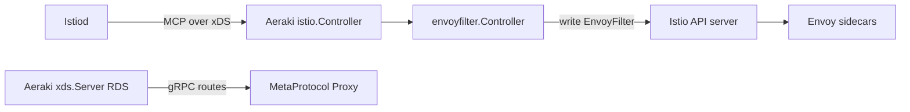

# Architecture

## Big picture

Aeraki has no data plane. It is a control plane that sits on top of Istio and Envoy and plays two roles. The first role generates Istio `EnvoyFilter` resources: it watches Istiod over MCP over xDS, reacts to changes in `ServiceEntry`, `VirtualService`, `Gateway`, and Aeraki's own custom resource definitions (CRDs), produces the matching Envoy configuration, and writes it back to the Istio API server. The second role is a Route Discovery Service (RDS) server for the MetaProtocol Proxy data plane: it pushes routes computed from `MetaRouter` resources over gRPC. Envoy's own RDS is HTTP-only, so this provides dynamic route delivery for arbitrary L7 protocols (`README.md:71`).



## Components

The components are wired together in `NewServer` (`internal/bootstrap/server.go:103`).

### istio.Controller

Watches Istiod over MCP over xDS. It is created at `internal/bootstrap/server.go:113` via `istio.NewController`. Inside, it holds an Aggregated Discovery Service Client (`xdsMCP *adsc.ADSC`, `internal/controller/istio/controller.go:69`) and connects to Istiod with `adsc.New` (`internal/controller/istio/controller.go:131`). It exposes a config `Store` that the other components read.

### envoyfilter.Controller

The component that turns config changes into `EnvoyFilter` resources. It is created at `internal/bootstrap/server.go:120` via `envoyfilter.NewController`. The server registers a handler that forwards every config event to it (`internal/bootstrap/server.go:122-124`):

```go
configController.RegisterEventHandler(func(_, _ *istioconfig.Config, event model.Event) {
    envoyFilterController.ConfigUpdated(event)
})
```

### xds.CacheMgr and xds.Server

The MetaProtocol RDS path. `xds.NewCacheMgr` (`internal/bootstrap/server.go:126`) builds the route cache; `xds.NewServer` (`internal/bootstrap/server.go:132`) serves it over gRPC. The cache manager holds a go-control-plane snapshot cache and the Istio config store (`internal/xds/cache_mgr.go:53`).

### Protocol generators

A map from protocol to a `Generator` implementation, one per non-HTTP protocol. `initGenerators` registers Thrift, Kafka, Zookeeper, and MetaProtocol (`cmd/aeraki/main.go:145-152`). Dubbo and Redis are added later because they need the controller-manager client (`internal/bootstrap/server.go:144-145`):

```go
args.Protocols[protocol.Dubbo] = dubbo.NewGenerator(scalableCtrlMgr.GetConfig())
args.Protocols[protocol.Redis] = redis.New(cfg, configController.Store)
```

## How a request flows

Trace one config change from Istiod to a written `EnvoyFilter`.

1. Istiod sends a config change over MCP. `istio.Controller` invokes the registered handler, which calls `envoyFilterController.ConfigUpdated(event)` (`internal/bootstrap/server.go:122-124`).
2. `ConfigUpdated` only sends the event to an internal channel (`internal/envoyfilter/controller.go:513-515`).
3. `mainLoop` selects on that channel and debounces with `debounce.New(debounceAfter, debounceMax, callback, stop)` before firing (`internal/envoyfilter/controller.go:116`). The debounce window is 1 second minimum, 10 seconds maximum (`internal/envoyfilter/controller.go:47-51`). The callback calls `pushEnvoyFilters2APIServer` and, on failure, re-queues up to 3 times (`internal/envoyfilter/controller.go:100-115`).
4. `pushEnvoyFilters2APIServer` (`internal/envoyfilter/controller.go:128`) generates the desired filters, lists the existing ones by label `manager=aeraki` (`internal/envoyfilter/controller.go:135-137`), then reconciles: delete removed (`internal/envoyfilter/controller.go:140-149`), update changed using `proto.Equal` to detect drift (`internal/envoyfilter/controller.go:156`), create new (`internal/envoyfilter/controller.go:171-178`).
5. `generateEnvoyFilters` (`internal/envoyfilter/controller.go:200`) lists all `ServiceEntry` resources (`internal/envoyfilter/controller.go:202`) and, for each port, determines the L7 protocol from the port name with `protocol.GetLayer7ProtocolFromPortName(port.Name)` (`internal/envoyfilter/controller.go:222`).
6. If a generator exists for that protocol (`internal/envoyfilter/controller.go:223`), it builds an `EnvoyFilterContext` (`internal/envoyfilter/controller.go:226`) and calls `generator.Generate(ctx)` (`internal/envoyfilter/controller.go:233`).

## Key design decisions

The unique virtual IP (VIP) assignment runs in a single controller because the VIP is used as a match condition when generating the `EnvoyFilter`. Istio allocates a VIP for a `ServiceEntry`, but in a sidecar scope, so the IP is not consistent across the mesh. Aeraki needs it consistent, so a singleton controller assigns it (`internal/bootstrap/server.go:296-302`).

Scaling is asymmetric. Writing `EnvoyFilter` resources runs only on the leader: in master mode the server runs the controller under leader election (`internal/bootstrap/server.go:341-351`). The RDS server, route cache, and config watcher run on every replica regardless of master or slave role (`internal/bootstrap/server.go:355-368`). Writes are funneled to one instance; read-side route delivery scales horizontally.

## Extension points

The single extension interface is `Generator` (`internal/envoyfilter/generator.go:22`), with one method `Generate(context *model.EnvoyFilterContext) ([]*model.EnvoyFilterWrapper, error)` (`internal/envoyfilter/generator.go:23`). New protocols register a `Generator` in the protocol map. Beyond that, new MetaProtocol protocols need only a codec in the `meta-protocol-proxy` data plane plus a `MetaRouter` CRD, not a new control-plane component.
