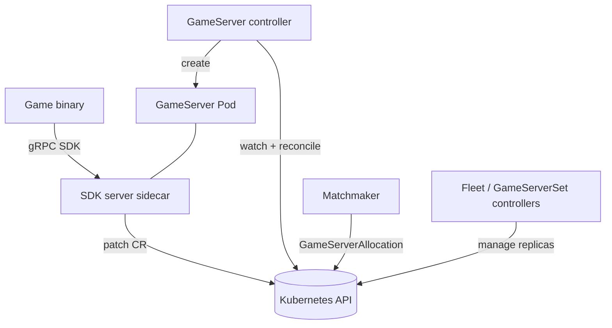

# Architecture

## Big picture

Agones is two things: a set of CRDs (Custom Resource Definitions) that model game servers and their groupings, and a set of controllers that reconcile those resources into running Pods. The CRD types live under `pkg/apis`, and one controller package per resource lives under `pkg/`. A game server Pod carries an Agones sidecar (the SDK server) that the game binary talks to over gRPC, and the sidecar writes state changes back to the Kubernetes API. This keeps game code decoupled from Kubernetes: the binary only knows the local SDK.

## Components

### CRD types (`pkg/apis`)

The API types define the resources users and controllers exchange. `agones/v1` holds `GameServer` (`pkg/apis/agones/v1/gameserver.go:197`), `Fleet` (`pkg/apis/agones/v1/fleet.go:41`), and `GameServerSet` (`pkg/apis/agones/v1/gameserverset.go:40`). `allocation/v1` holds `GameServerAllocation` (`pkg/apis/allocation/v1/gameserverallocation.go:52`). `autoscaling/v1` holds the `FleetAutoscaler`, and `multicluster` covers cross-cluster allocation.

### GameServer controller (`pkg/gameservers`)

This owns the lifecycle of a single `GameServer`: allocating a port, creating the backing Pod, populating its address, and driving it to `Ready`. The per-resource reconcile entry point is `syncGameServer` (`pkg/gameservers/controller.go:471`).

### Higher-level controllers (`pkg/gameserversets`, `pkg/fleets`, `pkg/fleetautoscalers`)

`GameServerSet` keeps a fixed number of identical game servers running (ReplicaSet analogue). `Fleet` manages rolling updates across `GameServerSet` generations (Deployment analogue). `FleetAutoscaler` scales a `Fleet` based on buffer or load policy.

### Allocation (`pkg/gameserverallocations`)

A matchmaker claims one `Ready` game server and moves it to `Allocated`. This is a one-shot request resource (`GameServerAllocation`) rather than a long-lived object.

### Port allocator (`pkg/portallocator`)

Agones assigns a Node HostPort to each game server itself instead of using a Kubernetes `Service`. The allocator tracks per-Node port usage (`pkg/portallocator/portallocator.go:115`).

### SDK server (`pkg/sdkserver`)

The sidecar that runs in every game server Pod. It exposes the SDK gRPC service to the game binary and patches the `GameServer` resource on the binary's behalf (`pkg/sdkserver/sdkserver.go:360`).

## How a request flows

Trace a `GameServer` from creation to `Ready`. The reconcile loop `syncGameServer` (`pkg/gameservers/controller.go:471`) calls each state-specific sync function in one pass; each function returns early unless the resource is in its state, so a single reconcile can advance several steps.

1. `syncGameServerPortAllocationState` (`pkg/gameservers/controller.go:565`) assigns a dynamic HostPort with `c.portAllocator.Allocate` (`pkg/gameservers/controller.go:570`) and advances the state to `Creating` (`pkg/gameservers/controller.go:572`). If the update fails it returns the port to the pool with `DeAllocate` (`pkg/gameservers/controller.go:580`).
2. `syncGameServerCreatingState` (`pkg/gameservers/controller.go:589`) creates the backing Pod via `createGameServerPod` (`pkg/gameservers/controller.go:683`), then advances to `Starting` (`pkg/gameservers/controller.go:631`).
3. `syncGameServerStartingState` (`pkg/gameservers/controller.go:916`) looks up the Node by the Pod's `NodeName` (`pkg/gameservers/controller.go:942`), writes the external address and port (`pkg/gameservers/controller.go:947`), and sets `Scheduled` (`pkg/gameservers/controller.go:954`).
4. The game binary calls `Ready()` over the SDK. The server side is `SDKServer.Ready` (`pkg/sdkserver/sdkserver.go:540`), which enqueues a `RequestReady` transition (`pkg/sdkserver/sdkserver.go:543`). The actual write happens in `SDKServer.updateState` (`pkg/sdkserver/sdkserver.go:360`), which sets `gsCopy.Status.State = s.gsState` (`pkg/sdkserver/sdkserver.go:396`).
5. `syncGameServerRequestReadyState` (`pkg/gameservers/controller.go:967`) detects `RequestReady`, fills in any missing address, and finalizes the state to `Ready` (`pkg/gameservers/controller.go:1014`), recording an `SDK.Ready() complete` event (`pkg/gameservers/controller.go:1023`).

The state constants this path walks are defined in order in `pkg/apis/agones/v1/gameserver.go`: `PortAllocation` (`:49`), `Creating` (`:51`), `Scheduled` (`:57`), `RequestReady` (`:59`), `Ready` (`:62`).

## Key design decisions

The controller assigns HostPorts directly rather than relying on a Kubernetes `Service` or `NodePort`. Game traffic is mostly UDP (User Datagram Protocol) and clients connect straight to a Pod's host port to minimize latency. The allocator keeps a per-Node bitmap of used ports (`pkg/portallocator/portallocator.go:119`) and rebuilds it from informer state at startup.

The reconcile loop chains state-specific sync functions in one pass (`pkg/gameservers/controller.go:471`). One transition becomes the entry condition for the next function, so a work item can move through several states without re-queuing. Each sync guards on its own state at the top, for example `syncGameServerPortAllocationState` returns early unless the state is `PortAllocation` (`pkg/gameservers/controller.go:566`).

Game binaries never touch the Kubernetes API. They talk only to the local SDK sidecar, which patches the resource (`pkg/sdkserver/sdkserver.go:419`). This decouples game code from Kubernetes credentials and API shape.

## Extension points

- **CRDs**: `GameServer`, `Fleet`, `GameServerSet`, `FleetAutoscaler`, `GameServerAllocation` are the public API surface, consumed with standard Kubernetes tooling.
- **SDKs**: client libraries for Go, C++, C#, Rust, and Node.js under `sdks/`, used from game engines such as Unity and Unreal to call `Ready`, `Allocate`, `Health`, and `Shutdown`.
- **Allocation API**: matchmakers integrate either through the `GameServerAllocation` CRD or the Allocator gRPC service.
- **Multiple binaries**: `cmd/` ships `controller`, `allocator`, `extensions`, `ping`, `processor`, and `sdk-server`, with the controller entry point at `cmd/controller/main.go:119`.
