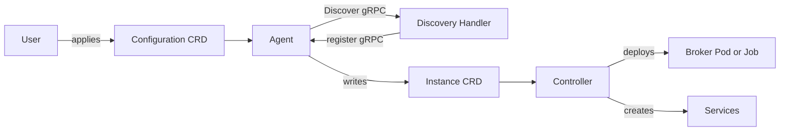

# Architecture

## Big picture

Akri has five moving parts: two Custom Resource Definitions (CRDs), a set of Discovery Handlers, an Agent that runs on every node, and a Controller. A user writes a Configuration CRD to say what to look for. Discovery Handlers (DHs) know how to find devices for a specific protocol. The Agent drives discovery on each node and writes one Instance CRD per discovered device. The Controller watches Instances and deploys broker workloads plus Services.

## Components

### Configuration CRD

The Configuration is the user facing declaration of what to discover. The type is `ConfigurationSpec` at `shared/src/akri/configuration.rs:114`, registered under group `akri.sh` version `v0` at `shared/src/akri/configuration.rs:106`. It carries `discovery_handler` (which DH to use plus its details), `capacity` (how many nodes may schedule workloads for a found device), an optional `broker_spec`, optional `instance_service_spec` and `configuration_service_spec`, and `broker_properties`. A broker is either a Pod or a Job, modeled by the `BrokerSpec` enum at `shared/src/akri/configuration.rs:90`.

### Instance CRD

Each Instance represents one discovered device. The type is `InstanceSpec` at `shared/src/akri/instance.rs:54`, with short name `akrii` declared at `shared/src/akri/instance.rs:27`. Key fields are `cdi_name` at `shared/src/akri/instance.rs:59`, `shared` at `shared/src/akri/instance.rs:76`, `nodes` at `shared/src/akri/instance.rs:81`, and `device_usage` at `shared/src/akri/instance.rs:90`. The `device_usage` map tracks capacity slots: each slot maps to a node name that has claimed it, or to an empty string when free.

### Discovery Handlers

A Discovery Handler is a process that knows one protocol (ONVIF for cameras, udev for local devices, OPC UA, or debug-echo for testing). DHs talk to the Agent over gRPC. The protocol is defined in `discovery-utils/proto/discovery.proto`. The Agent advertises a `Registration` service at `discovery-utils/proto/discovery.proto:7`; a DH calls `RegisterDiscoveryHandler` at `discovery-utils/proto/discovery.proto:8`, passing its name, an endpoint that is either a Unix Domain Socket (UDS) or NETWORK address (the `EndpointType` enum at `discovery-utils/proto/discovery.proto:19`), and a `shared` flag at `discovery-utils/proto/discovery.proto:26`. The Agent then calls the DH back through the `DiscoveryHandler` service at `discovery-utils/proto/discovery.proto:32`, whose `Discover` RPC returns a `stream DiscoverResponse` at `discovery-utils/proto/discovery.proto:33` (server streaming, so the DH can push device list updates).

### Agent

The Agent is a DaemonSet; its entry point is `main` at `agent/src/main.rs:23`. On startup it builds the DH registry with `new_registry` at `agent/src/main.rs:42`, starts the registration server with `run_registration_server` at `agent/src/main.rs:49`, creates an `InMemoryManager` at `agent/src/main.rs:58` and a `DevicePluginManager` at `agent/src/main.rs:61`, starts the device plugin manager with `start_dpm` at `agent/src/main.rs:69`, starts a slot reclaimer with `start_reclaimer` at `agent/src/main.rs:75`, and finally starts the Configuration controller with `start_controller` at `agent/src/main.rs:89`.

### Controller

The Controller's entry point is `main` at `controller/src/main.rs:21`. It spawns `handle_existing_instances` at `controller/src/main.rs:42`, `do_instance_watch` at `controller/src/main.rs:48`, a `NodeWatcher` at `controller/src/main.rs:56`, and a `BrokerPodWatcher` at `controller/src/main.rs:63`. Based on each Instance event it deploys or removes broker workloads. The action types are the `InstanceAction` enum at `controller/src/util/instance_action.rs:46`.

## How a request flows

This traces one device from discovery to a running broker.

1. A Discovery Handler starts and registers with the Agent over the registration socket (`RegisterDiscoveryHandler`, `discovery-utils/proto/discovery.proto:8`). The Agent receiver is `run_registration_server`, spawned at `agent/src/main.rs:49`.
2. The user applies a Configuration. The Agent's Configuration controller reconciles it in `reconcile` at `agent/src/util/discovery_configuration_controller.rs:80`, adding a finalizer if missing at `agent/src/util/discovery_configuration_controller.rs:99`.
3. On the first reconcile there is no request yet, so the controller calls `new_request` and returns an empty list; the None branch starts at `agent/src/util/discovery_configuration_controller.rs:134` and returns `vec![]` at `agent/src/util/discovery_configuration_controller.rs:145`.
4. The request queries each registered DH over gRPC. `query` at `agent/src/discovery_handler_manager/discovery_handler_registry.rs:309` builds a `DiscoverRequest` at `agent/src/discovery_handler_manager/discovery_handler_registry.rs:314`, resolving discovery properties from ConfigMaps and Secrets via `solve_discovery_properties` at `agent/src/discovery_handler_manager/discovery_handler_registry.rs:322`.
5. Device lists from the DH are watched by `watch_devices` at `agent/src/discovery_handler_manager/discovery_handler_registry.rs:249`, deduplicated by CDI fully qualified name at `agent/src/discovery_handler_manager/discovery_handler_registry.rs:285`, then pushed to the device plugin layer with `send_replace` at `agent/src/discovery_handler_manager/discovery_handler_registry.rs:288`.
6. On a later reconcile `get_request` hits, and `get_instances` at `agent/src/discovery_handler_manager/discovery_handler_registry.rs:186` converts each endpoint's latest devices into Instances via `device_to_instance` at `agent/src/discovery_handler_manager/discovery_handler_registry.rs:213`. The Instance name is `format!("{}-{}", self.key, dev.device_hash())` at `agent/src/discovery_handler_manager/discovery_handler_registry.rs:239`.
7. The reconcile stamps the local node name and an owner reference onto each Instance at `agent/src/util/discovery_configuration_controller.rs:127`, deletes Instances for devices that vanished at `agent/src/util/discovery_configuration_controller.rs:149`, and applies the current ones via server side apply at `agent/src/util/discovery_configuration_controller.rs:164`.
8. The Controller watches Instance events at `controller/src/main.rs:48` and, depending on the `InstanceAction`, deploys a broker Pod per node up to `capacity` or a Job, and creates the Instance and Configuration Services. The behavior table is documented at `controller/src/util/instance_action.rs:32`.
9. A successful reconcile requeues after 600 seconds (`SUCCESS_REQUEUE` at `agent/src/util/discovery_configuration_controller.rs:38`); a failure backs off exponentially from 500 ms in `error_policy` at `agent/src/util/discovery_configuration_controller.rs:176`.

## Key design decisions

The `shared` flag on a device decides whether it is one resource across nodes or one per node, and the only mechanism behind that is how the Instance name is hashed (see [Internals](./internals)). A shared device hashes its id alone, so every node resolves it to the same Instance; a local device folds the node name into the hash, so the same id becomes a distinct Instance per node. Capacity is enforced through the `device_usage` slot map on `InstanceSpec` (`shared/src/akri/instance.rs:90`).

Device injection was moved off the device plugin Allocate response and onto the Container Device Interface (CDI) v0.6.0 schema; the schema module records the spec URL at `agent/src/device_manager/cdi.rs:1`.

## Extension points

- **Discovery Handlers**: any process implementing the `DiscoveryHandler` gRPC service at `discovery-utils/proto/discovery.proto:32` can register and feed devices to the Agent, so new protocols need no Agent changes.
- **CRDs**: Configuration and Instance are standard Kubernetes CRDs under group `akri.sh` (`shared/src/akri/configuration.rs:106`), so they integrate with normal `kubectl` and RBAC.
- **Brokers**: the workload Akri schedules per device is an arbitrary PodSpec or JobSpec supplied in the Configuration (`BrokerSpec` at `shared/src/akri/configuration.rs:90`).
