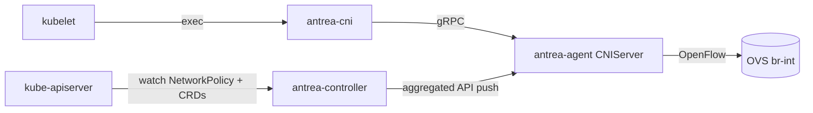

# Architecture

## Big picture

Antrea is three binaries. The Antrea Controller runs once per cluster and turns
Kubernetes and Antrea policy objects into a compact internal form. The Antrea
Agent runs on every node and owns that node's Open vSwitch (OVS) bridge. The
Antrea CNI binary is a thin executable kubelet runs per pod; it forwards the
request to the local agent. Policy is computed centrally and pushed to agents
through an aggregated API server, so each agent only receives the slice that
applies to its node.



## Components

### Antrea Controller

The controller watches Kubernetes NetworkPolicy plus Antrea's own Custom
Resource Definitions (CRDs) and computes them into internal groups. Its core is
`NetworkPolicyController` (`pkg/controller/networkpolicy/networkpolicy_controller.go:136`),
which aggregates informers and listers for Kubernetes NetworkPolicy, Antrea
ClusterNetworkPolicy, Antrea NetworkPolicy, Tier, ClusterGroup, Namespace,
Service, and Node. It runs as a single Deployment. The computed objects are
served from an aggregated API server in `pkg/apiserver/`.

### Antrea Agent

The agent runs as a DaemonSet, one pod per node. Its entry point is
`newAgentCommand` (`cmd/antrea-agent/main.go:37`), called from `main`
(`cmd/antrea-agent/main.go:31`). The agent owns the OVS integration bridge
(`br-int`), connects pod interfaces to it, installs OpenFlow entries, sets up
routing and tunnels, and watches the controller's aggregated API to program
policy into the data plane. The CNI request handling lives in
`pkg/agent/cniserver/`, and the OpenFlow abstraction lives in
`pkg/agent/openflow/`.

### Antrea CNI

The CNI binary is a thin shim kubelet invokes. Its `main` registers handlers
for the CNI verbs (`cmd/antrea-cni/main.go:28`):

```go
    funcs := skel.CNIFuncs{
        Add:   cni.ActionAdd.Request,
        Del:   cni.ActionDel.Request,
        Check: cni.ActionCheck.Request,
    }
```

Each handler sends a gRPC request to the local agent's CNIServer. The binary
holds no networking logic of its own.

## How a request flows

A pod start triggers a CNI ADD. The trace below ends with OVS ports and
OpenFlow rules in place.

1. kubelet runs the CNI binary, which registers `cni.ActionAdd.Request` as the
   ADD handler and sends the request to the agent over gRPC
   (`cmd/antrea-cni/main.go:29`).
2. The agent handles it in `CNIServer.CmdAdd`
   (`pkg/agent/cniserver/server.go:433`). It validates the request, waits for
   pod networking to be ready (`pkg/agent/cniserver/server.go:449`), arms a
   rollback `defer` that runs `cmdDel` if ADD fails
   (`pkg/agent/cniserver/server.go:462`), and serializes concurrent CNI calls
   for the same pod with a per-container lock (`pkg/agent/cniserver/server.go:477`).
3. It allocates the pod IP from the IPAM driver with `ipam.ExecIPAMAdd`
   (`pkg/agent/cniserver/server.go:498`).
4. It calls `s.podConfigurator.configureInterfaces`
   (`pkg/agent/cniserver/server.go:515`).
5. That reaches `configureInterfacesCommon`
   (`pkg/agent/cniserver/pod_configuration.go:244`), which builds the veth pair
   and sets up the container side through `ifConfigurator.configureContainerLink`
   (`pkg/agent/cniserver/pod_configuration.go:248`).
6. The host side is wired to OVS in `connectInterfaceToOVS`
   (`pkg/agent/cniserver/pod_configuration_linux.go:34`). The host veth name
   becomes the OVS port name (`pkg/agent/cniserver/pod_configuration_linux.go:41`),
   `createOVSPort` adds the port (`pkg/agent/cniserver/pod_configuration_linux.go:48`),
   and `GetOFPort` reads back the OpenFlow port number
   (`pkg/agent/cniserver/pod_configuration_linux.go:63`).
7. OpenFlow entries go in via `pc.ofClient.InstallPodFlows`
   (`pkg/agent/cniserver/pod_configuration_linux.go:68`), then the interface is
   recorded in the local cache with `ifaceStore.AddInterface`
   (`pkg/agent/cniserver/pod_configuration_linux.go:75`).
8. `InstallPodFlows` (`pkg/agent/openflow/client.go:643`) builds the per-pod
   flows: `podClassifierFlow` (`pkg/agent/openflow/client.go:653`),
   `l2ForwardCalcFlow` (`pkg/agent/openflow/client.go:654`),
   `arpSpoofGuardFlow` (`pkg/agent/openflow/client.go:659`),
   `podIPSpoofGuardFlow` (`pkg/agent/openflow/client.go:662`), and
   `l3FwdFlowToPod` (`pkg/agent/openflow/client.go:664`), then writes them in
   one batch with `c.modifyFlows` (`pkg/agent/openflow/client.go:680`).

On success the agent returns the CNI Result and kubelet sees the pod's IP. On
failure the rollback `defer` (`pkg/agent/cniserver/server.go:462`) runs `cmdDel`
to remove the OVS port and veth.

## Key design decisions

The defining choice is to compute policy centrally and push it. Instead of every
agent watching all pods and all NetworkPolicies and computing rules itself, the
controller precomputes each policy into three internal objects: `AppliedToGroup`
(the targets a policy applies to), `AddressGroup` (the IP sets a rule references),
and `NetworkPolicy` (the computed policy). These are exposed by an aggregated API
server under `controlplane.antrea.io/v1beta2`. The REST handlers are registered
in `pkg/apiserver/apiserver.go:206` (`addressgroup.NewREST`),
`pkg/apiserver/apiserver.go:207` (`appliedtogroup.NewREST`), and
`pkg/apiserver/apiserver.go:208` (`networkpolicy.NewREST`), and wired to their
API paths starting at `pkg/apiserver/apiserver.go:221`. Each agent watches only
the slice relevant to its node, which keeps agent load flat as pod and policy
counts grow. The internals page traces this in detail.

The second choice is to model the data plane as a two-dimensional OpenFlow
pipeline (stage by pipeline) in `pkg/agent/openflow/pipeline.go`, rather than a
flat table list. This is covered on the internals page.

## Extension points

- Antrea CRDs: NetworkPolicy, ClusterNetworkPolicy, Tier, ClusterGroup, Egress,
  and more, computed by `NetworkPolicyController`
  (`pkg/controller/networkpolicy/networkpolicy_controller.go:136`).
- The aggregated API group `controlplane.antrea.io/v1beta2`, served from
  `pkg/apiserver/apiserver.go`, that agents consume.
- IPAM is pluggable through the IPAM driver invoked at
  `pkg/agent/cniserver/server.go:498`.
