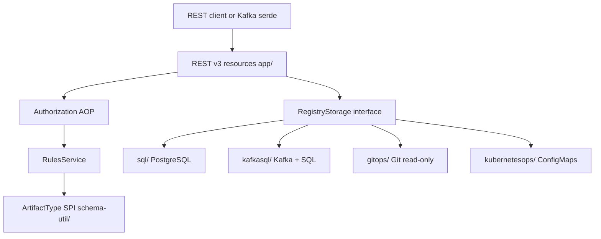

# Architecture

## Big picture

Apicurio Registry is a multi-module Maven project of roughly 30 modules. The server itself is a Quarkus application in `app/`. Around it sit schema-type utilities, client SDKs (Software Development Kits), Kafka serializers and deserializers, a Kubernetes operator, and a React UI. A request enters through a REST resource, passes through authorization and the rule engine, and lands in a pluggable storage backend.



## Components

### REST API server (`app/`)

The `app/` module is the Quarkus application: REST API, authentication, storage orchestration, and the rule engine. The process entry point is `RegistryQuarkusMain`, annotated `@QuarkusMain` and delegating to Quarkus:

```java
@QuarkusMain(name = "RegistryQuarkusMain")
public class RegistryQuarkusMain {
    public static void main(String... args) {
        Quarkus.run(args);
    }
}
```

That is the whole class at `app/src/main/java/io/apicurio/registry/RegistryQuarkusMain.java:6`. The current REST API is versioned at `/apis/registry/v3/`, implemented under `app/src/main/java/io/apicurio/registry/rest/v3/impl/`. The v2 API remains for backward compatibility. The server also exposes a Confluent Schema Registry compatible API under `app/src/main/java/io/apicurio/registry/ccompat/rest/`, which carries both a `v7` and a `v8` package.

### Schema-type utilities (`schema-util/`)

Each artifact type (Avro, Protobuf, JSON Schema, OpenAPI, AsyncAPI, GraphQL, XSD, WSDL, and others) gets a module under `schema-util/`. They implement a Service Provider Interface (SPI) so the server treats every type uniformly. The contract is `ArtifactTypeUtilProvider` at `schema-util/util-provider/src/main/java/io/apicurio/registry/types/provider/ArtifactTypeUtilProvider.java:20`, which bundles a canonicalizer, validator, compatibility checker, and more for one type.

### Storage backends (`app/.../storage/impl/`)

The `RegistryStorage` interface at `app/src/main/java/io/apicurio/registry/storage/RegistryStorage.java` is the boundary every backend implements. Implementations live under `app/src/main/java/io/apicurio/registry/storage/impl/` and are selected at runtime by the `APICURIO_STORAGE_KIND` setting:

- `sql/`: PostgreSQL over JDBC (Java Database Connectivity). The canonical implementation. SQL Server and MySQL are supported through dialects.
- `kafkasql/`: Kafka as a journal, SQL as a snapshot. State changes are replayed from a Kafka topic.
- `gitops/`: a Git repository as a read-only backing store (experimental, added in 3.3.0).
- `kubernetesops/`: Kubernetes ConfigMaps as a backing store.

### Surrounding modules

The `serdes/` module holds Kafka, NATS, and Pulsar serializers and deserializers. The `operator/` module is a Kubernetes operator. The `ui/` module is a React and TypeScript frontend with its own npm and Vite build. Client SDKs ship for Java, Go, Python, and TypeScript, and an `mcp/` module provides a Model Context Protocol (MCP) server.

## How a request flows

Trace the creation of an artifact: `POST /apis/registry/v3/groups/{groupId}/artifacts`.

1. Authorization runs first. The handler is annotated `@Authorized(style = AuthorizedStyle.GroupOnly, level = AuthorizedLevel.Write, dryRunParam = 3)` at `app/src/main/java/io/apicurio/registry/rest/v3/impl/GroupsResourceImpl.java:1281`, which enforces write access through aspect-oriented interception before the body runs.
2. The method body `createArtifact(...)` begins at `GroupsResourceImpl.java:1282`. It validates parameters, and if no `artifactId` was supplied it generates one with `idGenerator.generate()` at `GroupsResourceImpl.java:1363`.
3. The artifact type is inferred from the content by `ArtifactTypeUtil.determineArtifactType(...)` at `GroupsResourceImpl.java:1369`.
4. Referenced schemas are resolved with `RegistryContentUtils.recursivelyResolveReferences(...)` at `GroupsResourceImpl.java:1422`.
5. Unless the version is a draft (or draft production mode is enabled), `rulesService.applyRules(..., RuleApplicationType.CREATE, ...)` runs at `GroupsResourceImpl.java:1428`.
6. The work is handed to storage with `storage.createArtifact(...)` at `GroupsResourceImpl.java:1434`.
7. The handler builds and returns a `CreateArtifactResponse` at `GroupsResourceImpl.java:1448`.

Rule application is hierarchical. In `app/src/main/java/io/apicurio/registry/rules/RulesServiceImpl.java`, the service iterates `RuleType.values()` at `RulesServiceImpl.java:106` and, for each rule type, picks the single most specific configuration available: artifact, then group, then global, then the configured default global rule (`RulesServiceImpl.java:107` through `RulesServiceImpl.java:116`). Each selected rule runs through an executor from `factory.createExecutor(ruleType)` at `RulesServiceImpl.java:146`, invoked by `executor.execute(context)` at `RulesServiceImpl.java:152`. A failed rule throws and aborts the write.

The SQL backend then persists the artifact. In `app/src/main/java/io/apicurio/registry/storage/impl/sql/AbstractSqlRegistryStorage.java`, `createArtifact(...)` starts at `AbstractSqlRegistryStorage.java:486`. It optionally auto-creates the group at `AbstractSqlRegistryStorage.java:501`, stores the content and gets its identifier at `AbstractSqlRegistryStorage.java:516`, opens a JDBI transaction with `handles.withHandle` at `AbstractSqlRegistryStorage.java:521` (setting rollback for a dry run at `AbstractSqlRegistryStorage.java:523`), inserts the artifact row at `AbstractSqlRegistryStorage.java:531`, creates the first version at `AbstractSqlRegistryStorage.java:557`, and fires a storage event at `AbstractSqlRegistryStorage.java:566`:

```java
                outboxEvent.fire(SqlOutboxEvent.of(ArtifactCreated.of(amdDto)));
```

A primary-key violation is translated into `ArtifactAlreadyExistsException` at `AbstractSqlRegistryStorage.java:571`.

## Key design decisions

The single most consequential decision is the storage abstraction. One interface, `RegistryStorage`, lets the same server run on PostgreSQL, Kafka, Git, or ConfigMaps without changing the REST layer. The data transfer objects (DTOs) under `storage/dto/` must stay serializable because the KafkaSQL backend serializes them into its journal.

Rules are hierarchical and non-merging. Each rule type resolves to exactly one level, the most specific one, and higher levels are ignored rather than combined (`RulesServiceImpl.java:106` through `RulesServiceImpl.java:116`). This keeps rule evaluation predictable: an artifact-level compatibility rule fully overrides the global one.

State changes use an outbox pattern. The SQL backend fires `outboxEvent.fire(...)` inside the same transaction (`AbstractSqlRegistryStorage.java:566`), and the KafkaSQL backend builds its SQL snapshot by replaying journal events.

## Extension points

New artifact types are added by implementing the `ArtifactTypeUtilProvider` SPI (`ArtifactTypeUtilProvider.java:20`) in a new `schema-util/<type>/` module; no change to the server core is required. New storage backends implement the `RegistryStorage` interface (`RegistryStorage.java`). The Confluent-compatible REST layer under `app/.../ccompat/rest/` lets existing Kafka clients integrate without code changes, and client SDKs exist for Java, Go, Python, and TypeScript.
