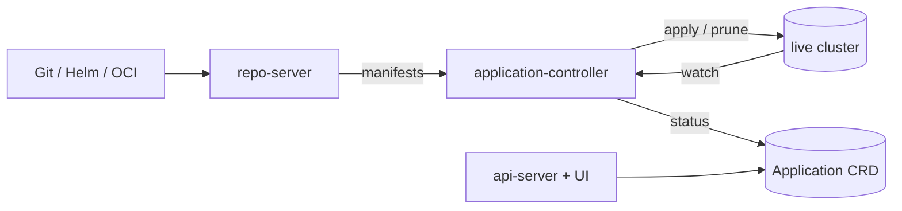

# Architecture

## Big picture

Argo CD ships as several cooperating processes, not one binary. They share a single executable that branches on its binary name: `cmd/main.go:1` is a multi-call entry point that dispatches to the right sub-command based on `ARGOCD_BINARY_NAME`. The core components are the application-controller (`controller/`), the repo-server (`reposerver/`), and the api-server (`server/`), supported by applicationset-controller (`applicationset/`), commit-server (`commitserver/`), config-management-plugin server (`cmpserver/`), notifications, and Dex for SSO.

## Components

### application-controller (`controller/`)

The heart of the system. It reconciles each `Application` resource: it compares the desired state from Git against the live cluster state and, when auto-sync is enabled, applies the difference. The reconcile loop is driven by `Run()` at `controller/appcontroller.go:908`, which spins up worker goroutines over rate-limited work queues.

### repo-server (`reposerver/`)

A gRPC service that turns a repo reference into rendered Kubernetes manifests. It handles plain manifests, Helm, Kustomize, and OCI. The controller reaches it through `GetRepoObjs` (`controller/state.go:206`), which lists repos and requests manifest generation. This is the most expensive step in a reconcile, which shapes much of the design (see Key design decisions).

### api-server (`server/`)

Serves the gRPC and REST API, handles authentication and RBAC, and serves the web UI. It reads and writes the `Application` resources the controller acts on.

### gitops-engine (`gitops-engine/`)

The shared diff-and-sync library, vendored into the monorepo as a local module (`go.mod:374`). It owns the actual reconcile and apply primitives that both the controller's compare and sync paths call into.

## How a request flows

Trace one Application from refresh to auto-sync.

1. The controller starts in `controller/appcontroller.go:908`. `Run()` launches status processors that drain `appRefreshQueue` (declared at `controller/appcontroller.go:118`, built as a rate-limited queue at `controller/appcontroller.go:200`).
2. One refresh item is handled by `processAppRefreshQueueItem()` at `controller/appcontroller.go:1728`. It fetches the Application from the informer index (`controller/appcontroller.go:1746`) and calls `needRefreshAppStatus` to decide whether a refresh is needed and at which comparison level (`controller/appcontroller.go:1761`). A `defer` re-queues the key onto `appOperationQueue` so sync runs after refresh (`controller/appcontroller.go:1743`, the ordering fix in issue #18500).
3. If the level is `ComparisonWithNothing`, the controller skips the repo-server entirely, rebuilds the resource tree from cached managed resources, and returns (`controller/appcontroller.go:1797`).
4. Otherwise it computes state with `CompareAppState(...)` at `controller/appcontroller.go:1876`. The body is `controller/state.go:632`: it generates target manifests via `GetRepoObjs` (`controller/state.go:694`), reads live state from the cluster cache via `GetManagedLiveObjs` (`controller/state.go:773`), and diffs them with `argodiff.StateDiffs(...)` (`controller/state.go:917`) after the gitops-engine `Reconcile()` pairs target and live objects (`gitops-engine/pkg/sync/reconcile.go:71`). Per-resource sync codes roll up into one `syncStatus.Status` (`controller/state.go:990`, `controller/state.go:1039`).
5. Auto-sync is gated by the project sync window (`controller/appcontroller.go:1900`), then `ctrl.autoSync(...)` runs (`controller/appcontroller.go:1908`). If the app is OutOfSync and auto-sync is on, it issues an Operation.
6. Sync executes on the operation queue in `SyncAppState()` (`controller/sync.go:101`). It builds a gitops-engine sync context with `sync.NewSyncContext(...)` (`controller/sync.go:319`), injecting options for server-side apply, prune, hooks, and sync waves (`controller/sync.go:300`). `syncCtx.Sync()` performs the apply (`controller/sync.go:343`) and `syncCtx.GetState()` collects the result (`controller/sync.go:347`).
7. The controller writes `Status.Sync`, `Status.Health`, and `Status.Resources` back (`controller/appcontroller.go:1929`) and patches the CRD.

## Key design decisions

- Pull-based GitOps. External CI does not push manifests; the controller treats Git as truth and reconciles continuously. This keeps the cluster's deployment story auditable, the reason Intuit chose it.
- Separate refresh and operation queues. `appRefreshQueue` and `appOperationQueue` are distinct, and a refresh re-queues onto the operation queue on completion so sync always runs after the comparison, avoiding a race (`controller/appcontroller.go:1743`, issue #18500).
- Staged comparison. Because manifest generation in the repo-server is the costly step, the controller does not always do a full diff. It picks a comparison level per item (`controller/appcontroller.go:1761`) so most refreshes do minimal work (see [Internals](./internals)).
- A repo-error grace period. A transient Git failure does not immediately flip an app to OutOfSync or Unknown; within `repoErrorGracePeriod` the prior state is held (`controller/state.go:699`).

## Extension points

- `Application` and `AppProject` CRDs (`pkg/apis/application/v1alpha1/types.go:68`) are the primary declarative interface.
- Config management plugins run in the cmp-server (`cmpserver/`) for custom manifest generation.
- ApplicationSet (`applicationset/`) generates Applications from generators for multi-cluster and monorepo layouts.
- Notifications and Dex-based SSO plug into the api-server.
