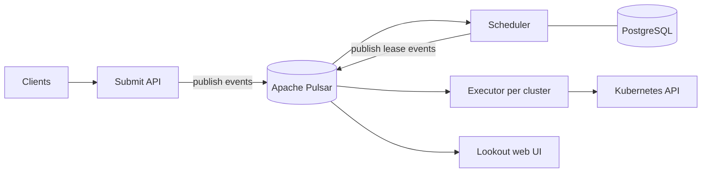

# Architecture

## Big picture

Armada is split into a control plane and a set of executors. The control plane accepts, schedules, and tracks jobs. One executor runs per worker cluster and bridges the control plane to that cluster's Kubernetes API (`docs/system_overview.md:21`). Clients submit jobs to the control plane, and jobs are transferred to a worker cluster only once scheduled (`docs/system_overview.md:20`).

The services communicate by event sourcing. Message routing goes through a log-based message broker, Apache Pulsar, shared by all services. The log is the source of truth, and each subsystem can rebuild its internal state by replaying messages (`docs/system_overview.md:62-70`).

## Components

### Control plane subsystems

The control plane is the set of components responsible for job submission and scheduling (`docs/system_overview.md:54`). It is made up of: job submission and control (submit, re-prioritise, cancel), job state querying, streaming job state querying, the scheduler that assigns jobs to clusters and nodes, and Lookout, the web UI showing job state (`docs/system_overview.md:56-60`). Each subsystem is a binary under `cmd/`; for example `cmd/server/main.go` and `cmd/scheduler`.

### Executor

There is one executor per worker cluster (`docs/system_overview.md:21`). It is responsible for communication between the Armada control plane and the Kubernetes control plane (`docs/system_overview.md:21`). When the scheduler marks a job as leased, the executor creates the Kubernetes resources for the job in its cluster and binds the pod to the assigned node (`docs/system_overview.md:45-46`).

### Dependency middleware

Armada relies on Apache Pulsar for message routing (`docs/system_overview.md:62`). The scheduler and Lookout persist to PostgreSQL, and Redis is part of the local development stack (README:81). The local stack brings up redis, postgres, and pulsar via Docker Compose (README:81).

## How a request flows

A job submission walks through the submit server in `internal/server/submit/submit.go`. The `Server` type is the service that accepts the original Armada submit API and publishes messages to Pulsar based on those calls (`internal/server/submit/submit.go:30-32`).

1. Entry point `func (s *Server) SubmitJobs(...)` (`internal/server/submit/submit.go:72`).
2. Authorization: the caller is checked with `s.authorize(ctx, req.Queue, permissions.SubmitAnyJobs, queue.PermissionVerbSubmit)`; failure returns `codes.PermissionDenied` (`internal/server/submit/submit.go:76-79`).
3. Validation: `validation.ValidateSubmitRequest(req, s.submissionConfig)`; failure returns `codes.InvalidArgument` (`internal/server/submit/submit.go:82-84`).
4. Deduplication: `s.deduplicator.GetOriginalJobIds(ctx, req.Queue, req.JobRequestItems)` maps a client id to an existing job id. Deduplication is best-effort, so an error here is logged and not fatal (`internal/server/submit/submit.go:88-92`). A request item that is a duplicate returns the previously submitted id and is skipped (`internal/server/submit/submit.go:101-106`).
5. Conversion: each non-duplicate item becomes a SubmitJob event via `conversion.SubmitJobFromApiRequest(...)` (`internal/server/submit/submit.go:109`), wrapped as an `EventSequence_Event_SubmitJob` (`internal/server/submit/submit.go:111-116`).
6. Publish: the events are assembled into an `EventSequence` (`internal/server/submit/submit.go:133-139`) and sent with `s.publisher.PublishMessages(ctx, es)`; failure returns `codes.Internal` (`internal/server/submit/submit.go:141-145`).
7. After a successful publish, deduplication ids are stored with `s.deduplicator.StoreOriginalJobIds(...)` (`internal/server/submit/submit.go:149`). A comment notes that a partial Pulsar submission can result in duplicate jobs because this store only runs on success (`internal/server/submit/submit.go:147-148`).

The scheduler then takes over. `func (s *Scheduler) Run(...)` (`internal/scheduler/scheduler.go:147`) runs a ticker every cycle period (`internal/scheduler/scheduler.go:159`, `:164-169`). Only the leader may schedule jobs (`internal/scheduler/scheduler.go:49-50`) and only the leader publishes (`internal/scheduler/scheduler.go:56`). On becoming leader, it first catches up to all Pulsar messages with `s.ensureDbUpToDate(...)` before scheduling (`internal/scheduler/scheduler.go:186-189`). The body of one cycle is `func (s *Scheduler) cycle(...)` (`internal/scheduler/scheduler.go:281`).

## Key design decisions

Event sourcing with Pulsar as source of truth is the central decision: subsystems update state and publish back to the log, and any subsystem can recover by replaying (`docs/system_overview.md:62-70`). The submit path therefore never writes jobs to a database; it only publishes to Pulsar, leaving persistence to downstream consumers (`internal/server/submit/submit.go:141`).

Scheduling is leader-only. A single leader schedules and publishes, which avoids two schedulers making conflicting placement decisions (`internal/scheduler/scheduler.go:49-50`, `:56`). To stay correct, a new leader blocks on catching up to Pulsar before it schedules (`internal/scheduler/scheduler.go:186-189`).

The scheduler decouples its hot loop from database I/O by holding all jobs in an in-memory transactional store, `JobDb` (`internal/scheduler/jobdb/jobdb.go:68`). This is covered in [Internals](./internals).

## Extension points

Armada exposes gRPC and REST submit APIs, so clients in several languages drive it without changing the server. Client libraries exist for Python, Java, and .NET (`docs/client_libraries.md`). An Airflow operator integrates Armada into Airflow DAGs (`docs/armada_airflow_operator.md`). Job scheduling behaviour is configurable through priority classes and Dominant Resource Fairness (DRF, fair allocation across multiple resource types) settings consumed by the scheduler (`internal/scheduler/scheduling/fairness/fairness.go:43`).
