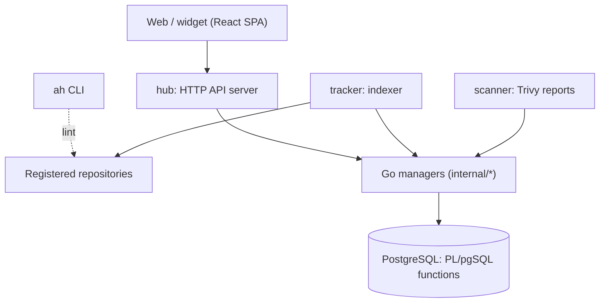

# Architecture

## Big picture

The project's own `docs/architecture.md` describes a layered design where each layer serves the one outside it. From the inside out: a PostgreSQL database whose functions act as an API, a set of Go managers, the backend binaries (`hub`, `tracker`, `scanner`), and the React web and widget layer. A separate `ah` CLI sits alongside for publishers.

## Components

### hub (HTTP API server)

The API server is the entrypoint at `cmd/hub/main.go:35`. It sets up a pgx database pool with `util.SetupDB` (`cmd/hub/main.go:48`) and an OPA-based authorizer with `authz.NewAuthorizer` (`cmd/hub/main.go:56`). All managers are wired into a `handlers.Services` struct (`cmd/hub/main.go:65`), which holds the organization, user, repository, package, subscription, webhook, API key, and stats managers plus an image store and OCI puller. It serves the HTTP router (`cmd/hub/main.go:91`) and exposes Prometheus metrics on a separate port (`cmd/hub/main.go:101`).

### tracker (indexer)

The tracker walks registered repositories and keeps the index current. It loads repositories (`cmd/tracker/main.go:93`) and processes each one, bounded by `tracker.concurrency` (default 1, `cmd/tracker/main.go:147`) and `tracker.repositoryTimeout` (default 15 minutes, `cmd/tracker/main.go:148`). It requires the external `opm` tool to be present at startup (`cmd/tracker/main.go:53`).

### scanner (vulnerability reporting)

The scanner uses Trivy as a library to produce vulnerability reports for container images. It imports `github.com/aquasecurity/trivy/pkg/types` (`internal/scanner/alerts.go:10`).

### Go managers

Each domain has a manager under `internal/` (for example `internal/pkg`, `internal/repo`, `internal/org`, `internal/user`). A manager calls the database functions and exposes a higher-level Go API to the binaries above.

### Database

PostgreSQL holds the schema and a set of PL/pgSQL functions managed by Tern migrations under `database/migrations/`. As `docs/architecture.md` states, these functions serve as the API for the outer layers, hiding schema detail.

## How a request flows

Tracking a repository end to end is the representative operation. The tracker creates a `Tracker` and calls `Run()` (`cmd/tracker/main.go:125`). Inside `Run()` (`internal/tracker/tracker.go:34`):

1. It fetches the remote digest with `GetRemoteDigest` (`internal/tracker/tracker.go:36`). If the digest matches the stored one, it returns without work (`internal/tracker/tracker.go:41`). This is the "nothing changed, do nothing" optimization.
2. It clones the repository if the kind requires it (`internal/tracker/tracker.go:50`). Helm, Container, and Kagent kinds skip cloning and read `index.yaml` or OCI tags directly.
3. It loads the digests of already-registered packages with `GetPackagesDigest` (`internal/tracker/tracker.go:64`).
4. It builds the kind-specific source with `SetupTrackerSource` (`internal/tracker/tracker.go:86`), then calls `GetPackagesAvailable()` (`internal/tracker/tracker.go:87`) to list packages.
5. For each package, it skips unchanged ones (`internal/tracker/tracker.go:103`), applies ignore rules (`internal/tracker/tracker.go:108`), predicts a category when unset (`internal/tracker/tracker.go:115`), and registers it with `Pm.Register` (`internal/tracker/tracker.go:122`).

The package manager's `Register` (`internal/pkg/manager.go:243`) validates fields in Go, marshals the package to JSON (`internal/pkg/manager.go:313`), and calls the database function (`internal/pkg/manager.go:317`).

## Key design decisions

Most of the persistence and query logic sits in PostgreSQL functions, not Go. The Go side serializes a `hub.Package` and runs `select register_package($1::jsonb)` (`internal/pkg/manager.go:43`). Reads work the same way: `select get_package($1::jsonb)` (`internal/pkg/manager.go:30`) and `search_packages`. This keeps query optimization and JSON shaping in the database; the cost is logic spread across SQL.

A second decision is incremental tracking. Digest comparison at the repository level (`internal/tracker/tracker.go:41`) and the package level (`internal/tracker/tracker.go:103`) lets the tracker skip unchanged work entirely, which matters when scanning many large repositories.

## Extension points

The main extension axis is the artifact kind. The `TrackerSource` interface (`internal/hub/tracker.go:37`) has a single method, `GetPackagesAvailable()`, and `SetupSource` dispatches each `RepositoryKind` to a concrete implementation (`internal/tracker/helpers.go:92`). Helm and Kagent map to `helm`, Krew to `krew`, OLM to `olm`, Tekton to `tekton`, Container to `container`, and most others to a `generic` source. Publishers extend the system by registering a repository of a supported kind; the `ah` CLI validates that repository's metadata with `ah lint` before publishing.
