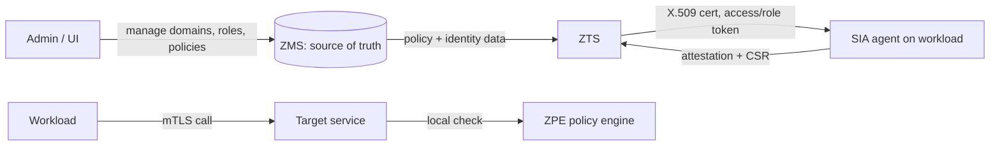

# Architecture

## Big picture

Athenz has two server roles and a set of agents and client libraries. ZMS is the central authority that owns authorization data and answers central access checks. ZTS sits at the edge, caches ZMS data locally, and issues short-lived credentials (X.509 identity and role certificates, OAuth2 access tokens, role tokens) to workloads. SIA agents run on each platform to fetch and renew a workload's identity certificate. ZPE is the client-side policy engine for distributed, offline enforcement. Both servers run as REST services on an embedded Jetty container.

## Components

### ZMS (Athenz Management System)

The source of truth for authorization data. It handles CRUD for domains, roles, policies, and service identities, and answers centralized access checks. Core logic is in `servers/zms/src/main/java/com/yahoo/athenz/zms/ZMSImpl.java`, with persistence in `servers/zms/src/main/java/com/yahoo/athenz/zms/DBService.java` backed by a MySQL schema in `servers/zms/schema/zms_server.sql`.

### ZTS (Athenz Token System)

The credential-issuing service for distributed authorization. It keeps a local copy of ZMS data in `servers/zts/src/main/java/com/yahoo/athenz/zts/store/DataStore.java` and issues X.509 identity certificates, role certificates, access tokens, and role tokens. The main body is `servers/zts/src/main/java/com/yahoo/athenz/zts/ZTSImpl.java`, and certificate handling lives in `servers/zts/src/main/java/com/yahoo/athenz/zts/cert/InstanceCertManager.java`.

### auth_core

The principal/authority abstraction plus authentication implementations and token/certificate utilities. It lives under `libs/java/auth_core/src/main/java/com/yahoo/athenz/auth/`. `Authority` is the pluggable authentication SPI and `Principal` is the authenticated-subject abstraction.

### SIA (Service Identity Agent)

A Go agent that fetches and renews a workload's identity certificate on each platform. Shared code is in `libs/go/sia/`, and per-platform entry points are at `provider/{aws,gcp,azure,github,buildkite,harness,spacelift}/.../cmd/siad/main.go`.

### ZPE (client-side policy engine)

Distributed enforcement on the client side, with implementations in `clients/go/zpe` and `clients/nodejs/zpe`.

### Server entry point

Both ZMS and ZTS serve REST over embedded Jetty. The startup entry point is `main` in `containers/jetty/src/main/java/com/yahoo/athenz/container/AthenzJettyContainer.java:759`.

## How a request flows

Trace a centralized access check through ZMS. The entry point is `ZMSImpl.access(action, resource, principal, trustDomain)` at `servers/zms/src/main/java/com/yahoo/athenz/zms/ZMSImpl.java:3648`.

1. Inputs are lowercased and the principal is resolved (home-domain conversion for `user.` principals), then the request checks that the Authority is allowed to be used for an authorization decision.
2. ZMS resolves the domain from the resource; a missing domain returns 404 and an invalid one returns 403.
3. `hasAccess(...)` at `servers/zms/src/main/java/com/yahoo/athenz/zms/ZMSImpl.java:3708` runs. For role-token-based checks it first validates the role token at `:3717`.
4. `evaluateAccess(...)` at `servers/zms/src/main/java/com/yahoo/athenz/zms/ZMSImpl.java:3530` does the core work: mTLS-restricted certificates are denied immediately, then it scans every active policy and every assertion.
5. `assertionMatch(...)` at `servers/zms/src/main/java/com/yahoo/athenz/zms/ZMSImpl.java:6809` matches action, resource, and role. Each glob pattern is converted to a regex by `StringUtils.patternFromGlob` at `libs/java/auth_core/src/main/java/com/yahoo/athenz/auth/util/StringUtils.java:47`.

The credential-bootstrap flow runs through ZTS instead; it is traced step by step in [Internals](./internals).

## Key design decisions

The notable choice is explicit-deny-wins. `evaluateAccess` does not short-circuit on the first ALLOW. It keeps scanning all policies and assertions so that a later DENY assertion can override a broad ALLOW, and only returns the matched status at the end (`servers/zms/src/main/java/com/yahoo/athenz/zms/ZMSImpl.java:3583`-`3607`). Because matching is glob-based, deny-last is what lets a narrow DENY punch a hole in a wide ALLOW.

The second choice is push central, pull at the edge. ZMS is authoritative, but ZTS caches ZMS data wholesale in `DataStore.java` so distributed enforcement does not pay a round-trip to ZMS on every request.

The third is contract-first APIs. The REST interfaces and data models are generated from RDL (REST Description Language) definitions such as `servers/zms/src/main/rdl/ZMS.rdl` and `servers/zts/src/main/rdl/ZTS.rdl`, which pushes compatibility management into the IDL.

## Extension points

`Authority` (`libs/java/auth_core/src/main/java/com/yahoo/athenz/auth/Authority.java:30`) is the pluggable authentication SPI, letting operators swap certificate, token, and header authentication. On the ZTS side, the `InstanceProvider` implementations validate platform attestation (AWS, GCP, Azure, Kubernetes, GitHub Actions, and others) before a CA signs the workload certificate.
