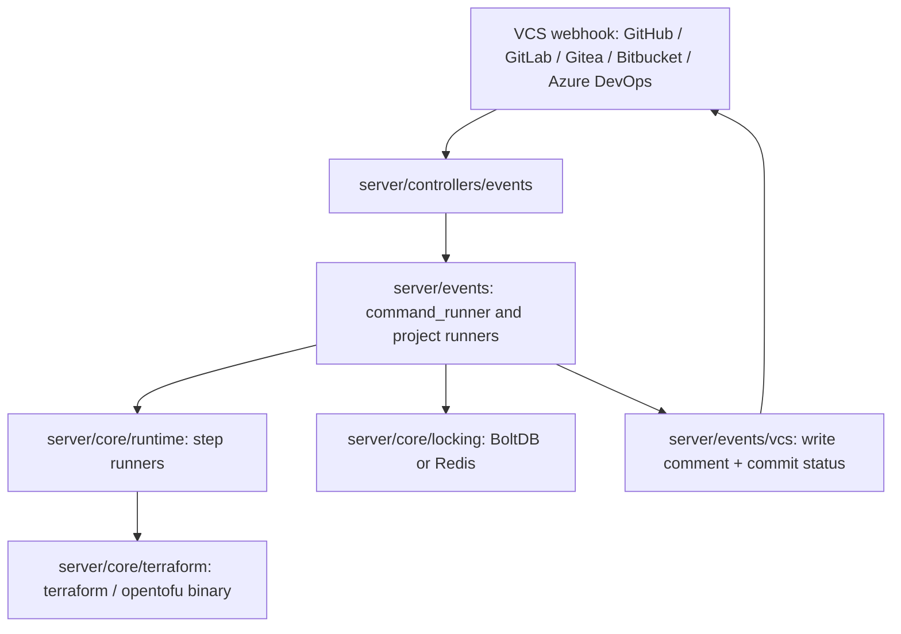

# Architecture

## Big picture

Atlantis is one Go process that exposes an HTTP server. The entry point `main.go` registers three subcommands on `cmd.RootCmd`: `server`, `version`, and `testdrive` (`main.go:52-54`). The real work happens in `server`. Inside it, four layers stack up: HTTP controllers receive webhooks, an events layer turns a comment into an ordered set of project commands, a core layer runs the Terraform binary and holds locks, and a VCS client layer writes results back to the pull request.

## Components

### HTTP controllers (`server/controllers`)

This layer owns the webhook endpoint and the supporting web pages. `VCSEventsController.Post` is the single POST handler for every VCS (`server/controllers/events/events_controller.go:101`). It inspects request headers to decide which host sent the event; the GitHub branch checks the GitHub header and calls `handleGithubPost` (`server/controllers/events/events_controller.go:110-117`), defined at `server/controllers/events/events_controller.go:169`. The same directory also holds the lock UI, the job streaming endpoint, the status endpoint, and the API controller.

### Events layer (`server/events`)

This is the domain core. It parses the comment, checks permissions, builds the per-project commands, and orchestrates each run. `DefaultCommandRunner.RunCommentCommand` is the hub (`server/events/command_runner.go:292`). Command-type specifics live in `plan_command_runner.go`, `apply_command_runner.go`, and the per-project `project_command_runner.go`. The comment grammar is in `comment_parser.go`.

### VCS clients (`server/events/vcs`)

A set of client implementations, one per supported host: GitHub, GitLab, Gitea, Bitbucket Cloud and Server, and Azure DevOps. They abstract "post a comment", "set a commit status", and "get changed files" behind one interface so the events layer does not care which host it is talking to.

### Core (`server/core`)

The execution substrate. `server/core/terraform` downloads and runs the Terraform or OpenTofu binary. `server/core/runtime` holds the step runners, one per workflow step (init, plan, apply, policy_check, run, env, and more). `server/core/locking` plus `server/core/db` (with BoltDB and Redis backends) persist locks; BoltDB is the embedded default. `server/core/config/valid` parses and validates the repository's `atlantis.yaml` into typed structs.

## How a request flows

Trace a single `atlantis plan` comment from webhook to pull request reply.

1. The POST arrives at `VCSEventsController.Post`, which routes to `handleGithubPost` for a GitHub event (`server/controllers/events/events_controller.go:101`, branch at `:110-117`, handler at `:169`).
2. A comment event funnels into `handleCommentEvent` (`server/controllers/events/events_controller.go:673`). After the comment parses as a command and the repo passes the allowlist, it launches the work in a goroutine: `go e.CommandRunner.RunCommentCommand(...)` (`server/controllers/events/events_controller.go:742`). The HTTP response returns immediately; the result comes back later as a comment.
3. The comment text is interpreted by `CommentParser.Parse` (`server/events/comment_parser.go:156`). It lowercases the first token and matches it against the executable name, returning a "did you mean" hint when someone types `terraform` instead of `atlantis` (`server/events/comment_parser.go:172-181`).
4. `DefaultCommandRunner.RunCommentCommand` orchestrates the run (`server/events/command_runner.go:292`): it rejects work during shutdown via the drainer (`:293`), checks the team allowlist (`:313-329`), assembles the request-scoped `command.Context` (`:351`), sets the commit status to pending (`:372-381`), runs pre-workflow hooks (`:386`), picks the command-specific runner with `buildCommentCommandRunner` and calls `Run` (`:416-418`), then runs post-workflow hooks (`:420`).
5. For plan the runner is `PlanCommandRunner.run` (`server/events/plan_command_runner.go:194`). It builds the target projects from the pull request's changed files with `BuildPlanCommands` (`:214`), discards previous plans and locks when the plan is generic (`:270-277`), then runs each project (optionally in parallel) through `runProjectCmdsWithCancellationTracker(..., p.prjCmdRunner.Plan)` (`:279`).
6. Per project, `DefaultProjectCommandRunner.Plan` calls `doPlan` (`server/events/project_command_runner.go:242`, `:666`), which acquires the persistent Atlantis lock, acquires the in-process working-directory lock, clones the repo, and runs the workflow steps (covered in [Internals](./internals)).
7. The plan step itself shells out to the binary in `planStepRunner.Run` (`server/core/runtime/plan_step_runner.go:50`), which resolves the Terraform distribution and version and calls `TerraformExecutor.RunCommandWithVersion` (`:62`).
8. The output is rendered to Markdown and written back to the pull request through the VCS client, and the commit status is updated.

## Key design decisions

- **Server-side execution.** Atlantis runs the Terraform or OpenTofu binary on its own disk (`server/core/runtime/plan_step_runner.go:62`). State stays in the user's backend; Atlantis persists only locks and plan metadata. Credentials live on the server, not on developer machines.
- **Push, not pull.** Atlantis is started by VCS webhooks and comments. There is no reconcile loop that continuously compares desired and live state. The flow is imperative and comment-driven, which is the opposite of a GitOps controller like Flux or Argo CD.
- **Two layers of locking.** A persistent project lock serialises plan and apply across pull requests, while a separate in-process lock guards the working directory against filesystem races. This is detailed in [Internals](./internals).

## Extension points

The main extension point is the custom workflow in `atlantis.yaml`. A `valid.Workflow` carries an `Apply`, `Plan`, `PolicyCheck`, `Import`, and `StateRm` stage (`server/core/config/valid/repo_cfg.go:252`), and each stage is a list of `valid.Step` (`server/core/config/valid/repo_cfg.go:231`). The `run` step lets an operator inject an arbitrary shell command, which is how integrations such as Terragrunt, Conftest policy checks, and Infracost are wired in.
