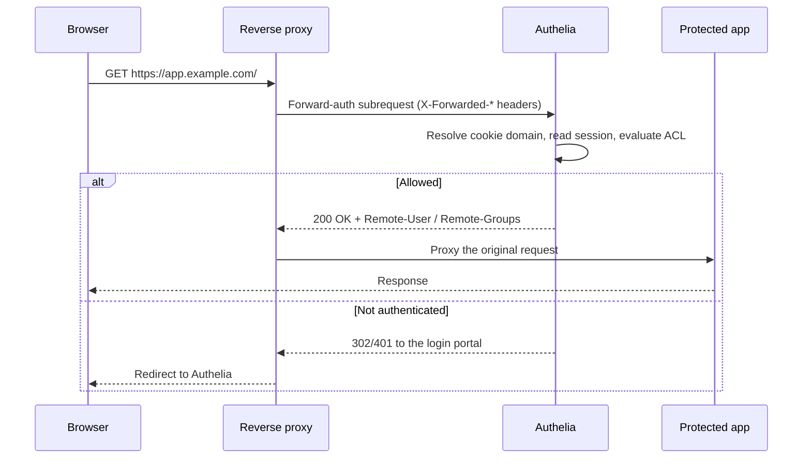

# Architecture

## Big picture

Authelia is one Go binary that exposes an HTTP API and a login portal. The backend is organised as a set of packages under `internal/`, each owning one concern. The frontend is a React application served as static assets. State lives in a SQL database and, for sessions, optionally in Redis.

The request that matters most does not come from a browser directly. It comes from the reverse proxy, which asks Authelia whether to allow a request it just received. The sequence below is the forward-auth flow that every protected request goes through.

## Components

The major packages under `internal/`:

| Package | Responsibility |
| --- | --- |
| `internal/authorization` | The access-control engine: rules, levels, and the decision. |
| `internal/session` | Per-domain session providers and the `UserSession` type. |
| `internal/authentication` | User backends (file, LDAP) and password checking. |
| `internal/handlers` | The HTTP handlers, including the forward-auth framework. |
| `internal/oidc` | The OpenID Connect provider. |
| `internal/storage` | SQL persistence and migrations. |
| `internal/middlewares` | The request context and the bridge the authz framework runs on. |
| `internal/notification` | Email and file notifiers for verification and reset. |
| `internal/totp`, `internal/webauthn`, `internal/duo` | The second-factor methods. |
| `internal/configuration` | Config loading and the typed schema the engine consumes. |

The entry point is `cmd/authelia/main.go`, which runs a Cobra root command defined in `internal/commands`.

## How a request flows

One handler serves four reverse-proxy dialects. Rather than a separate handler per proxy, a builder injects per-proxy behaviour into a shared handler. The implementations are enumerated in `internal/handlers/handler_authz_types.go:141`: `AuthzImplLegacy`, `AuthzImplForwardAuth` (Traefik, Caddy, Skipper), `AuthzImplAuthRequest` (NGINX), and `AuthzImplExtAuthz` (Envoy). `AuthzBuilder.Build` wires the per-implementation function pointers at `internal/handlers/handler_authz_builder.go:128`.

The shared entry is `func (authz *Authz) Handler` at `internal/handlers/handler_authz.go:146`. It runs these steps:

1. **Extract the target object.** `authz.handleGetObject` reads the proxy's headers. ForwardAuth reads `X-Forwarded-Proto/Host/Uri` (`internal/handlers/handler_authz_impl_forwardauth.go:12`); AuthRequest reads `X-Original-URL` (`handler_authz_impl_authrequest.go:13`); ExtAuthz uses the real `Host` and path (`handler_authz_impl_extauthz.go:13`).
2. **Require a secure scheme.** Non-`https` targets are rejected at `handler_authz.go:162`, because the session cookie must travel securely.
3. **Resolve the session.** `ctx.GetSessionManagerByTargetURI` (`handler_authz.go:170`) picks the session provider for the target's cookie domain, implemented in `internal/middlewares/authelia_context.go:322`.
4. **Authenticate the subject.** `authz.authn` (`handler_authz.go:191`) tries each strategy: a cookie session, or an `Authorization` header carrying Basic credentials or an OIDC bearer token. Any failure sets the level to not-authenticated.
5. **Evaluate authorization.** `ctx.GetProviders().Authorizer.GetRequiredLevel` (`handler_authz.go:196`) returns the level the rules require for this subject and object.
6. **Decide the response.** `handler_authz.go:225` maps the authenticated level against the required level: `200 OK` with `Remote-User` and `Remote-Groups` headers, a `403` forbidden, or a redirect to the portal.

The [Internals](./internals) page walks the authorization decision in step 5 in detail.

## Key design decisions

- **One handler, four proxies.** The differences between Traefik, NGINX, and Envoy are pure data: header names and which status codes to use for an unauthenticated request. The shared handler never knows which proxy it is serving (`handler_authz_builder.go:128`).
- **Bearer tokens are a first-class authz path.** An `Authorization: Bearer` token is introspected as an Authelia OAuth2 access token and checked against the same access-control rules, so API access uses the same machinery as browser access.
- **Sessions are partitioned per cookie domain**, each with its own encrypted store, and a session is destroyed if it arrives on a domain that does not match the one embedded in it. This is covered on the [Internals](./internals) page.

## Extension points

The OpenID Connect provider (`internal/oidc`) lets applications integrate by speaking OIDC rather than going through the proxy. Authentication backends are pluggable between a flat file and LDAP. Notifications are pluggable between SMTP and a filesystem notifier.

## Sources

- Source read at commit `06af72a` (v4.39.20): paths above are relative to the repository root.
- [Proxy integration support matrix](https://www.authelia.com/integration/proxies/support/)
