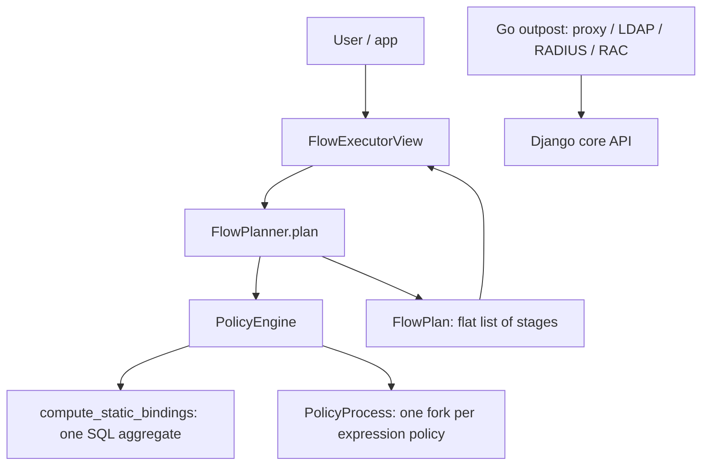

# Architecture

## Big picture

authentik is one repository that mixes three languages by responsibility. The Python/Django core under `authentik/` owns the data model, the protocol providers, and the policy and flow engines. Go programs under `cmd/` and `internal/` are the outposts: standalone processes that terminate a protocol (forward-auth proxy, LDAP, RADIUS, RAC) and call back to the core. The `web/` directory is the TypeScript/Lit frontend for the admin UI and the flow executor screen.

## Components

### Django core (`authentik/`)

The core owns everything stateful. Sub-packages each own a feature: `policies/` is the authorization policy engine, `flows/` is the authentication flow planner and executor, `providers/` holds the protocol implementations (`oauth2`, `saml`, `ldap`, `proxy`, `rac`, `radius`, `scim`), `sources/` integrates external IdPs and directories, `stages/` holds the individual flow steps, and `core/` defines `User`, `Group`, `Application`, and `Token`. Declarative configuration lives in `blueprints/`. The Enterprise edition lives in `authentik/enterprise/` under its own license.

### Go outposts (`cmd/`, `internal/`)

Each outpost is a separate Go binary: `cmd/proxy`, `cmd/ldap`, `cmd/radius`, `cmd/rac`, with `cmd/server` as the combined entry point. The forward-auth reverse proxy lives in `internal/outpost/proxyv2/`. An outpost terminates its protocol at the edge and defers identity decisions to the core.

### Web UI (`web/`)

A TypeScript and Lit application serving both the administration interface and the user-facing flow executor that renders each stage.

## How a request flows

Trace a user hitting a protected application backed by a flow.

1. `FlowExecutorView` is the HTTP entry point. It keeps the planned flow in the session under `SESSION_KEY_PLAN = "authentik/flows/plan"` (`authentik/flows/views/executor.py:66`).
2. `FlowPlanner.plan()` first checks the flow's own direct policy bindings by building a `PolicyEngine` for the flow and requiring the result to pass, otherwise it raises `FlowNonApplicableException` (`authentik/flows/planner.py:279-285`).
3. If the user passes and a cached plan exists, the planner returns it; otherwise `_build_plan()` evaluates each `FlowStageBinding`'s policies and assembles the stages (`authentik/flows/planner.py:286-308`).
4. The result is a `FlowPlan`, a flat parallel list of `bindings` and `markers` (`authentik/flows/planner.py:63-73`). `FlowPlan.next()` returns the next pending stage by asking the marker to process it (`authentik/flows/planner.py:94-112`).
5. The executor walks the plan stage by stage over successive GET/POST requests.

For a forward-auth request, the Go outpost's `ProxyServer.Handle` (`internal/outpost/proxyv2/handlers.go:87`) resolves the target application via `lookupApp` (`internal/outpost/proxyv2/handlers.go:43`).

## Key design decisions

The non-obvious decision is how policies are evaluated. A user-defined expression policy can run arbitrary Python, so each one is isolated in its own OS process via a forked `multiprocessing` context and terminated by a per-binding timeout (see [Internals](./internals)). Static user/group bindings never spawn a process: they are folded into a single SQL aggregate in `compute_static_bindings()` (`authentik/policies/engine.py:105-146`). The combination mode (`all` vs `any`) is a property of the bound object, defined by `PolicyEngineMode` (`authentik/policies/models.py:20-24`).

Plans and policy results are cached. The flow planner caches built plans keyed by flow and user (`authentik/flows/planner.py:288-305`), and the policy engine caches per-binding results (see [Internals](./internals)).

## Extension points

- Expression policies: administrator-supplied Python evaluated by `PolicyEvaluator` (`authentik/policies/expression/evaluator.py:65-89`).
- Sources under `authentik/sources/` integrate external IdPs and directories.
- Blueprints under `authentik/blueprints/` define resources declaratively in YAML.
- Outposts: the Go proxy/LDAP/RADIUS/RAC processes can run anywhere and connect back to the core, fronting Traefik, nginx, or Envoy for forward-auth.
