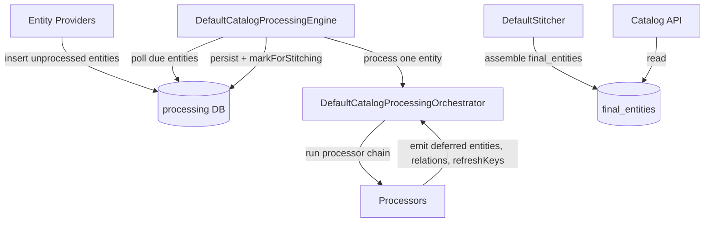

# Architecture

## Big picture

Backstage is a monorepo with two top-level halves: `packages/*` is the framework core, and `plugins/*` is the 159 plugins that do the actual work. An adopter composes a frontend React app and a Node backend out of these. The conceptual center is the Software Catalog, which stores Entities and keeps them fresh through a reconcile loop modeled on Kubernetes, rather than a CRUD store. Templates, TechDocs, and Search all build on top of the catalog.

## Components

### Catalog model (`packages/catalog-model`)

Defines the Entity shape and the entity-reference utilities every other component keys off. An `Entity` has `apiVersion`, `kind`, `metadata`, `spec`, and `relations`, and the docstring points directly at the Kubernetes objects documentation as the model it imitates (`packages/catalog-model/src/entity/Entity.ts:24-28`, `:28-54`). The standard kinds (Component, API, Resource, System, Domain, Group, User, Location) live in `packages/catalog-model/src/kinds/`.

### Catalog backend (`plugins/catalog-backend`)

Owns the processing loop, stitching, and the database. This is where entities go from "raw, just ingested" to "final, ready to serve". It uses Knex over Postgres or SQLite.

### Backend framework (`packages/backend-plugin-api`, `packages/backend`)

The dependency-injection wiring. Core services such as auth, cache, database, discovery, and httpRouter are declared with `createServiceRef` in `packages/backend-plugin-api/src/services/definitions/CoreServices.ts:34`, and plugins and modules are declared with `createBackendPlugin` (`packages/backend-plugin-api/src/wiring/createBackendPlugin.ts:53`) and `createBackendModule` (`createBackendModule.ts:58`). The example backend assembles a portal in `packages/backend/src/index.ts:24-82`.

## How a request flows

Trace one entity from ingestion to being served by the API:

1. The engine starts. `DefaultCatalogProcessingEngine.start()` launches the processing pipeline and an orphan-cleanup loop (`plugins/catalog-backend/src/processing/DefaultCatalogProcessingEngine.ts:114-126`).
2. The pipeline is polling-driven. `startPipeline` calls `startTaskPipeline` with `lowWatermark: 5` and `highWatermark: 10`, and `loadTasks` pulls due entities from the DB via `getProcessableEntities` (`DefaultCatalogProcessingEngine.ts:135-154`, `processing/TaskPipeline.ts:66-75`).
3. For each item, `processTask` calls `orchestrator.process({ entity, state })` (`DefaultCatalogProcessingEngine.ts:155-172`).
4. The orchestrator runs `processSingleEntity`, applying the registered processors in order: envelope validation, preProcess, policy, validate, optional special-location handling, then postProcess (`processing/DefaultCatalogProcessingOrchestrator.ts:116-130`).
5. Processors emit side products into a `collector`: derived (deferred) entities, relations, and refresh keys. Each emitted entity is checked against `rulesEnforcer.isAllowed` so that a location can only originate kinds it is permitted to, which blocks cross-location injection (`DefaultCatalogProcessingOrchestrator.ts:166-186`).
6. Back in the engine, the outputs are hashed. If the new `resultHash` equals the previous one, the engine writes nothing and skips stitching entirely (`DefaultCatalogProcessingEngine.ts:219-249`).
7. On a real change, `updateProcessedEntity` persists the result, the diff of old and new relation sources builds a `setOfThingsToStitch`, and `markForStitching` flags those entities in the DB (`DefaultCatalogProcessingEngine.ts:292-342`).
8. A separate Stitcher phase (`plugins/catalog-backend/src/stitching/DefaultStitcher.ts`) assembles the final entity in the `final_entities` table from every source's relations. That final entity is what the Catalog API returns.

## Key design decisions

Processing and stitching are deliberately decoupled through DB flags rather than direct calls. Because one entity's update can ripple into another entity's relations, the engine computes only the affected set (`setOfThingsToStitch`) and re-stitches just those, instead of recomputing everything (`DefaultCatalogProcessingEngine.ts:325-342`).

The no-op fast path is the second key decision: hashing the produced outputs and bailing when nothing changed keeps a large, frequently-polled catalog from writing and stitching on every cycle (`DefaultCatalogProcessingEngine.ts:219-249`).

## Extension points

The two main extension surfaces are Entity Providers (which feed unprocessed entities into the DB) and Processors (which validate entities and emit derived entities, relations, and refresh keys). On the backend, third parties ship `createBackendPlugin` plugins and `createBackendModule` modules that the host assembles. Multiple features can be grouped with `createBackendFeatureLoader`, as the example backend does for search (`packages/backend/src/index.ts:27-41`).
