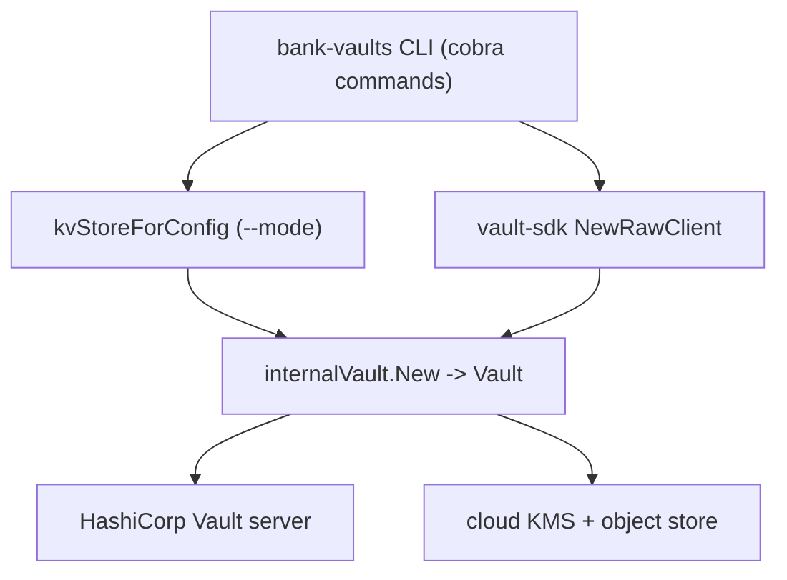

# Architecture

## Big picture

The CLI assembles two things and binds them together: a key-value (KV) store that holds the unseal keys and root token, and a HashiCorp Vault Application Programming Interface (API) client that points at one Vault server. The `--mode` flag picks which KV backend to build, the Vault SDK builds the client, and `internalVault.New` ties them into one `vault` value that every subcommand operates through (`cmd/bank-vaults/unseal.go:86`). The `Vault` interface is the only surface the commands touch (`internal/vault/operator_client.go:44`).

## Components

### CLI commands

The `cmd/bank-vaults/` package holds the cobra subcommands. `main.go` defines the root command, every flag, and the `--mode` constants (`cmd/bank-vaults/main.go:39`). `init.go`, `unseal.go`, and `configure.go` are the three core jobs; `metrics.go` adds a Prometheus exporter, and `common.go` holds the shared KV store builder. `main()` parses flags and calls `execute()` to run the cobra root (`cmd/bank-vaults/main.go:300`, `cmd/bank-vaults/main.go:140`).

### Vault operations (`internal/vault`)

`internal/vault/operator_client.go` is the operation core. It declares the `Vault` interface (`internal/vault/operator_client.go:44`) and the `vault` struct that implements it (`internal/vault/operator_client.go:120`). Sibling files implement the pieces of `configure`: `auth_methods.go`, `secrets_engines.go`, `policies.go`, `audits.go`, `plugins.go`, `identity_groups.go`, and `startup_secrets.go`.

### KV backends (`pkg/kv`)

`pkg/kv/kv.go` declares the `Service` interface that every backend implements, with just `Set` and `Get` (`pkg/kv/kv.go:53`). Each subdirectory is one backend: `awskms`, `gckms`, `azurekv`, `alibabakms`/`alibabaoss`, `ocikms`/`oci`, `s3`, `gcs`, `vault`, `k8s`, `hsm`, `file`, `dev`, and `multi`.

### Vault SDK (external)

The CLI does not carry its own Vault client. It imports `github.com/bank-vaults/vault-sdk/vault` and calls `vault.NewRawClient()` to get a HashiCorp Vault API client (`cmd/bank-vaults/unseal.go:24`, `cmd/bank-vaults/unseal.go:80`).

## How a request flows

Tracing `bank-vaults unseal --mode aws-kms-s3`:

1. The command's `Run` reads flags into an `unsealCfg` (`cmd/bank-vaults/unseal.go:60`, `cmd/bank-vaults/unseal.go:65`).
2. `kvStoreForConfig` builds the KV store for the chosen mode (`cmd/bank-vaults/unseal.go:74`). For `aws-kms-s3` it creates an S3 backend with `s3.New`, wraps it with `awskms.New`, and returns `multi.New(services)` so several regions can be combined (`cmd/bank-vaults/common.go:162`, `cmd/bank-vaults/common.go:175`, `cmd/bank-vaults/common.go:185`).
3. `vault.NewRawClient()` builds the Vault API client (`cmd/bank-vaults/unseal.go:80`).
4. `internalVault.New` binds the store and client into a `vault` value (`cmd/bank-vaults/unseal.go:86`).
5. The command enters a loop that calls `unseal(ctx, unsealConfig, v)` and sleeps for `unsealPeriod` between attempts (`cmd/bank-vaults/unseal.go:137`).
6. `unseal` checks `v.Sealed()` and returns early if Vault is already unsealed, otherwise calls `v.Unseal(ctx)` (`cmd/bank-vaults/unseal.go:154`, `cmd/bank-vaults/unseal.go:162`, `cmd/bank-vaults/unseal.go:170`).
7. `(*vault).Unseal` loops over key IDs, pulls each from the KV store, and sends it to Vault (`internal/vault/operator_client.go:197`). With the awskms backend the `Get` reads ciphertext from S3 and decrypts it through KMS before the key reaches Vault (`pkg/kv/awskms/awskms.go:86`).

## Key design decisions

The KV store is layered for envelope encryption. A KMS backend implements `kv.Service` but holds another `kv.Service` inside it: `awsKMS` carries a `store kv.Service` field (`pkg/kv/awskms/awskms.go:38`). `Set` encrypts then writes to the inner store, and `Get` reads from the inner store then decrypts (`pkg/kv/awskms/awskms.go:109`, `pkg/kv/awskms/awskms.go:86`). The unseal key is always ciphertext at rest in the object store.

The `multi` store multiplexes one logical store over several backends, so the AWS path can write the same key to S3 buckets in several regions (`cmd/bank-vaults/common.go:185`).

The configuration decoder fails on unknown keys. `Configure` sets `ErrorUnused: true` on its mapstructure decoder so a typo in the YAML becomes an error rather than a silent no-op (`internal/vault/operator_client.go:574`). This matters because purge mode deletes Vault state not present in the YAML.

## Extension points

- KV backends implement the two-method `kv.Service` interface (`pkg/kv/kv.go:53`); a new key store is a new package under `pkg/kv` plus a case in `kvStoreForConfig` (`cmd/bank-vaults/common.go:81`).
- The `--mode` constants enumerate the supported backends, including `hsm` and `hsm-k8s` for PKCS#11 devices (`cmd/bank-vaults/main.go:39`, `cmd/bank-vaults/common.go:303`).
- The wider umbrella extends Vault through the Operator's CRD and the Secrets Webhook, in separate repositories.
