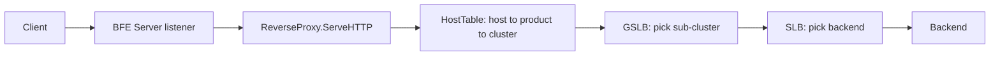

# Architecture

## Big picture

The full BFE system splits into a data plane and a control plane (source [8]). This repository is the data plane: the BFE Server, a single Go process that accepts connections, picks a backend, and forwards. The control plane lives in other repositories under the bfenetworks organisation: API-Server stores and generates configuration, Conf-Agent fetches the latest configuration and tells the server to reload, and Dashboard is the GUI (source [7]).

Inside the server, traffic moves through a routing hierarchy. A request is mapped from its host name to a product (a logical tenant), then to a cluster, then through two-stage load balancing to a sub-cluster and finally a single backend.



## Components

### BFE Server (`bfe_server/`)

Owns process startup, listeners, connection handling, and the reverse proxy loop. `StartUp` is the entry from `main` (`bfe_server/bfe_server_init.go:28`). The `BfeServer` struct (`bfe_server/bfe_server.go:45`) ties together the listeners, the `ReverseProxy`, TLS state, the module callbacks, and the routing and balancing tables.

### Routing (`bfe_route/`)

Resolves a request to a product and then a cluster. The `HostTable` (`bfe_route/host_table.go:41`) holds the host-to-product maps, a trie of reversed fully qualified domain names (FQDNs), and the basic and advanced route rules.

### Load balancing (`bfe_balance/`)

Two stages. The GSLB (Global Server Load Balance) layer in `bfe_balance/bal_gslb/` chooses a sub-cluster. The SLB (Server Load Balance) layer in `bfe_balance/bal_slb/` chooses a backend inside that sub-cluster.

### Request model and condition language (`bfe_basic/`)

`bfe_basic/request.go` defines the internal request type carried through the whole pipeline. `bfe_basic/condition/` is the domain-specific language (DSL) used by advanced routing and by module conditions.

### Modules (`bfe_module/` and `bfe_modules/`)

`bfe_module/` is the plugin framework; `bfe_modules/` holds 30 built-in modules (for example `mod_block`, `mod_rewrite`, `mod_waf`, `mod_trace`, `mod_compress`).

### Protocol implementations

Separate packages implement the wire protocols: `bfe_http`, `bfe_http2`, `bfe_spdy`, `bfe_stream`, `bfe_tls`, `bfe_websocket`, `bfe_fcgi`, and `bfe_proxy` (the PROXY protocol). `bfe_wasmplugin` hosts proxy-wasm extensions.

## How a request flows

One HTTP request is handled by `func (p *ReverseProxy) ServeHTTP(rw, basicReq)` (`bfe_server/reverseproxy.go:663`). The steps below trace it end to end.

1. Determine the real client IP with `setClientAddr(basicReq)` (`bfe_server/reverseproxy.go:689`).

2. Run the `HandleBeforeLocation` module callbacks (`bfe_server/reverseproxy.go:692`). The return value can close, finish, redirect, or respond early.

3. Resolve the product with `srv.findProduct(basicReq)` (`bfe_server/reverseproxy.go:718`). That calls `HostTable.LookupHostTagAndProduct` (`bfe_route/host_table.go:114`), which looks up the host name, falls back to the VIP table, then to a default product (`bfe_route/host_table.go:121-130`).

4. Run the `HandleFoundProduct` callbacks (`bfe_server/reverseproxy.go:732`).

5. Resolve the cluster with `srv.findCluster(basicReq)` (`bfe_server/reverseproxy.go:758`). That calls `HostTable.LookupCluster` (`bfe_route/host_table.go:141`), which first queries the basic route tree by host and path (`bfe_route/host_table.go:145-160`), then evaluates advanced route rules in order with `rule.Cond.Match(req)` (`bfe_route/host_table.go:171-176`).

6. Fetch the cluster config with `serverConf.ClusterTable.Lookup(clusterName)` (`bfe_server/reverseproxy.go:773`).

7. Run the `HandleAfterLocation` callbacks (`bfe_server/reverseproxy.go:804`).

8. Build the outgoing request: `*outreq = *req` (`bfe_server/reverseproxy.go:837`), then strip hop-by-hop headers with `hopByHopHeaderRemove(outreq, req)` (`bfe_server/reverseproxy.go:843`).

9. Forward to a backend with `p.clusterInvoke(srv, cluster, basicReq, rw)` (`bfe_server/reverseproxy.go:898`; defined at `bfe_server/reverseproxy.go:307`).

10. After the `HandleReadResponse` callbacks (`bfe_server/reverseproxy.go:967`), copy the response back to the client with `p.sendResponse(rw, res, ...)` (`bfe_server/reverseproxy.go:990`; defined at `bfe_server/reverseproxy.go:527`).

## Key design decisions

Module hooks are a fixed sequence of nine callback points (`bfe_module/bfe_callback.go:33-41`). Each module registers handlers against these points at startup, so the forwarding loop stays fixed while behaviour is added at the edges.

```go
const (
    HandleAccept = iota
    HandleHandshake
    HandleBeforeLocation
    HandleFoundProduct
    HandleAfterLocation
    HandleForward
    HandleReadResponse
    HandleRequestFinish
    HandleFinish
)
```

Routing is content-based and expressed as conditions, not just host and path prefixes. Advanced route rules carry a `Cond` that is evaluated against the request (`bfe_route/host_table.go:171-176`). This is the same DSL modules use for their own conditions, so one language covers both routing and module gating.

## Extension points

- Built-in and custom modules registered against the nine callback points (`bfe_module/`).
- proxy-wasm plugins via `bfe_wasmplugin`.
- The condition DSL (`bfe_basic/condition/`) for advanced routing and module conditions.
- EPP mode in the GSLB layer, which calls an external processor using Envoy's `go-control-plane` types (`bfe_balance/bal_gslb/bal_gslb.go:39`).
