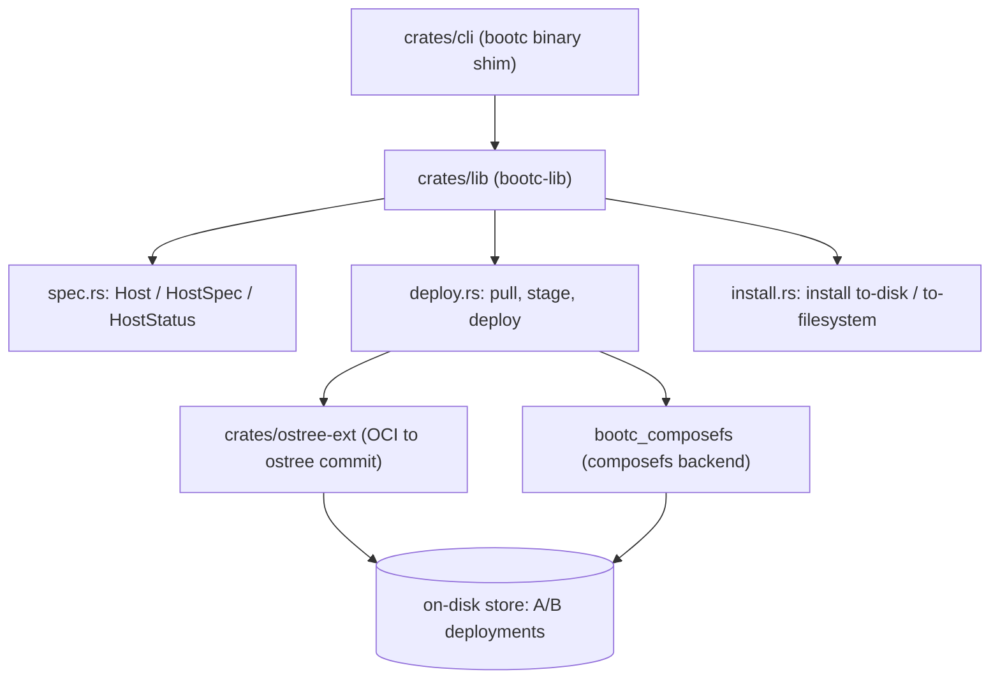

# Architecture

## Big picture

bootc is a Cargo workspace. The root manifest declares `members = ["crates/*"]` (`Cargo.toml:2`), and the bootc binary is a thin shim over a shared library. The CLI crate does global initialization, builds a single-threaded async runtime, and calls into the library (`crates/cli/src/main.rs:20-32`). All real logic lives in `bootc-lib`: command parsing, status, pull, deploy, install, and the two storage backends.

## Components

### crates/cli

The runnable binary. `crates/cli/src/main.rs` is deliberately small. `run()` calls `bootc_lib::cli::global_init()` before any threads exist (`crates/cli/src/main.rs:22`), then builds a current-thread Tokio runtime because bootc does little CPU-heavy async work and uses `spawn_blocking` for explicit threads (`crates/cli/src/main.rs:27-30`). `async_main` then hands off to the library entry point (`crates/cli/src/main.rs:15`).

### crates/lib (bootc-lib)

The core. It defines the CLI surface (`crates/lib/src/cli.rs`), the declarative host model (`crates/lib/src/spec.rs`), the pull/stage/deploy pipeline (`crates/lib/src/deploy.rs`), and installation (`crates/lib/src/install.rs`). It is the crate every other piece depends on.

### crates/ostree-ext

A Rust wrapper over libostree that imports and exports between OCI images and ostree commits, including the `ManifestDiff` used by `bootc upgrade --check` (`crates/lib/src/cli.rs:1250`). It is the original storage path.

### bootc_composefs backend

A newer backing store under `crates/lib/src/bootc_composefs/`, with its own boot, update, switch, and rollback modules (`boot.rs`, `update.rs`, `switch.rs`, `rollback.rs`). The runtime selects it per operation based on the booted storage kind.

## How a request flows

Trace `bootc upgrade`, the operation that fetches a newer version of the current image and queues it for the next boot.

1. The binary calls `bootc_lib::cli::run_from_iter(std::env::args())` (`crates/cli/src/main.rs:15`).
2. `run_from_iter` parses arguments and delegates to `run_from_opt` (`crates/lib/src/cli.rs:1718`). Parsing goes through `Opt::parse_including_static`, which inspects argv0 so that being invoked as `ostree-container` or the systemd generator dispatches into internal subcommands (`crates/lib/src/cli.rs:1736`, `crates/lib/src/cli.rs:1750`).
3. `run_from_opt` matches `Opt::Upgrade`, acquires storage, and branches on `storage.kind()`: the ostree backend calls `upgrade`, the composefs backend calls `upgrade_composefs` (`crates/lib/src/cli.rs:1771-1780`).
4. `upgrade` reads the current `Host` via `status::get_status` and takes the target image from `host.spec.image` (`crates/lib/src/cli.rs:1161-1162`). A `--tag` argument derives a new reference from the current image (`crates/lib/src/cli.rs:1165-1172`).
5. Local rpm-ostree modifications block the upgrade with an error (`crates/lib/src/cli.rs:1183-1187`). With `--check`, bootc prepares the import without fetching and prints a `ManifestDiff` (`crates/lib/src/cli.rs:1231-1252`).
6. Otherwise it fetches: `pull_unified` when the image already exists in unified storage, `pull` otherwise (`crates/lib/src/cli.rs:1256-1277`).
7. It compares the fetched digest against the staged and booted digests (`crates/lib/src/cli.rs:1278-1289`). If nothing changed it prints `No update available.`; if there is a new image it calls `deploy::stage` (`crates/lib/src/cli.rs:1325`, `crates/lib/src/cli.rs:1329`).
8. `stage` records a journal entry and emits a three-step progress sequence (merging, deploying, bound images) while calling `deploy`, then pulls logically bound images (`crates/lib/src/deploy.rs:1075-1099`).

## Key design decisions

The host is modeled as a Kubernetes-style declarative object. `spec.rs` sets `API_VERSION = "org.containers.bootc/v1"` and `KIND = "BootcHost"` (`crates/lib/src/spec.rs:18-19`), and the `Host` struct flattens a k8s `Resource` to carry apiVersion, kind, and metadata, then separates `spec` (intent) from `status` (observed) (`crates/lib/src/spec.rs:29-35`). `bootc edit` is described in its help as operating like `kubectl apply`, honoring only changes to the `spec` section (`crates/lib/src/cli.rs:891-899`).

Updates are A/B and pull-based. The `Upgrade` help documents that an update does not touch the running system, becomes visible as `staged` in `bootc status`, and is applied at shutdown via `ostree-finalize-staged.service` unless you pass `--apply` (`crates/lib/src/cli.rs:842-855`). `switch` is described as almost the same operation as `upgrade` but also changing the image reference, with the common pattern being a management agent that controls updates through image tags (`crates/lib/src/cli.rs:856-866`).

The runtime stays out of the container. Per the README, the kernel ships in the image and boots the host, but the running userspace is not in a container and systemd is pid1 (`README.md:14-17`). The container is the delivery format only.

## Extension points

- Install configuration: drop a TOML file under `/usr/lib/bootc/install/` to set defaults such as the root filesystem type, merged in alphanumeric order (documented in `docs/src/bootc-install.md`).
- Bootloader installation is delegated to the external `bootupd` project, invoked by `bootc install` (`docs/src/bootc-install.md`).
- Logically bound images: images referenced by the host image are pulled during staging via `boundimage::pull_bound_images` (`crates/lib/src/deploy.rs:1099`).
- Storage backends: the ostree-container and composefs stores are selected via `storage.kind()` (`crates/lib/src/cli.rs:1773`).

## Sources

1. [bootc source at commit a7f95e7](https://github.com/bootc-dev/bootc/tree/a7f95e743aa54a2f966edc1a0417ef6d509df9af)
2. [bootc website and documentation](https://bootc.dev/bootc/)
