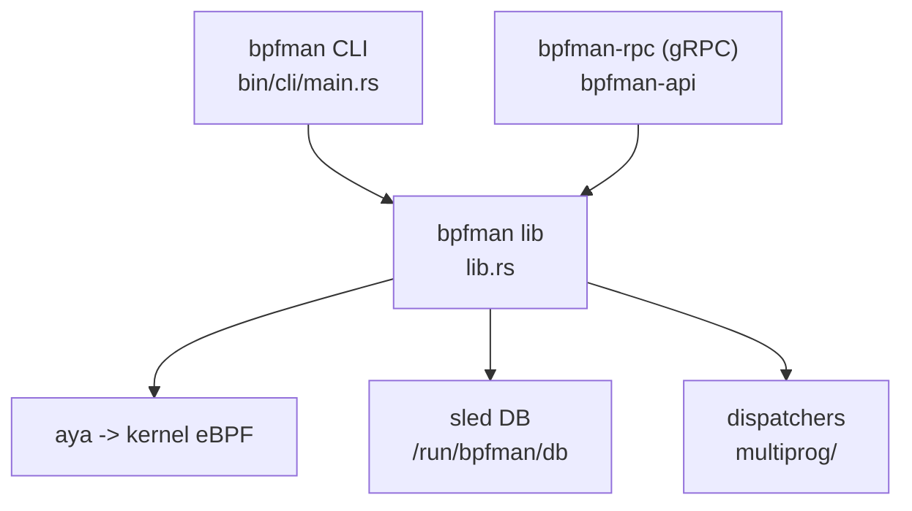

# Architecture

## Big picture

bpfman is a Cargo workspace of several crates (`Cargo.toml`). The core is the `bpfman` crate, a library plus CLI that loads and attaches eBPF (extended Berkeley Packet Filter) programs through the `aya` Rust library and persists state in a `sled` embedded database. The CLI calls the library in its own process, so no daemon is needed for local use. A separate gRPC (gRPC Remote Procedure Call) server, the `bpfman-rpc` binary in the `bpfman-api` crate, wraps the same library for remote and privilege-separated callers such as Kubernetes. Supporting crates provide a CSI (Container Storage Interface) driver, a network-namespace helper, and OpenTelemetry exporters.

## Components

### bpfman (library and CLI)

The core logic. The CLI binary entry point is `fn main` (`bpfman/src/bin/cli/main.rs:23`), which dispatches subcommands through `Commands::execute` (`bpfman/src/bin/cli/main.rs:33`). The library exposes the operations the CLI calls, such as `add_programs` (`bpfman/src/lib.rs:193`) and `attach_program` (`bpfman/src/lib.rs:428`). The CLI imports these directly from the `bpfman` crate (`bpfman/src/bin/cli/load.rs:7`).

### bpfman-api (bpfman-rpc)

A `tonic`-based gRPC server that wraps the same library functions. It is the remote and privilege-separated path, used by the Kubernetes agent and the CSI driver. It is optional for local CLI use.

### csi

A CSI driver that mounts the BPF filesystem into pods so containers can reach pinned maps.

### bpfman-ns and exporters

`bpfman-ns` enters a network namespace to operate inside a container (for example uprobes). `bpf-log-exporter` and `bpf-metrics-exporter` ship logs and metrics to OpenTelemetry.

## How a request flows

Loading an XDP (eXpress Data Path) program from the CLI:

1. `bpfman load image ...` enters `fn main` (`bpfman/src/bin/cli/main.rs:23`) and routes through `Commands::execute` (`bpfman/src/bin/cli/main.rs:33`) to the load subcommand.
2. `execute_load_file` (`bpfman/src/bin/cli/load.rs:30`) calls `setup()` (`bpfman/src/bin/cli/load.rs:31`) to get a `(Config, Db)` pair, builds a `ProgramData` from the CLI arguments, and maps the type string to a variant such as `Program::Xdp(XdpProgram::new(data)?)` (`bpfman/src/bin/cli/load.rs:52`).
3. It calls `add_programs` (`bpfman/src/bin/cli/load.rs:71`), which is `bpfman::add_programs` (`bpfman/src/lib.rs:193`) and delegates to `add_programs_internal` (`bpfman/src/lib.rs:221`).
4. `add_programs_internal` writes each program's temp database tree with `get_data_mut().load(root_db)` (`bpfman/src/lib.rs:228`) and pulls the OCI (Open Container Initiative) bytecode with `set_program_bytes` (`bpfman/src/lib.rs:251`).
5. It builds one `EbpfLoader::new()` (`bpfman/src/lib.rs:257`) so all programs from the same image share global data via `loader.set_global(...)` (`bpfman/src/lib.rs:263`). XDP and non-TCX TC programs are registered as extensions with `loader.extension(extension)` (`bpfman/src/lib.rs:276`).
6. `loader.load(...)` loads the bytecode into the kernel (`bpfman/src/lib.rs:281`), then each program goes through `load_program` (`bpfman/src/lib.rs:287`, defined at `bpfman/src/lib.rs:1232`).
7. On any failure the error branch deletes every program with `program.delete(root_db)` to roll back (`bpfman/src/lib.rs:303`). On success the kernel-assigned id drives `save_map` (`bpfman/src/lib.rs:311`) and `finalize` (`bpfman/src/lib.rs:315`).

Attachment is a separate call. `attach_program` (`bpfman/src/lib.rs:428`) creates a link with `prog.add_link()` (`bpfman/src/lib.rs:458`) and, after `link.attach(...)`, calls `attach_program_internal` (`bpfman/src/lib.rs:481`). XDP and TC go through `attach_multi_attach_program` (`bpfman/src/lib.rs:491`); single-attach types go through `attach_single_attach_program` (`bpfman/src/lib.rs:499`). Success ends with `link.finalize` (`bpfman/src/lib.rs:506`).

## Key design decisions

The defining decision is **daemonless local operation**. `setup()` (`bpfman/src/lib.rs:1226`) opens the config file and initializes the database, nothing more, and the CLI runs the load logic in the same process. State, not a server, is the source of truth: it lives in the sled database at `/run/bpfman/db` (`bpfman/src/lib.rs:92`), configured by `get_db_config` (`bpfman/src/lib.rs:96`). The gRPC daemon is invoked only when Kubernetes or socket-activated privilege separation needs it.

The second decision is the **dispatcher pattern** for XDP and TC. The kernel allows one program per interface for these hooks. bpfman installs its own small eBPF dispatcher in that single slot and inserts user programs as freplace extensions, calling them in priority order (`bpfman/src/multiprog/xdp.rs:50`). This is what lets several XDP programs share one interface.

## Extension points

bpfman is consumed through its CLI, its gRPC API (`proto/bpfman.proto`), and on Kubernetes through Custom Resource Definitions (CRDs) handled by a separate operator and agent. eBPF bytecode is delivered as OCI images, so any registry can serve programs. OpenTelemetry exporters and the CSI driver are the observability and storage integration points.
