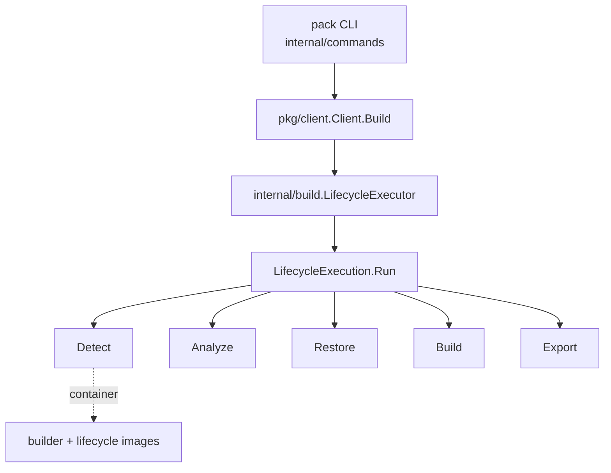

# Architecture

## Big picture

CNB is layered. The `pack` CLI in this repository is a platform implementation. It does not compile or assemble images itself. It resolves a builder image, then starts the `lifecycle` binaries as containers and drives them through the build phases. The reference build engine lives in the separate `buildpacks/lifecycle` repository, and the per-language build logic lives in individual buildpacks. `pack` shares only a contract with `lifecycle`: it imports `github.com/buildpacks/lifecycle/api` and the lifecycle file formats rather than any build code (`internal/build/lifecycle_executor.go:9`).

## Components

### CLI layer (`internal/commands`)

Each subcommand defines flags and validates input. `Build` (`internal/commands/build.go:70`) parses the image reference, reads `project.toml`, resolves the builder, decides trust, and packs everything into a `client.BuildOptions` before calling the client (`internal/commands/build.go:177`).

### Client API layer (`pkg/client`)

`Client.Build` (`pkg/client/build.go:308`) is the orchestration body of `pack build`. It normalizes the app path, builder name, and platform target, resolves the buildpack order with `processBuildpacks` (`pkg/client/build.go:436`), generates an ephemeral builder with `createEphemeralBuilder` (`pkg/client/build.go:568`), assembles `build.LifecycleOptions` (`pkg/client/build.go:637`), and hands off to the executor (`pkg/client/build.go:834`).

### Lifecycle execution engine (`internal/build`)

`LifecycleExecutor.Execute` (`internal/build/lifecycle_executor.go:118`) creates a temp dir, builds a `LifecycleExecution` (`internal/build/lifecycle_executor.go:124`), and calls `Run` (`internal/build/lifecycle_executor.go:131`). `Run` (`internal/build/lifecycle_execution.go:170`) resolves caches, creates an ephemeral bridge network, and starts each phase as a container.

### Distribution and image packages

`pkg/dist` holds the on-disk metadata types such as `Order` (`pkg/dist/dist.go:41`). `pkg/image`, `pkg/cache`, `pkg/blob`, `internal/builder`, and `internal/container` cover image fetch, caching, the in-memory builder representation, and Docker container operations.

## How a build flows

A `pack build <image>` traces end to end as follows.

1. `internal/commands/build.go:70` parses flags, reads `project.toml`, resolves the builder, and computes trust.
2. `internal/commands/build.go:177` calls `packClient.Build`. The `TrustBuilder` field is passed as a `func(string) bool` closure.
3. `pkg/client/build.go:308` normalizes inputs, resolves the buildpack order, builds an ephemeral builder, and assembles `LifecycleOptions`. For a trusted builder it sets `UseCreator = true` (`pkg/client/build.go:679`).
4. `pkg/client/build.go:834` calls `c.lifecycleExecutor.Execute`.
5. `internal/build/lifecycle_executor.go:118` builds the execution and calls `Run` (`internal/build/lifecycle_executor.go:131`).
6. `internal/build/lifecycle_execution.go:170` resolves caches, creates the bridge network (`internal/build/lifecycle_execution.go:217`), and runs the phases (`Detect` at `internal/build/lifecycle_execution.go:482`, plus Analyze, Restore, Build, Export), each via `NewPhaseConfigProvider` and `phaseFactory.New(...).Run(ctx)`.

## Key design decisions

Trust changes the container execution model. When the builder is trusted, `UseCreator = true` and the lifecycle `creator` binary runs all phases in a single container (`internal/build/lifecycle_execution.go:349`). This is faster but co-locates root-privileged phases. When the builder is untrusted, detect, analyze, restore, build, and export run in separate containers, with only the phases that need root run in disposable trusted containers and the rest dropped to the CNB user (`internal/build/lifecycle_execution.go:240`). The CLI logs this intent (`internal/commands/build.go:130`).

The Platform API version reorders phases. Below 0.7 the order is DETECT then ANALYZE; at 0.7 and above it is ANALYZE then DETECT (`internal/build/lifecycle_execution.go:241`). `pack` supports Platform API 0.3 through 0.15 via `SupportedPlatformAPIVersions` (`internal/build/lifecycle_executor.go:24`) and negotiates the version against what the builder and lifecycle declare (`internal/build/lifecycle_execution.go:48`).

Image extension, where a Dockerfile extends the build or run image, is available from API 0.10 and uses a kaniko cache. `ExtendBuild` and `ExtendRun` run concurrently under an errgroup (`internal/build/lifecycle_execution.go:319`).

## Extension points

- Buildpacks: the per-language units resolved through `dist.Order` (`pkg/dist/dist.go:41`); third parties publish their own.
- Builders and stacks: builder images that bundle buildpacks and a lifecycle, represented in memory by `builder.Builder` (`internal/builder/builder.go:71`).
- Image extensions: Dockerfiles that extend the build or run image, run via the kaniko-backed extend phases (`internal/build/lifecycle_execution.go:319`).
- Platform API: the negotiated contract that lets other platforms drive the same lifecycle.

## Sources

1. [buildpacks/pack repository](https://github.com/buildpacks/pack)
2. [buildpacks/lifecycle repository](https://github.com/buildpacks/lifecycle)
3. [buildpacks/spec repository](https://github.com/buildpacks/spec)
