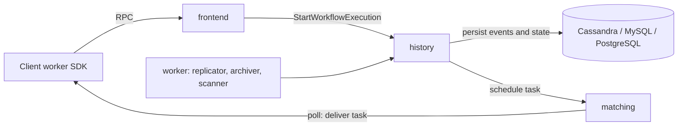

# Architecture

## Big picture

A Cadence cluster is one binary running in four roles: frontend, history, matching, and worker. Each role lives under `service/` in the repository. The frontend is the stateless API edge; the history service owns workflow state and is the heart of the system; the matching service hands tasks to your workers; the worker service runs internal system workflows. Your own workflow and activity code runs outside the cluster in a separate process using a client SDK (`README.md:13-15`). State is persisted to Cassandra, MySQL, or PostgreSQL.

## Components

### frontend

The stateless entry point for every API call. It authenticates, validates, rate-limits, and routes requests to the right backend service. `WorkflowHandler` in `service/frontend/api/handler.go` is the public surface; for example `StartWorkflowExecution` validates the request and forwards it to the history service (`service/frontend/api/handler.go:1650`).

### history

The core service. It owns each workflow run's mutable state and its event history, divided into shards. The durable-execution logic lives here: `historyEngineImpl` in `service/history/engine/engineimpl` implements operations such as starting a workflow (`service/history/engine/engineimpl/start_workflow_execution.go:53`). A shard is represented by `shard.Context` (`service/history/shard/context.go:55`), which serializes all writes for the workflows it owns.

### matching

Hosts task lists (also called task queues) and dispatches decision tasks and activity tasks to polling workers. The history service schedules a task; matching holds it until a worker polls for it.

### worker

Runs internal system workflows: the replicator (cross-cluster replication), the archiver (moving closed histories to cold storage), and scanners. These are Cadence workflows that operate the cluster itself.

### sharddistributor

A newer service under `service/sharddistributor` that manages the distributed assignment of shards across history hosts.

## How a request flows

Tracing `StartWorkflowExecution` from edge to storage:

1. The request lands at `WorkflowHandler.StartWorkflowExecution` (`service/frontend/api/handler.go:1650`). After a shutdown check the handler calls `validateStartWorkflowExecutionRequest` (`service/frontend/api/handler.go:1658`), resolves the domain name to a domain ID (`service/frontend/api/handler.go:1663`), builds a history request with `CreateHistoryStartWorkflowRequest` (`service/frontend/api/handler.go:1667`), and forwards it through the history client (`service/frontend/api/handler.go:1687`).
2. In the history service, `historyEngineImpl.StartWorkflowExecution` looks up the domain (`service/history/engine/engineimpl/start_workflow_execution.go:57`) and delegates to `startWorkflowHelper` (`service/history/engine/engineimpl/start_workflow_execution.go:62`). On failure it runs `handleCreateWorkflowExecutionFailureCleanup` to clean up an orphaned history branch (`service/history/engine/engineimpl/start_workflow_execution.go:69`).
3. `startWorkflowHelper` confirms the domain is registered (`service/history/engine/engineimpl/start_workflow_execution.go:89`), re-validates the request (`service/history/engine/engineimpl/start_workflow_execution.go:94`), and grabs the current execution as a lock to block concurrent starts of the same workflow ID (`service/history/engine/engineimpl/start_workflow_execution.go:109`). A new run ID is minted (`service/history/engine/engineimpl/start_workflow_execution.go:124`) and an empty mutable state is built with `createMutableState` (`service/history/engine/engineimpl/start_workflow_execution.go:126`).
4. `addStartEventsAndTasks` appends the `WorkflowExecutionStarted` event and schedules the first decision task (`service/history/engine/engineimpl/start_workflow_execution.go:181`). The transaction is closed (`service/history/engine/engineimpl/start_workflow_execution.go:204`), the events are persisted (`service/history/engine/engineimpl/start_workflow_execution.go:211`), and the run is written with `CreateWorkflowExecution` in brand-new mode (`service/history/engine/engineimpl/start_workflow_execution.go:236`).
5. From there execution is event-sourced: a worker polls matching for the decision task, replays the workflow function in the SDK, and commits the next decision (such as starting an activity) back to history. That decision loop repeats until the workflow completes.

## Key design decisions

The strongest design choice is how the history service stays consistent without a heavy lock service. Each shard has a single writer enforced by a monotonic generation number called the rangeID, checked on every shard update with a conditional `PreviousRangeID` compare-and-set (`service/history/shard/context.go:1128`). A stale owner's write fails and that host shuts its shard down. The Internals page traces this in full.

A second choice is idempotency at the start path. A duplicated start request returns the existing run ID rather than erroring, handled by `AsDuplicateRequestError` (`service/history/engine/engineimpl/start_workflow_execution.go:245`) and by absorbing `WorkflowExecutionAlreadyStartedError` when the request ID matches (`service/history/engine/engineimpl/start_workflow_execution.go:255`).

## Extension points

- Client SDKs implement the worker side: the official [Go](https://github.com/cadence-workflow/cadence-go-client) and [Java](https://github.com/cadence-workflow/cadence-java-client) clients run user workflow and activity code.
- Persistence plugins are loaded by blank import in the server entry point, so Cassandra, MySQL, PostgreSQL, SQLite, the Kafka async-workflow queue, and the gcloud archiver are all pluggable (`cmd/server/main.go:30-36`).
- [iWF](https://github.com/indeedeng/iwf) is a DSL framework that runs on top of Cadence (`README.md:42`).
