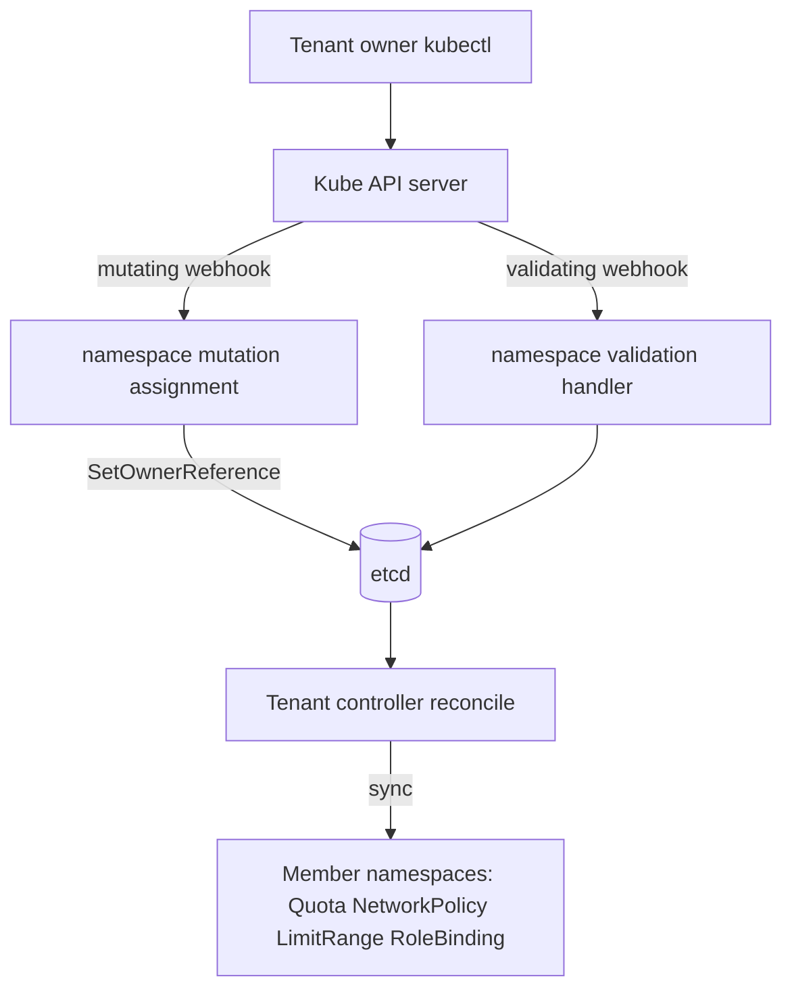

# Architecture

## Big picture

Capsule is one Go binary that plays two roles on a shared cluster. It is a set of controller-runtime reconcilers under `internal/controllers/` that keep member namespaces in sync with the policy on their `Tenant`, and it is a set of admission webhooks under `internal/webhook/` that inspect or mutate requests before the API server persists them. Both are wired onto a single controller-runtime Manager in `func main()` (`cmd/controller/main.go:115`); the webhook packages are imported together near the top of that file (`cmd/controller/main.go:62-83`).

## Components

### API types (`api/v1beta1`, `api/v1beta2`)

The CRD type definitions. `api/v1beta2` is the storage version (`api/v1beta2/tenant_types.go:141`). The central type is `Tenant`, a cluster-scoped resource with short name `tnt` (`api/v1beta2/tenant_types.go:152`). Other types in the group include `CapsuleConfiguration` (cluster-wide settings), `ResourcePool` and `GlobalResourcePool` (shared quota across namespaces), `TenantResource`, and `CustomResourceQuota`.

### Controllers (`internal/controllers/`)

The reconcilers. The tenant reconciler is the core one: `Manager.Reconcile` (`internal/controllers/tenant/manager.go:237`) responds to changes on a `Tenant` and calls `reconcile` (`internal/controllers/tenant/manager.go:308`), which collects RBAC, syncs namespaces, then ensures metadata, network policies, limit ranges, resource quotas, and role bindings on each member namespace. Sibling controllers handle resource pools, RBAC, persistent volumes, service labels, and the Transport Layer Security (TLS) certificate that Capsule uses to serve its own webhooks.

### Webhooks (`internal/webhook/`)

The admission handlers. They cover namespace mutation and validation, tenant, pod, ingress, persistent volume claim (PVC), service, owners, node, gateway, Dynamic Resource Allocation (DRA), and resource pool requests. The namespace path matters most: the mutating handler assigns a namespace to a tenant, and the validating handler enforces quota, prefix, and metadata rules.

### Reusable packages (`pkg/`)

Shared logic that is not a controller or a webhook. `pkg/tenant` resolves owners and ownership, `pkg/api` holds the RBAC, rule, and quota types, `pkg/ruleengine` and `pkg/template` implement policy and templating, and `pkg/runtime` holds field indexers, certificate handling, admission helpers, and event recorders.

## How a request flows

Trace a tenant owner creating a namespace.

1. The API server calls Capsule's mutating webhook, `ownerReferenceHandler.OnCreate` (`internal/webhook/namespace/mutation/assignment.go:37`). It resolves the owning tenant from the requesting user and labels with `utils.GetNamespaceTenant` (`internal/webhook/namespace/mutation/assignment.go:46`). An admin with no resolved tenant is allowed through (`internal/webhook/namespace/mutation/assignment.go:53`); any other unresolved case is denied with a message to use the tenant label (`internal/webhook/namespace/mutation/assignment.go:57-63`). When a tenant resolves, it stamps the tenant name label (`internal/webhook/namespace/mutation/assignment.go:66-68`) and `assignToTenant` calls `controllerutil.SetOwnerReference(tnt, ns, ...)` to make the tenant the namespace's owner (`internal/webhook/namespace/mutation/assignment.go:182`).

2. The API server then calls the validating handler, `handler.OnCreate` (`internal/webhook/namespace/validation/handler.go:35`). It re-resolves the tenant with `tenant.ResolveNamespaceTenant` (`internal/webhook/namespace/validation/handler.go:53`), denies a non-admin non-Capsule user creating a tenant-owned namespace (`internal/webhook/namespace/validation/handler.go:58-60`), returns nil when no tenant is involved (`internal/webhook/namespace/validation/handler.go:62-64`), rejects new namespaces for a terminating tenant via `rejectOnTermination` (`internal/webhook/namespace/validation/handler.go:66-73`), and then runs the sub-handlers in order (`internal/webhook/namespace/validation/handler.go:75-79`).

3. The quota sub-handler `quotaHandler.handle` (`internal/webhook/namespace/validation/quota.go:71`) denies when `tnt.IsFull()` (`internal/webhook/namespace/validation/quota.go:79`) unless the namespace already exists, in which case it returns nil and lets the API server's own `AlreadyExists` answer stand (`internal/webhook/namespace/validation/quota.go:84-86`).

4. The prefix sub-handler `prefixHandler.OnCreate` (`internal/webhook/namespace/validation/prefix.go:33`) rejects names matching the protected regular expression (`internal/webhook/namespace/validation/prefix.go:43-50`) and, when prefix enforcement is on, requires the `<tenant>-` prefix (`internal/webhook/namespace/validation/prefix.go:61-79`).

5. After the object persists, the Tenant controller reconciles. `reconcile` (`internal/controllers/tenant/manager.go:308`) collects RBAC, then calls `reconcileNamespaces` (`internal/controllers/tenant/manager.go:319`), and goes on to ensure metadata, network policies, limit ranges, resource quotas, and role bindings (`internal/controllers/tenant/manager.go:312-363`).

## Key design decisions

Membership is expressed with a Kubernetes OwnerReference, not a label. When the mutating webhook assigns a namespace, it sets the tenant as the namespace's owner (`internal/webhook/namespace/mutation/assignment.go:182`). The controller looks members up through a field index keyed on `.metadata.ownerReferences[*].capsule` (`pkg/runtime/indexers/namespace/const.go:7`). This ties tenant deletion to Kubernetes garbage collection, so deleting a tenant cascades to its namespaces, while giving the controller an efficient reverse lookup.

The quota webhook defers to the API server on a re-apply. If a tenant is full but the namespace already exists, the handler returns nil instead of its own quota error (`internal/webhook/namespace/validation/quota.go:84-86`), so the user sees the native `AlreadyExists` response rather than a Capsule-specific denial.

## Extension points

The `Tenant`, `CapsuleConfiguration`, `ResourcePool`, and related CRDs in `api/v1beta2` are the primary declarative surface. Cluster-wide behaviour is tuned through `CapsuleConfigurationSpec` (`api/v1beta2/capsuleconfiguration_types.go:16`), which sets the entities included in Capsule, the global prefix enforcement flag, the protected namespace regular expression, and webhook secret names. The admission webhooks themselves are the runtime extension surface; they sit in the request path and can deny or mutate.
