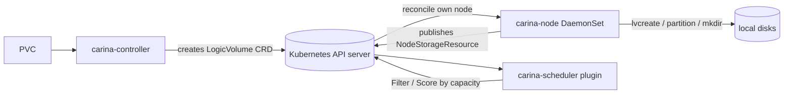

# Architecture

## Big picture

Carina has three components, and they never talk to each other directly. The controller writes a custom resource, the node agent reads it, and the Kubernetes API server sits between them as the message bus. The controller decides where a volume should go; the node agent runs the actual `lvcreate`; the scheduler plugin picks the node based on free capacity.

## Components

### carina-controller

The cluster-level CSI (Container Storage Interface) controller. It receives PVC (PersistentVolumeClaim) requests through the CSI `CreateVolume` call and creates a `LogicVolume` custom resource definition (CRD); it does not touch any disk. The entry point is `controllerService.CreateVolume` (`pkg/csidriver/driver/controller.go:54`), and it runs as the control-plane deployment.

### carina-node

A DaemonSet on every node. It reconciles `LogicVolume` resources addressed to its own node and performs the real disk work through LVM, raw partitions, or host directories. The reconcile loop is `LogicVolumeReconciler.Reconcile` (`controllers/logicvolume_controller.go:60`), and the disk implementations are bundled by `DeviceManager` (`pkg/devicemanager/manager.go:54`). It also publishes each node's capacity into a `NodeStorageResource` CRD.

### carina-scheduler

A kube-scheduler framework plugin that adds `Filter` and `Score` stages. `Filter` rejects nodes without enough free capacity (`scheduler/schedulerplugin/localstorage/storage-plugins.go:93`), and `Score` ranks the rest using binpack or spreadout (`scheduler/schedulerplugin/localstorage/storage-plugins.go:153`).

## How a request flows

A PVC turning into a local logical volume runs end to end like this.

1. `controllerService.CreateVolume` is called (`pkg/csidriver/driver/controller.go:54`). Only the `SINGLE_NODE_WRITER` access mode is allowed (`pkg/csidriver/driver/controller.go:109`). The requested size is rounded up to whole GiB by `convertRequestCapacity` (`pkg/csidriver/driver/controller.go:452`), which returns `(requestBytes-1)>>30 + 1` (`pkg/csidriver/driver/controller.go:469`).
2. The node and device group are chosen. If the scheduler already bound a node, `HaveSelectedNode` returns it (`pkg/csidriver/driver/controller.go:122`); otherwise the controller selects one with `SelectNode` (`pkg/csidriver/driver/controller.go:170`).
3. The controller calls `s.lvService.CreateVolume(...)` (`pkg/csidriver/driver/controller.go:192`).
4. `LogicVolumeService.CreateVolume` (`pkg/csidriver/driver/k8s/logicvolume_service.go:161`) builds the `LogicVolume` object (`pkg/csidriver/driver/k8s/logicvolume_service.go:164`), attaches a finalizer (`pkg/csidriver/driver/k8s/logicvolume_service.go:182`), and creates it (`pkg/csidriver/driver/k8s/logicvolume_service.go:195`). It then polls every 100ms for `.status.volumeID` (`pkg/csidriver/driver/k8s/logicvolume_service.go:210`), returning once the field is set (`pkg/csidriver/driver/k8s/logicvolume_service.go:224`).
5. On the target node, `LogicVolumeReconciler.Reconcile` fires (`controllers/logicvolume_controller.go:60`). When `VolumeID` is empty it calls `createLV` (`controllers/logicvolume_controller.go:74`). `createLV` (`controllers/logicvolume_controller.go:153`) branches on the volume type annotation; for the LVM type it calls `r.dm.VolumeManager.CreateVolume(...)` with up to three retries (`controllers/logicvolume_controller.go:165`) and on success sets `lv.Status.VolumeID = carina.VolumePrefix + lv.Name` (`controllers/logicvolume_controller.go:178`) before updating status (`controllers/logicvolume_controller.go:262`).
6. `LocalVolumeImplement.CreateVolume` (`pkg/devicemanager/volume/volume.go:48`) takes a global lock (`pkg/devicemanager/volume/volume.go:49`), checks free space with `VGDisplay` (`pkg/devicemanager/volume/volume.go:55`), returns `ResourceExhausted` if the reserved margin would be crossed (`pkg/devicemanager/volume/volume.go:65`), and finally calls `LVCreateFromVG` (`pkg/devicemanager/volume/volume.go:79`).
7. `Lvm2Implement.LVCreateFromVG` (`pkg/devicemanager/lvmd/lvm.go:258`) assembles the `lvcreate` arguments (`pkg/devicemanager/lvmd/lvm.go:259`) and runs the command (`pkg/devicemanager/lvmd/lvm.go:274`).

## Key design decisions

The defining choice is that the CSI controller never touches a disk. It creates a `LogicVolume` CRD and waits, polling `.status.volumeID` until the node agent fills it in (`pkg/csidriver/driver/k8s/logicvolume_service.go:210`). The actual `lvcreate` happens on the target node. This makes the Kubernetes API server the message bus between the controller and the node agents. The node agent picks up only the resources addressed to itself through `logicVolumeFilter` (`controllers/logicvolume_controller.go:356`), which matches on `lv.Spec.NodeName == f.nodeName` (`controllers/logicvolume_controller.go:364`). This CRD-mediated pattern comes from TopoLVM, the same lineage of LVM-based local CSI drivers.

A second choice is that capacity lives in the cluster, not just on the node. Each node agent publishes its volume groups, disks, and RAID state into a `NodeStorageResource` CRD, and the controller and scheduler read that to make placement decisions. Scheduling supports two opposite strategies: spreadout scores a node `1.0 - request/allocatable` (`scheduler/schedulerplugin/localstorage/storage-plugins.go:200`) and binpack scores it `request/allocatable` (`scheduler/schedulerplugin/localstorage/storage-plugins.go:203`); a node that already hosts the PV gets the maximum score (`scheduler/schedulerplugin/localstorage/storage-plugins.go:162`).

## Extension points

- **StorageClass parameters**: the driver is configured through standard CSI parameters such as the disk group, cache ratio, and cache policy (`constants.go:42`, `constants.go:47`, `constants.go:49`).
- **Custom resources**: `LogicVolume` (`api/v1/logicvolume_types.go:63`) and `NodeStorageResource` (`api/v1beta1/nodestorageresource_types.go:65`) are the contract between components.
- **Scheduler framework plugin**: the `LocalStorage` plugin implements `Filter` and `Score` against the kube-scheduler framework (`scheduler/schedulerplugin/localstorage/storage-plugins.go:93`).
- **Metrics**: Prometheus integration ships in `pkg/metrics` with a ServiceMonitor manifest in `deploy/kubernetes/prometheus-service-monitor.yaml`.
