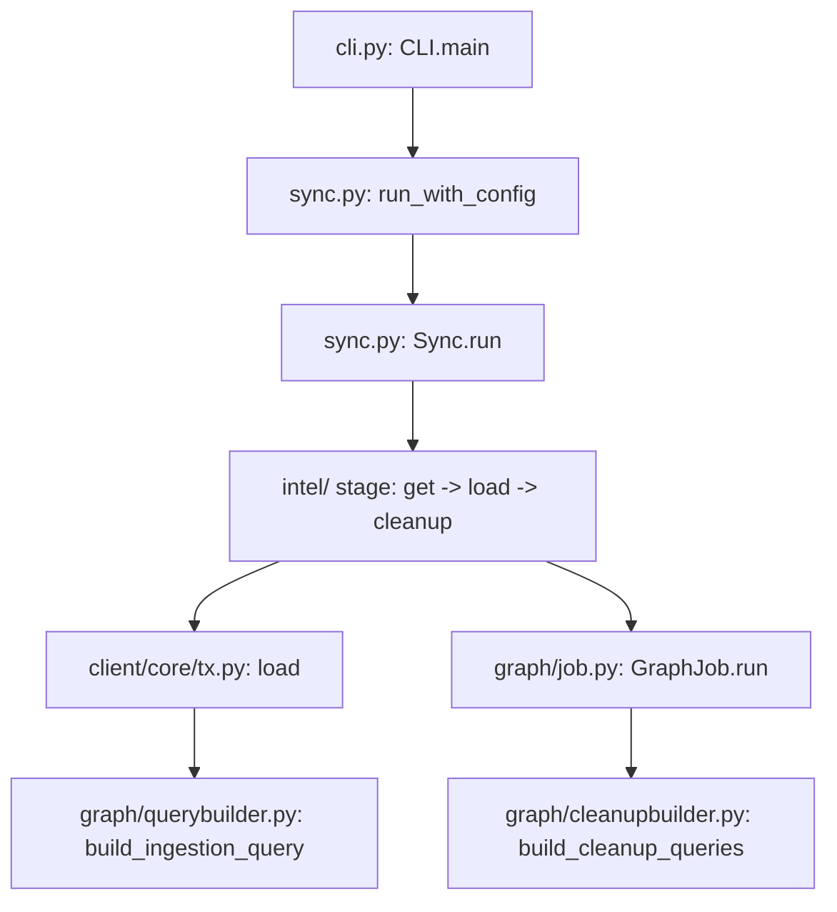

# Architecture

## Big picture

Cartography is a batch tool, not a daemon. One run is one sync: it reads from provider Application Programming Interfaces (APIs), writes nodes and relationships into Neo4j, then deletes whatever it did not touch this run. The command-line entrypoint builds an ordered list of stages, and an orchestrator runs each stage inside a single Neo4j session. Each stage is a provider module that follows the same `get / transform / load / cleanup` shape.

## Components

### Command-line interface (`cartography/cli.py`)

The `CLI` class (cli.py:210) parses arguments and decides which stages to run. If `--selected-modules` is set it calls `build_sync(selected_modules)`; otherwise it falls back to `build_default_sync()` (cli.py:2047-2049). It then calls `run_with_config(sync, config)` (cli.py:2757). The process entrypoint is `main` (cli.py:2762), which is also what `python -m cartography` reaches through `__main__.py` (cartography/__main__.py:7).

### Orchestrator (`cartography/sync.py`)

`Sync` (sync.py:137) holds the ordered stages and runs them. `TOP_LEVEL_MODULES` is an `OrderedDict` whose insertion order is the run order (sync.py:45). The order matters: `create-indexes` is first (sync.py:47) and `analysis` is last (sync.py:132). `run_with_config` (sync.py:374) creates the Neo4j driver and assigns the update tag, then calls `Sync.run` (sync.py:225), which iterates the stages and invokes each one as `stage_func(neo4j_session, config)` (sync.py:270).

### Provider modules (`cartography/intel/`)

Each provider lives under `cartography/intel`. A module fetches from the provider API, loads into the graph, and runs a cleanup. AWS Elastic MapReduce (EMR) is a representative example: its stage function `sync` (cartography/intel/aws/emr.py:104) loops per region, `get_emr_clusters` fetches (emr.py:28), `load_emr_clusters` writes (emr.py:73), and `cleanup` deletes stale data (emr.py:94).

### Graph write and schema layer (`cartography/client`, `cartography/graph`, `cartography/models`)

Modules do not write Cypher by hand. They define frozen-dataclass schemas under `cartography/models` and call `load` (cartography/client/core/tx.py:784). `load` calls `build_ingestion_query` (cartography/graph/querybuilder.py:1128) to generate the MERGE query from the schema. Cleanup queries are generated by `build_cleanup_queries` (cartography/graph/cleanupbuilder.py:16) and executed by a `GraphJob` (cartography/graph/job.py).

## How a sync flows

A single AWS EMR sync touches each layer in order:

1. `main` (cli.py:2762) parses args and calls `run_with_config` (cli.py:2757).
2. `run_with_config` (sync.py:374) creates the Neo4j driver and, if no update tag was supplied, assigns `int(time.time())` as the run's update tag (sync.py:479-481).
3. `Sync.run` (sync.py:225) opens one session and iterates the stages, calling each as `stage_func(neo4j_session, config)` (sync.py:270).
4. The EMR stage `sync` (emr.py:104) loops per region, collecting cluster details into a list (emr.py:119-128).
5. `load_emr_clusters` (emr.py:73) calls `load` with the `EMRClusterSchema` and passes `lastupdated`, `Region`, and `AWS_ID` as keyword arguments (emr.py:83-90).
6. `load` (tx.py:784) returns early if there is no data, ensures indexes, builds the ingestion query, then writes the batch.
7. `cleanup` (emr.py:94) builds a `GraphJob` from the schema and runs it, deleting nodes and relationships whose `lastupdated` does not match this run's update tag.

## Key design decisions

The central decision is a garbage-collection model based on an update tag instead of diffing. Cartography does not compute deltas. It assigns one integer update tag per run (sync.py:479), writes `lastupdated = $UPDATE_TAG` on everything it touches, and afterward deletes whatever still has an older `lastupdated`. The internals page traces this in the cleanup query.

The second decision is a declarative schema framework. Module authors define frozen dataclasses for nodes and relationships and call `load`; the query builder generates the MERGE query and indexes. The `load` docstring states that queries should come from `build_ingestion_query` rather than being handwritten (tx.py:665-667).

A third decision is lazy stage loading. `_LazyStage` (sync.py:22) defers the import of a provider module until the stage actually runs (sync.py:36-39). This keeps `import cartography.sync` cheap even though individual providers pull in heavy Software Development Kits (SDKs) like boto3.

## Extension points

The main extension point is a new intel module: implement the `get / transform / load / cleanup / sync` functions under `cartography/intel`, define the node and relationship schemas under `cartography/models`, and register the stage in `TOP_LEVEL_MODULES` (sync.py:45). Because writes go through the schema and query builder, a new module rarely writes Cypher directly.
