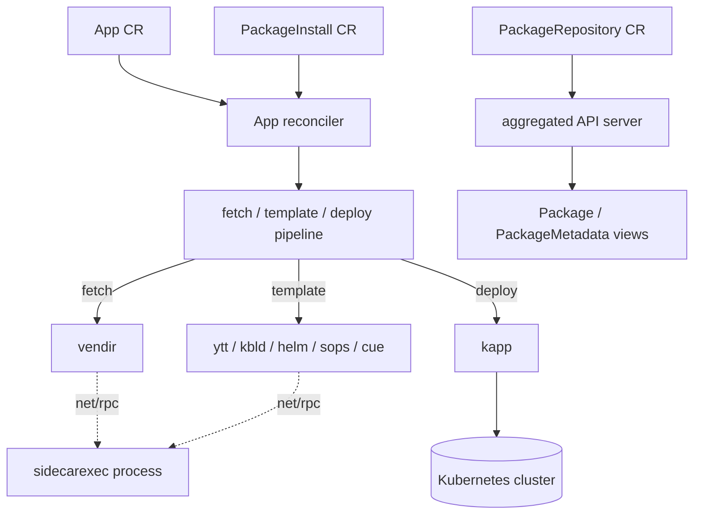

# Architecture

## Big picture

kapp-controller is a controller-runtime manager that runs several reconcilers in one process. `main()` parses flags and calls `Run` (`cmd/controller/run.go:61`), which builds the manager (`cmd/controller/run.go:82`) and registers one reconciler per custom resource: config, `App`, `PackageInstall`, and `PackageRepository`. For each `App` the controller runs a three-stage pipeline (fetch, template, deploy), and each stage shells out to a Carvel command-line tool. Fetch and template tools run in a separate sidecar process; only `kapp` runs in the main process.

## Components

### Controller entrypoint (`cmd/controller`)

`main()` defines the flags (concurrency, namespace, metrics bind address, start-api-server, sidecarexec) and parses them (`cmd/controller/main.go:23`). When the `--sidecarexec` flag is set, the binary takes a different path and runs as the sidecar process instead of the controller (`cmd/controller/main.go:35`). Otherwise it calls `Run` (`cmd/controller/main.go:47`). `Run` builds the manager with the Carvel scheme (`cmd/controller/run.go:72`) and then registers each reconciler in its own block.

### App reconciler (`pkg/app`)

The `App` reconciler owns the core pipeline. It is registered in `Run` via `app.NewReconciler` (`cmd/controller/run.go:218`), with its maximum parallelism set from the `--concurrency` flag (`cmd/controller/run.go:226`). The reconciler resolves each `App` into a concrete object through a `CRDAppFactory` (`cmd/controller/run.go:208`) and delegates the actual work to it.

### Packaging reconcilers (`pkg/packageinstall`, `pkg/pkgrepository`)

`PackageInstall` and `PackageRepository` each get their own reconciler, registered after the `App` block (`cmd/controller/run.go:242` and `cmd/controller/run.go:276`). A `PackageRepository` fetches an imgpkg bundle and exposes the `Package` and `PackageMetadata` resources inside it; a `PackageInstall` resolves a package version and generates an `App` to install it.

### Aggregated API server (`pkg/apiserver`)

`Package` and `PackageMetadata` are not stored as ordinary CRDs. They are served by an aggregated API server that registers itself with the Kubernetes API aggregator. `NewAPIServer` is built in `Run` when `--start-api-server` is set (`cmd/controller/run.go:136`), and the server registers an `APIService` through the kube-aggregator client (`pkg/apiserver/apiserver.go:149`).

### Sidecar executor (`pkg/sidecarexec`)

External command-line tools used by fetch and template do not run inside the controller process. A separate sidecar process executes them and the controller calls it over `net/rpc`. The package documents this as a security boundary, moving binary exec calls into an isolated container (`pkg/sidecarexec/client.go:4`).

## How a request flows

A change to an `App` resource drives one reconcile from edge to engine:

1. controller-runtime calls `Reconciler.Reconcile` (`pkg/app/reconciler.go:74`). It re-fetches the latest `App` from the API to avoid acting on a stale copy (`pkg/app/reconciler.go:79`), builds the concrete object with the factory (`pkg/app/reconciler.go:90`), updates reference tracking (`pkg/app/reconciler.go:91`), and delegates with `return crdApp.Reconcile(force)` (`pkg/app/reconciler.go:100`).
2. `App.Reconcile` branches on state (`pkg/app/app_reconcile.go:19`): deleting, paused/canceled, or due for a deploy. The deploy branch calls `reconcileDeploy` (`pkg/app/app_reconcile.go:50`).
3. The pipeline body is `reconcileFetchTemplateDeploy` (`pkg/app/app_reconcile.go:105`). It creates a temporary directory (`pkg/app/app_reconcile.go:113`), runs fetch (`pkg/app/app_reconcile.go:128`), records the result in `Status.Fetch` (`pkg/app/app_reconcile.go:130`), runs template (`pkg/app/app_reconcile.go:154`), then pipes the template output into deploy (`pkg/app/app_reconcile.go:177`). If a stage errors, the function returns early and the error is stored in status.
4. Fetch converts each `Spec.Fetch` entry into one `vendir` directory config (`pkg/app/app_fetch.go:35`) and runs `vendir` (`pkg/app/app_fetch.go:48`).
5. Template walks `Spec.Template` in order and dispatches by kind (`pkg/app/app_template.go:34`), feeding each tool's standard output into the next tool's standard input (`pkg/app/app_template.go:50`).
6. Deploy requires exactly one deploy entry (`pkg/app/app_deploy.go:21`) and runs `kapp` (`pkg/app/app_deploy.go:38`).

## Key design decisions

- **Three-stage pipeline as the contract.** The `App` resource is fetch, template, deploy, and that order is the controller's central loop (`pkg/app/app_reconcile.go:105`). Each stage's standard output, standard error, and exit code are written back to the resource status, so a failing deploy is visible in `kubectl get app`.
- **Privilege separation via a sidecar.** Fetch and template tools run in a separate process reached over `net/rpc`, with an allowlist of permitted command names (`cmd/controller/sidecarexec.go:20`). The deploy tool `kapp` is the exception and runs in the controller process (`pkg/sidecarexec/cmd_exec_client.go:38`). See [Internals](./internals) for the allowlist enforcement.
- **Aggregated API instead of many CRDs.** Serving `Package` and `PackageMetadata` through an aggregated API server (`pkg/apiserver/apiserver.go:149`) keeps repository contents as virtual, read-oriented resources rather than materialising one CRD object per package version in etcd.
- **Synchronous first config reconcile.** Before any tool runs, the config reconciler is invoked once synchronously so that proxy and certificate-authority settings reach the sidecar (`cmd/controller/run.go:184`).

## Extension points

- **Custom resources.** `App`, `PackageInstall`, `PackageRepository` are the primary interfaces operators write against (`pkg/apis/kappctrl/v1alpha1/types.go:24`, `pkg/apis/packaging/v1alpha1/package_install.go:24`, `pkg/apis/packaging/v1alpha1/package_repository.go:20`).
- **Pluggable template tools.** The template dispatch supports `ytt`, `kbld`, `helm`, `sops`, and `cue` (`pkg/app/app_template.go:35`), so configuration can be rendered by whichever tool fits the source.
- **Pluggable fetch sources.** `vendir` is the fetch backend, so any source it supports (git, Helm chart, HTTP archive, OCI imgpkg bundle) is usable from an `App`.
