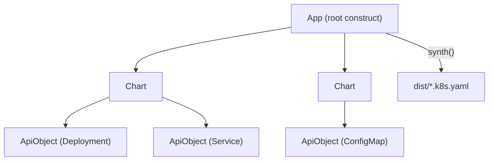

# Architecture

## Big picture

CDK8s is a synthesis framework, not a controller. You build a tree of constructs in code, call `App.synth()`, and the framework writes Kubernetes YAML to an output directory. There is no cluster connection and no reconcile loop. The tree has three levels, all of which extend the `Construct` base class from the `constructs` library: `App` at the root, one or more `Chart` nodes, and `ApiObject` leaves that each become one Kubernetes resource.

## Components

### App (root construct)

`App` is defined in `src/app.ts:87` and extends `Construct`. It is the only construct without a scope; its constructor calls `super(undefined as any, '')` (`src/app.ts:170`). It owns the output configuration: `outdir` defaults to the `CDK8S_OUTDIR` environment variable or `dist` (`src/app.ts:171`), the file extension defaults to `.k8s.yaml` (`src/app.ts:172`), and the split mode defaults to `YamlOutputType.FILE_PER_CHART` (`src/app.ts:173`). The `YamlOutputType` enum is declared at `src/app.ts:12`.

### Chart (one manifest file)

`Chart` is defined in `src/chart.ts:36`. A chart is the unit that maps to one output file. It carries a default namespace and common labels, and it generates resource names for the objects it contains through `generateObjectName` (`src/chart.ts:126`). Its `toJson()` delegates straight to `App._synthChart(this)` (`src/chart.ts:148`).

### ApiObject (one Kubernetes resource)

`ApiObject` is defined in `src/api-object.ts:52`. Each instance becomes a single Kubernetes resource. The constructor records `kind` and `apiVersion`, derives `apiGroup` from the API version (`src/api-object.ts:148`), and allocates the resource name, falling back to the chart's name generator when `metadata.name` is absent (`src/api-object.ts:150`). Its `toJson()` (`src/api-object.ts:200`) turns the in memory object into the final resource JSON.

### Supporting modules

- `src/resolve.ts`: the resolver chain that replaces token values during synthesis.
- `src/dependency.ts`: `DependencyGraph` and `DependencyVertex`, which topologically sort constructs.
- `src/yaml.ts`: the `Yaml` class that serializes objects to multi document YAML.
- `src/names.ts`: the `Names` utility that generates stable DNS compatible names.

## How synthesis flows

`App.synth()` (`src/app.ts:182`) is the entry point. With the default `FILE_PER_CHART` mode the path is:

1. `fs.mkdirSync(this.outdir, { recursive: true })` creates the output directory (`src/app.ts:184`).
2. `validate(this, cache)` collects `node.validate()` from every construct and throws if any returned errors (`src/app.ts:190`, body at `src/app.ts:298`).
3. `resolveDependencies(this, cache)` turns implicit construct dependencies into explicit chart to chart and ApiObject to ApiObject dependencies, and returns `hasDependantCharts` (`src/app.ts:194`, body at `src/app.ts:325`).
4. The `charts` getter sorts charts topologically with `new DependencyGraph(this.node).topology()` (`src/app.ts:158`).
5. In the `FILE_PER_CHART` branch (`src/app.ts:212`) a `ChartNamer` names each chart, `chart.toJson()` renders it, and `Yaml.save` writes the file (`src/app.ts:216`).
6. `Chart.toJson()` calls `App._synthChart(this)` (`src/chart.ts:148`).
7. `App._synthChart` (`src/app.ts:101`) re-runs `resolveDependencies` (`src/app.ts:109`) and `validate` (`src/app.ts:114`), then returns `chartToKube(chart).map(obj => obj.toJson())` (`src/app.ts:116`).
8. `chartToKube` (`src/app.ts:372`) topologically sorts the chart subtree and keeps only `ApiObject` nodes whose closest parent chart is this chart, preventing nested charts from being emitted twice (`src/app.ts:373`).
9. `ApiObject.toJson()` (`src/api-object.ts:200`) renders one resource. It builds the data object, resolves tokens, sanitizes and sorts keys, applies JSON patches, and reorders the top level keys (detailed in [Internals](./internals)).

A second entry point, `synthYaml()` (`src/app.ts:269`), runs the same dependency and validation steps but returns a YAML string instead of writing files.

## Key design decisions

- **Synthesize, do not apply.** The framework writes YAML and stops. There is no apply, no cluster client, no drift detection. This keeps cdk8s composable with any apply mechanism (`kubectl`, GitOps controllers) and free of cluster credentials.
- **Two phase dependency resolution.** Dependencies are first inferred at the whole app level so cross chart relationships are visible, then re-resolved per chart inside `_synthChart`. The comment at `src/app.ts:107` explains that the app must be prepared before a single chart can be synthesized because dependency inference happens at the app level.
- **Topological output order.** `DependencyVertex.topology()` (`src/dependency.ts:134`) emits dependencies before dependants, so a resource appears in the manifest after the resources it depends on.
- **YAML 1.1 schema.** The serializer pins the YAML schema to `1.1` (`src/yaml.ts:12`) for backward compatibility with parsers such as PyYAML and to keep octal numbers like `0775` parsing correctly.

## Extension points

- **Resolvers.** `AppProps.resolvers` accepts an array of `IResolver` (`src/resolve.ts:49`) implementations. Each one can rewrite property values during synthesis; the first resolver to call `context.replaceValue` wins (`src/resolve.ts:128`).
- **JSON patches.** `ApiObject.addJsonPatch` (`src/api-object.ts:190`) queues RFC-6902 (JSON Patch) operations that are applied to the rendered manifest at `src/api-object.ts:210`.
- **Custom chart naming.** `Chart.generateObjectName` (`src/chart.ts:126`) can be overridden to customize resource names per chart.
- **Importing manifests.** `Yaml.load` (`src/yaml.ts:72`) reads existing YAML from a URL or file, the basis for importing CRDs and external manifests as constructs.
