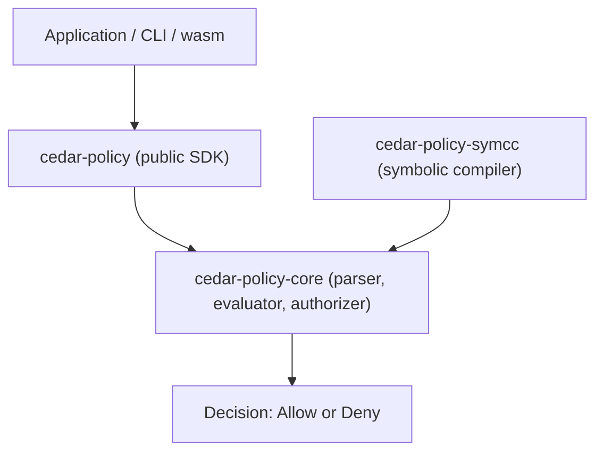

# Architecture

## Big picture

Cedar is a Rust workspace. The core authorization engine is a parser plus an evaluator (the component that interprets a policy condition against a request) plus an authorizer (the component that combines per-policy results into one decision). Applications do not talk to the core directly. They use the public `cedar-policy` SDK crate, which wraps a thin layer over `cedar-policy-core` (README:42, README:47). Around that core sit the CLI, the wasm binding, the Language Server, the formatter, and the symbolic compiler (README:42-49).

## Components

### Public SDK: `cedar-policy`

This is the crate applications depend on (README:42). Its `Authorizer::is_authorized` takes a `Request`, a `PolicySet`, and an `Entities` set and returns a `Response` (`cedar-policy/src/api.rs:1116`). The body delegates straight to the core authorizer of the same name (`api.rs:1117`).

### Core engine: `cedar-policy-core`

The internal crate holds the parser, evaluator, and typechecker (README:47). The authorizer lives in `cedar-policy-core/src/authorizer.rs`, the evaluator in `cedar-policy-core/src/evaluator.rs`, and the abstract syntax tree (AST) types under `cedar-policy-core/src/ast/`.

### Symbolic compiler: `cedar-policy-symcc`

This crate compiles policies into logic for an SMT solver so properties can be proved rather than tested (README:43). Its entry points are covered in [Internals](./internals).

### CLI, wasm, and Language Server

`cedar-policy-cli` provides the `cedar` command and parses subcommands with `clap` from `fn main` (`cedar-policy-cli/src/main.rs:28`). `cedar-wasm` exposes the wasm interface for JavaScript and TypeScript (README:46). `cedar-language-server` implements the Language Server Protocol (LSP) for editor integration (README:45).

## How a request flows

Trace one `is_authorized` call from the SDK down to a decision.

1. The SDK entry `Authorizer::is_authorized` (`api.rs:1116`) clones the request and calls the core authorizer (`api.rs:1117`).

2. Core `Authorizer::is_authorized` (`authorizer.rs:76`) calls `is_authorized_core(...).concretize()` (`authorizer.rs:77`).

3. `is_authorized_core` (`authorizer.rs:83`) builds an evaluator with `Evaluator::new(...)` (`authorizer.rs:89`) and hands off to `is_authorized_core_internal` (`authorizer.rs:90`).

4. `is_authorized_core_internal` (`authorizer.rs:95`) iterates every policy with `for p in pset.policies()` (`authorizer.rs:109`) and calls `eval.partial_evaluate(p)` on each (`authorizer.rs:111`). It sorts results into buckets by effect (permit or forbid) and truth value. A policy whose condition raises an evaluation error is recorded and, under the only error mode `ErrorHandling::Skip` (`authorizer.rs:136`), treated as not satisfied.

5. `partial_evaluate` (`evaluator.rs:397`) interprets the policy condition. If it reduces to a concrete value it converts to a boolean with `get_as_bool`; if unknowns remain it returns a residual expression (`evaluator.rs:398-401`).

6. The buckets are packed into a `PartialResponse` with `PartialResponse::new(...)` (`authorizer.rs:152`).

7. `concretize` (`partial_response.rs:115`) turns the `PartialResponse` into a final `Response`, and the decision is computed by `decision` (`partial_response.rs:121`).

## Key design decisions

The combining rule is deny-trumps-allow, and it is enforced in one place: the match inside `decision` (`partial_response.rs:122-138`). Any satisfied forbid means `Deny` (`partial_response.rs:129`). No satisfied or potential permit means a default `Deny` (`partial_response.rs:131`). An allow only happens when there is at least one satisfied permit and no satisfied or residual forbid (`partial_response.rs:137`). The consequence: forbid always overrides permit, and the absence of any permit is denied by default.

The decision type is intentionally two-valued. `Decision` is an enum of only `Allow` and `Deny` (`authorizer.rs:701`), and a sufficiently fatal error such as a policy parse failure also resolves to `Deny` (`authorizer.rs:704-708`). There is no third "error" outcome that a caller could mishandle.

The engine is partial-evaluation-first. The internal path is `partial_evaluate` returning either a boolean or a residual (`evaluator.rs:397`), and `concretize` collapses a `PartialResponse` to a `Response` (`partial_response.rs:115`). The same machinery serves both a full request and a request with unknowns left to be filled in later.

## Extension points

The supported integration surfaces are the public SDK crate (README:42), the wasm binding for JavaScript and TypeScript (README:46), the CLI (README:44), the Language Server for editors (README:45), and the Foreign Function Interface (FFI) JSON entry points such as `is_authorized` and `is_authorized_json` (`cedar-policy/src/ffi/is_authorized.rs:58`, `:88`). Cedar also supports extension functions for values such as IP addresses and decimals, surfaced in the AST as the `ExtensionFunctionApp` expression variant.
