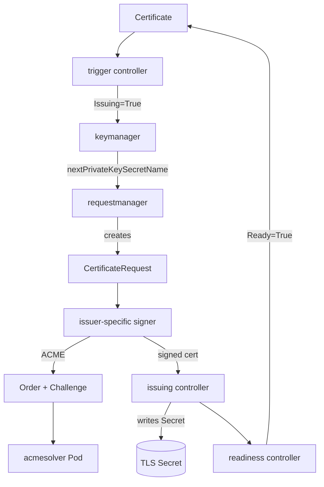

# Architecture

## Big picture

cert-manager runs as a set of long-lived Kubernetes components plus a couple of helper binaries. The `cmd/` directory holds five entry points: `controller`, `webhook`, `cainjector`, `acmesolver`, and `startupapicheck`. The controller is where all the reconcile loops live, the webhook validates and converts the API types, and cainjector keeps CA bundles in sync. The acmesolver is a short-lived Pod spun up to answer ACME HTTP-01 challenges.

The API surface is two groups: `certmanager` (`Certificate`, `CertificateRequest`, `Issuer`, `ClusterIssuer`) in `pkg/apis/certmanager/v1`, and `acme` (`Order`, `Challenge`) in `pkg/apis/acme/v1`. The ACME group persists protocol state as CRDs so a restart resumes where it left off.

## Components

### controller

The aggregate of every reconcile loop. The entry point is `app.NewServerCommand(ctx)` (`cmd/controller/main.go:37`), imported from a separate module `controller-binary/app` (`cmd/controller/main.go:26`). Individual controllers self-register into a global map via `Register(name, fn)` (`pkg/controller/register.go:48`), so the binary is a plugin-style assembly of reconcilers rather than one monolithic loop.

### webhook

Hosts the validating and mutating admission webhooks plus the conversion webhook for the API types (`pkg/webhook`, with validation logic under `pkg/apis/.../validation`). It is the gate that rejects malformed `Certificate` and `Issuer` specs before they reach the controllers.

### cainjector

Injects CA certificates into the `caBundle` fields of webhook configurations and APIService objects. Its reconciler lives in `pkg/controller/cainjector/reconciler.go`, with supporting code under `internal/cainjector`. Without it the API server cannot trust cert-manager's own webhook.

### acmesolver

A throwaway Pod that serves the token for an ACME HTTP-01 challenge (`cmd/acmesolver`). The ACME controllers create it on demand and delete it once the challenge is validated.

## How a request flows

Issuing one `Certificate` is not a single loop. It is split across several small controllers under `pkg/controller/certificates/` (`trigger`, `keymanager`, `requestmanager`, `issuing`, `readiness`, `revisionmanager`), each owning one state transition and coordinating only through status conditions and Secrets.

1. trigger: `ProcessItem` (`pkg/controller/certificates/trigger/trigger_controller.go:160`) checks for duplicate Secret ownership via `CertificateOwnsSecret` (`:188`), applies a failure backoff (`:210`), and evaluates the reissue policy with `shouldReissue` (`:225`). If reissuance is due it sets the `Issuing` condition to True and updates status (`:243`). It does not create a CertificateRequest.
2. keymanager: sees `Issuing=True`, generates the private key Secret for the next revision, and records `status.nextPrivateKeySecretName` (`pkg/controller/certificates/keymanager`).
3. requestmanager: `ProcessItem` (`pkg/controller/certificates/requestmanager/requestmanager_controller.go:140`) confirms `Issuing=True` (`:156`), decodes the key from the next-private-key Secret (`:180`), and if no matching CertificateRequest exists calls `createNewCertificateRequest` (`:236`, defined at `:367`). The CSR is encoded from the key (`:381`) and PEM-wrapped (`:387`), then the request is created via `CertmanagerV1().CertificateRequests(...).Create(...)` (`:435`).
4. signer: the signer matching the `IssuerRef` handles the CertificateRequest. For ACME, `Sign` (`pkg/controller/certificaterequests/acme/acme.go:118`) decodes the CSR (`:122`), checks the CommonName appears in the SANs (`:133`), builds the expected `Order` (`:145`), and creates it if absent (`:160`).
5. acmeorders / acmechallenges: `pkg/controller/acmeorders` and `pkg/controller/acmechallenges` drive the Order against the ACME server and solve the Challenge (HTTP-01 or DNS-01). The acmesolver Pod answers HTTP-01. The signed certificate is written back to the CertificateRequest status.
6. issuing: writes the signed certificate into the real Secret and clears the `Issuing` condition (`pkg/controller/certificates/issuing`). The readiness controller then sets the `Ready` condition.

## Key design decisions

The defining choice is splitting reconciliation into micro-controllers. Each controller advances one step and they stay loosely coupled through the `Certificate` status conditions (`Issuing`, `Ready`) and naming conventions (`nextPrivateKeySecretName`, revision annotations). This is easier to observe and test than one large loop, at the cost of spreading state across resources.

The `CertificateRequest` is a deliberate intermediate contract. Every issuer type, ACME, CA, SelfSigned, Vault, Venafi (`pkg/controller/certificaterequests/`), consumes the same CertificateRequest, so an external process can sign requests out of band. This is what lets third-party issuers exist without forking the core.

ACME error handling separates retriable from fatal. Network failures become Pending plus backoff, while an undecodable CSR or a CommonName not in the SANs is a hard fail to avoid infinite retries (`pkg/controller/certificaterequests/acme/acme.go:122`-`:142`).

## Extension points

- Custom resources: `Certificate`, `CertificateRequest`, `Issuer`, `ClusterIssuer`, `Order`, `Challenge` are the public API.
- External issuers: any controller that signs a `CertificateRequest` plugs into the flow without changing cert-manager itself; an approver and checks layer guards them (`pkg/controller/certificaterequests/approver`).
- Admission and conversion webhooks (`pkg/webhook`) for validating and versioning the types.
- The controller plugin registry `Register` (`pkg/controller/register.go:48`) for wiring additional reconcilers into the controller binary.
